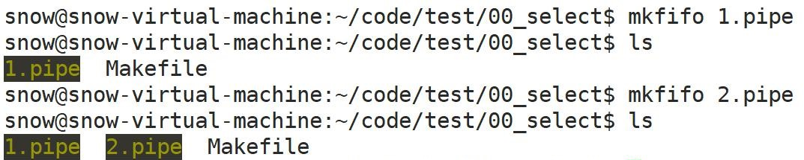
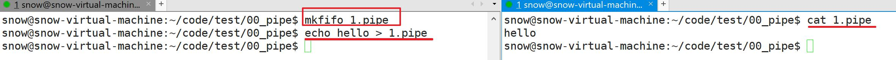
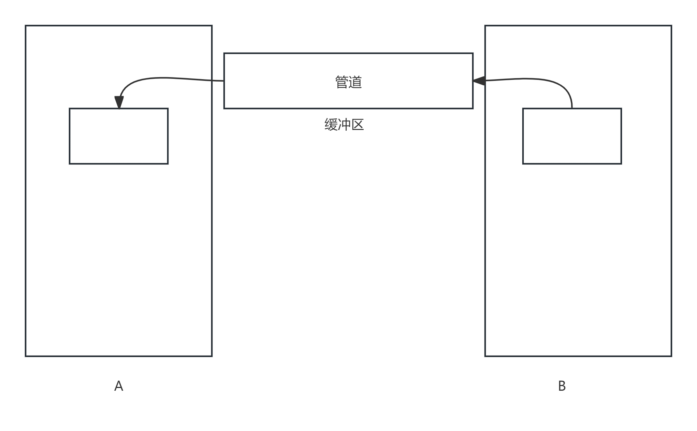
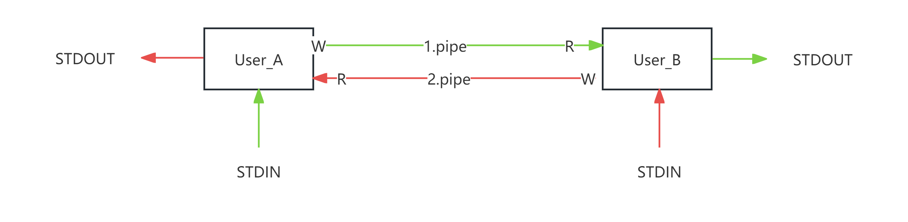
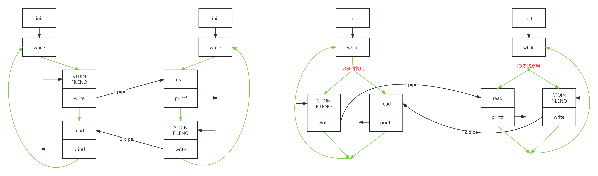

# IO多路复用

# 1, 管道

### 1.1.1 管道概述

>Linux中的**命名管道 (named  pipe)** 是一种特殊类型的文件，又称为**FIFO**，它外的外在表现好像是一个磁盘文件，实际上本质只是一个数据流或缓冲区。管道允许一个进程的输出直接作为另一个进程的输入，在Linux系统中是一种重要的实现进程间通信（IPC）的机制。
>
>- 除了命名管道以外, 还有一种用于进程间通信的匿名管道。(后面再讲)
>- 命名管道创建的管道文件不是普通的磁盘文件。这个文件本身不存储数据（它不占用磁盘空间来存储长期数据），而是作为一个通信接口存在 (它是一个文件系统标识, 方便我们以**操作文件系统的方式**读写管道的缓冲区)。
>- 命名管道, 从一端读取数据, 从另一端写入数据。使用命名管道, 必须读端写端同时打开, 无法单独去打开读端或者写端。
>- 命名管道是一种半双工通信, 但是我们一般把它当作单工管道使用(  即: 一个进程只打开它的写端写数据,  另一个进程只打开它的读端读数据)。
>- 当管道缓冲区无数据, 读管道的操作将被阻塞。
>- 当管道缓冲区写满, 写管道将被阻塞。
>- 在管道操作中, 如果写端关闭,  读端可以继续读取缓冲区的剩余数据, 如果缓冲区没有剩余数据, 读取操作(read)直接返回0。
>- 在管道操作中, 如果读端关闭, 写端继续向管道中写数据的时候, 会导致写操作(write)触发SIGPIPE信号, 进而导致进程异常终止。
>- 一般我们会使用两根管道构建两个进程间的全双工通信。
>
>

### 1.1.2 创建管道文件

>命名管道创建的管道文件不是普通的磁盘文件, 所以创建的方式也和普通文件创建方式不同。
>
>- 通过**`mkfifo  name.pipe`**创建管道文件
>- 不允许使用vim打开管道文件
>
>

### 1.1.3 使用管道

**直接使用**

>- 假设先创建一个管道: `mkfifo 1.pipe`
>- 通过`echo hello > 1.pipe`向管道缓冲区写入数据, 我们会发现这个写入操作会直接写阻塞;   这是因为使用命名管道 , 是从一端读取数据, 从另一端写入数据, 必须读端写端同时打开, 无法单独去打开读端或者写端。
>- 当我们另开一个窗口(新的进程)使用`cat 1.pipe`读取管道数据, 相当于开启了管道的读端,  这可以使之前打开的写端正常写入,  从阻塞态变为非阻塞态写入;  等写端写入完成之后, 读端读出写入数据。
>
>

**在代码中使用管道**

>EgCode: 写端
>
>````C
>int main(int argc,char*argv[])
>{
>        int pipe_fd = open("1.pipe", O_WRONLY);
>
>        while(1){
>            write(pipe_fd, "hello", 5);
>            printf("write once \n");
>            sleep(5);
>        }
>        return 0;
>}
>````
>
>EgCode: 读端
>
>```C
>int main(int argc,char*argv[])
>{
>        int pipe_fd = open("1.pipe", O_RDONLY);
>
>        while(1){
>            char buf[60] = {0};
>            read(pipe_fd, buf, sizeof(buf));
>            printf("read : %s\n", buf);
>        }
>        return 0;
>}
>```

### 1.1.4 通信的方式

>在通信系统中，根据数据传输的方向和方式，通信可以被分为单工、双工和半双工三种模式

| 通信方式   | 描述                                                 |
| ---------- | ---------------------------------------------------- |
| 单工通信   | 永远只能由一方向另一方发送数据                       |
| 半双工通信 | 双方都可以收发数据, 但是在同一时刻只能一端发另一端收 |
| 全双工通信 | 两端可以同时收发数据                                 |

>EgCode: 命名管道是半双工通信
>
>```C
>int main(int argc,char*argv[])
>{
>        int pipe_fd = open("1.pipe", O_RDWR);
>
>        while(1){
>            write(pipe_fd, "hello", 5);
>            printf("write \n");
>            sleep(5);
>
>            char buf[10] = {0};
>            read(pipe_fd, buf, sizeof(buf));
>            printf("read:%s \n", buf);
>        }
>        return 0;
>}
>```

### 1.1.5 管道写阻塞

>假设我们通过pipe实现一个通信, 写端一直在写, 读端不读, 会发生什么?
>
>EgCode:写端
>
>````C
>int main(int argc,char*argv[])
>{
>        int fd_write = open("1.pipe", O_WRONLY);
>
>        char buf[4096] = {0};
>        int times = 0;
>        while(1){
>           write(fd_write, buf, sizeof(buf));
>           printf("write times: %d \n", ++times);
>        }
>
>        close(fd_write);
>        return 0;
>}
>````
>
>EgCode:读端
>
>```C
>int main(int argc,char*argv[])
>{
>        int fd_read = open("1.pipe", O_RDONLY);
>
>        sleep(10);
>        char buf[4096] = {0};
>        while(1){
>           read(fd_read, buf, sizeof(buf));
>           printf("read \n");
>           sleep(2);
>        }
>
>        close(fd_read);
>        return 0;
>}
>```
>
>- 假设我们通过pipe实现一个通信, 写端一直在写, 读端不读, 会发生什么? 会发生写阻塞; 因为管道的大小是有限制的。
>- 了解: 管道的真实可用缓冲区的大小取决于单个**单个管道缓冲区大小**和**管道缓冲区的数目**共同决定。而且在不同的操作系统设置是不一样的。 
>
>```C
>ps:闲聊 (下面讨论按标准情况, 忽略非标准情况)
>// 假设以我们上课使用系统为例:
>//    我们通过查看ulimit -a 中的pipe size为 8*512=4096字节
>//    我们也可以从操作系统的源码中查看, 管道缓冲区个数为16
>// 假设我们创建一个1.pipe的管道, 我们在不读的情况下可以连续写入16个4096, 即可把管道写满, 再试图写就会写阻塞; 写满之后, 假设又读出4096字节,我们可以再接着写4096个字节
>// 假设我们创建一个1.pipe的管道, 我们在不读的情况下, open其两次, 得到同一个管道的两个管道文件描述符, 按照每次4096字节写入管道; 你会发现两个文件加起来最终还是16次写入
>// 假设我们创建一个1.pipe和2.pipe的管道, 我们在不读的情况下, 分别open这两个管道, 得到两个管道文件的文件描述符, 按照每次4096字节写入管道; 你会发现两个文件每个管道都是16次写入
>
>// PIPE_BUF: 小于PIPE_BUF的写入应该是原子操作(不可被中断) (man 7 pipe)。
>/usr/src/linux-source-4.15.0/linux-source-4.15.0/include/linux/pipe_fs_i.h
>/usr/src/linux-source-4.15.0/linux-source-4.15.0/include/uapi/linux/limits.h  
>   
>总结: Applications should not rely on a particular capacity: an application should be designed so that a reading process consumes data as soon as it is available, so that a writing process does not remain blocked.(应用程序不应依赖于特定的容量：应用程序的设计应确保读取过程在数据可用时立即消耗数据，这样写入过程就不会被阻止)
>```
>
>

### 1.1.6 管道构建双工通信

>**实现一份代码,  让两个程序基于基于pipe管道的双工通信。**工作流程图如下:
>
>
>
>**创建两个pipe文件:**
>
>```shell
>mkfifo 1.pipe
>mkfifo 2.pipe
>```
>
>
>
>EgCode:  User_A
>
>```C
>int main(int argc,char*argv[])
>{
>        int fd_write = open("1.pipe", O_WRONLY);
>        int fd_read = open("2.pipe", O_RDONLY);
>
>        while(1){
>            // 读取标准输入: 通过1.pipe发送给User_B
>            char buf[60];
>            bzero(buf, sizeof(buf));
>            int read_stdin = read(STDIN_FILENO, buf, sizeof(buf));
>            if(read_stdin == 0){
>                // 用户按下ctrl+d;终止标准输入
>                break;
>            }
>            write(fd_write, buf, sizeof(buf));
>
>            bzero(buf, sizeof(buf));
>            // 读取2.pipe: 打印到标准输出
>            int read_num = read(fd_read, buf, sizeof(buf));
>            if(read_num == 0){
>                printf("对方断开链接 \n");
>                break;
>            }
>            printf("UserB: %s ", buf);
>        }
>
>        close(fd_write);
>        close(fd_read);
>        return 0;
>}
>```
>
>EgCode:  User_B
>
>```C
>int main(int argc,char*argv[])
>{
>        int fd_read = open("1.pipe", O_RDONLY);
>        int fd_write = open("2.pipe", O_WRONLY);
>
>        while(1){
>            char buf[60];
>            bzero(buf, sizeof(buf));
>            // 读取1.pipe: 打印到标准输出
>            int read_num = read(fd_read, buf, sizeof(buf));
>            if(read_num == 0){
>                printf("对方断开链接 \n");
>                break;
>            }
>            printf("UserA: %s ", buf);
>     
>            bzero(buf, sizeof(buf));
>            // 读取标准输入: 通过2.pipe发送给User_A
>            int read_stdin = read(STDIN_FILENO, buf, sizeof(buf));
>            if(read_stdin == 0){
>                // 用户按下ctrl+d; 输入文件终止符; 终止标准输入; read返回0
>                break;
>            }
>            write(fd_write, buf, sizeof(buf));
>
>        }
>
>        close(fd_write);
>        close(fd_read);
>        return 0;
>}
>```
>
>在上面的代码过程中, 我们需要注意一些问题:
>
>- 1.pipe和2.pipe在A和B中的打开顺序, 有可能导致产生竞争条件导致死锁。
>- 上面的对答流程属于一问一答式的模式, 需要由A发起聊天。连续发送多条数据对面无法立即显示。
>
>上面流程明显不符合实际生活对话流程, 该怎么改进这个过程?

# 2, IO多路复用

>上面一问一答式的对话流程, 是因为在上面代码执行中, 它是一个串行执行的逻辑,   如果模拟现实情况, 我们更希望要做的是怎么把这个串行逻辑改为并行逻辑。**这里我们就可以用到IO多路复用技术**
>
>

**IO多路复用**

>操作系统允许**单个进程或线程**同时<span style="color:red">**监视**</span>多个**文件描述符**的一种技术。当其中的一个或多个文件状态变为非阻塞状态（例如: **文件由阻塞态, 变得可读、可写或有异常待处理**）时，该进程或线程会收到一个对应通知。_而我们的逻辑中收到这个通知, 就可以根据对应变得可读的文件描述符处理是读取标准输入, 还是接收对端数据, 还是都处理_。
>
>这样, 就允许程序同时处理多个文件就绪, 或者称为**谁就绪就处理谁**，而不是只能按照固定处理顺序处理每一个任务，从而提高效率。
>
>**select是实现IO多路复用的一种方式。(其他的还有poll, epoll)** 

## 2.1 Select

><span style="color:red">select的最基本的原理, 就是把要监视的文件描述符, 构建一个**文件描述符监听集合**; 这个集合交给select, select促使操作系统内核, 通过轮询的方式监听这个文件描述符集合。直到监听集合中, 至少有一个文件按照条件就绪(条件:预设的监听是读就绪OR写就绪...),  这一次的select监听宣告结束, 并**携带就绪的文件描述符集合**返回, 继续执行用户书写的代码逻辑。</span>

### 2.1.1 Select函数

>select是一个在Unix系统中就已经出现了的, 传统的IO多路复用接口。(man select)
>
>```C
>#include <sys/select.h>
>#include <sys/time.h>
>#include <sys/types.h>
>#include <unistd.h>
>// synchronous I/O multiplexing
>// 同步      I/O    多路复用
>int select(
>        int nfds, // 被监听文件描述符集合最大的文件描述符+1 (最大的文件描述符+1)
>        fd_set *readfds, // 要监听的: 读操作文件描述符集合
>        fd_set *writefds, // 要监听的: 写操作文件描述符集合
>        fd_set *exceptfds, // 要监听的: 异常操作文件描述符集合
>        struct timeval *timeout // 监听时候的阻塞时间:NULL代表一直等待直到指定就绪,0代表不等待检查文件描述符立即返回
>);
>// 返回值: 正数表示就绪的文件描述符数量; 0表示监听超时; -1表示是失败
>```
>
>```C
>// 构建监听文件描述符:
>void FD_ZERO(fd_set *set); // 初始化文件描述符集合
>void FD_SET(int fd, fd_set *set); // 向文件描述符集合添加要监听的文件描述符
>void FD_CLR(int fd, fd_set *set); // 从文件描述符集合移除一个文件描述符,不再监听移除项
>int  FD_ISSET(int fd, fd_set *set); // 判断某个文件描述符, 是否在文件描述符集合中
>```
>
>- 调用select之后, select会**阻塞**进程, 去监听设置的文件描述符状态; 直到监听到至少一个文件描述符就绪, select**解除阻塞**状态, 并携带就绪的文件描述符返回。
>- 监听集合和监听完毕之后携带的就绪集合, 是同一个fd_set存储。(传入传出参数, 非const指针) (意味着在循环中, 每次都要重置监听集合set)

### 2.1.2 代码示例

> EgCode:
>
> ```C
> int main(int argc,char*argv[])
> {
>         int fd_write = open("1.pipe", O_WRONLY);
>         int fd_read = open("2.pipe", O_RDONLY);
>         char buf[60];
>         // 监听集合
>         fd_set set;
> 
>         while(1){
>             // 初始化集合
>             FD_ZERO(&set);
>             // 添加要监听的文件描述符
>             FD_SET(STDIN_FILENO, &set);
>             FD_SET(fd_read, &set);
> 
>             // 调用select: 监听就绪
>             int res_select = select(10, &set, NULL,NULL, NULL);
> 
>             if(FD_ISSET(fd_read, &set)){
>                 bzero(buf, sizeof(buf));
>                 int read_num = read(fd_read, buf, sizeof(buf));
>                 if(read_num == 0){
>                     printf("对方断开链接 \n");
>                     break;
>                 }
>                 printf("UserA: %s", buf);
>             }
>             if(FD_ISSET(STDIN_FILENO, &set)){
>                 bzero(buf, sizeof(buf));
>                 int read_stdin = read(STDIN_FILENO, buf, sizeof(buf));
>                 if(read_stdin == 0){
>                     // 用户按下ctrl+d; 输入文件终止符; 终止标准输入; read返回0
>                     break;
>                 }
>                 write(fd_write, buf, sizeof(buf));
>             }
>         }
> 
>         close(fd_write);
>         close(fd_read);
>         return 0;
> }
> ```
>
> - UserA 和UserB代码除了打开pipe的顺序, 和确定pipe的读端写端以外,  其余的通信逻辑是相同的。

### 2.1.3 超时设置

>我们可以在select函数中设置指定的时间, 来限制select的阻塞时间。
>
>```C
>int select(
>        int nfds, // 被监听文件描述符集合最大的文件描述符+1 (最大的文件描述符+1)
>        fd_set *readfds, // 要监听的: 读操作文件描述符集合
>        fd_set *writefds, // 要监听的: 写操作文件描述符集合
>        fd_set *exceptfds, // 要监听的: 异常操作文件描述符集合
>        struct timeval *timeout // 监听时候的阻塞时间:NULL代表一直等待直到指定就绪,0代表不等待检查文件描述符立即返回
>);
>// 返回值: 正数表示就绪的文件描述符数量; 0表示监听超时; -1表示是失败
>```
>
>```C
>// (man select )
>struct timeval {
>        long    tv_sec;         // seconds: 秒
>        long    tv_usec;        // microseconds: 微秒 (1秒 = 1000 000微秒)
>};
>```
>
>- 如果设置了阻塞时间,  可以通过select的返回值确定到底之超时返回,还是就绪返回。
>- timeout会随着select的阻塞时间而递减。如果因为就绪事件导致select返回,  timeout留下的是剩余时间。
>
>```C
>int main(int argc,char*argv[])
>{
>    int fd_write = open("1.pipe", O_WRONLY);
>    int fd_read = open("2.pipe", O_RDONLY);
>    char buf[60];
>    // 监听集合
>    fd_set set;
>
>    while(1){
>        // 初始化集合
>        FD_ZERO(&set);
>        // 添加要监听的文件描述符
>        FD_SET(STDIN_FILENO, &set);
>        FD_SET(fd_read, &set);
>
>        struct timeval time_val;
>        time_val.tv_sec = 10;
>        time_val.tv_usec = 0;
>        
>        // 调用select: 监听就绪
>        int res_select = select(10, &set, NULL,NULL, &time_val);
>
>        // 打印剩余时间
>        printf("tv_sec: %ld \n", time_val.tv_sec);
>
>        if(FD_ISSET(fd_read, &set)){
>            bzero(buf, sizeof(buf));
>            int read_num = read(fd_read, buf, sizeof(buf));
>            if(read_num == 0){
>                printf("对方断开链接 \n");
>                break;
>            }
>            printf("UserA: %s", buf);
>        }
>        if(FD_ISSET(STDIN_FILENO, &set)){
>            bzero(buf, sizeof(buf));
>            int read_stdin = read(STDIN_FILENO, buf, sizeof(buf));
>            if(read_stdin == 0){
>                // 用户按下ctrl+d; 输入文件终止符; 终止标准输入; read返回0
>                break;
>            }
>            write(fd_write, buf, sizeof(buf));
>        }
>    }
>    close(fd_write);
>    close(fd_read);
>    return 0;
>}
>```

#### **练习**

>**设计一份代码:当UserA用户10秒未发生信息, UserB关闭连接。 **
>
>```C
>int main(int argc,char*argv[])
>{
>    int fd_read = open("1.pipe", O_RDONLY);
>    int fd_write = open("2.pipe", O_WRONLY);
>    char buf[60];
>
>    fd_set set;
>
>    struct timeval time_val;
>    time_val.tv_sec = 10;
>    time_val.tv_usec = 0;
>    while(1){
>        FD_ZERO(&set);
>        FD_SET(STDIN_FILENO, &set);
>        FD_SET(fd_read, &set);
>
>        int res_select = select(10, &set, NULL, NULL, &time_val);
>
>        if(FD_ISSET(fd_read, &set)){
>            bzero(buf, sizeof(buf));
>            int read_num = read(fd_read, buf, sizeof(buf));
>            if(read_num == 0){
>                printf("对方断开链接 \n");
>                break;
>            }
>            printf("UserA: %s", buf);
>
>            time_val.tv_sec = 10;
>            time_val.tv_usec = 0;
>        }else{
>            if(time_val.tv_sec <= 0){
>                printf("对方十秒未说话 \n");
>                break;
>            }
>        }
>        if(FD_ISSET(STDIN_FILENO, &set)){
>            bzero(buf, sizeof(buf));
>            int read_stdin = read(STDIN_FILENO, buf, sizeof(buf));
>            if(read_stdin == 0){
>                // 用户按下ctrl+d; 输入文件终止符; 终止标准输入; read返回0
>                break;
>            }
>            write(fd_write, buf, sizeof(buf));
>        }
>    }
>    close(fd_write);
>    close(fd_read);
>    return 0;
>}
>```
>
>思考: 如果在多人聊天的情况下, 上述实现有什么缺陷?
>
>改进: 假设使用time_t计时可以实现吗? 有什么问题?
>
>```C
>int main(int argc,char*argv[])
>{
>        int fd_write = open("1.pipe", O_WRONLY);
>        int fd_read = open("2.pipe", O_RDONLY);
>        char buf[60];
>
>        fd_set set;
>
>        // 记录a发过来信息的时间
>        time_t tag_a_msg = time(NULL);
>        // 记录当前时间
>        time_t tag_cur = time(NULL);
>
>        while(1){
>            FD_ZERO(&set);
>            FD_SET(STDIN_FILENO, &set);
>            FD_SET(fd_read, &set);
>
>            // 每1秒就绪一次
>            struct timeval time_val;
>            time_val.tv_sec = 1;
>            time_val.tv_usec = 0;
>            int res_select = select(10, &set, NULL,NULL, &time_val);
>            // 更新当前时间
>            tag_cur = time(NULL);
>
>            if(FD_ISSET(fd_read, &set)){
>                bzero(buf, sizeof(buf));
>                int read_num = read(fd_read, buf, sizeof(buf));
>                if(read_num == 0){
>                    printf("对方断开链接 \n");
>                    break;
>                }
>                printf("UserA: %s", buf);
>                // 更新a的发送信息时间
>                tag_a_msg = time(NULL);
>            }
>            if(FD_ISSET(STDIN_FILENO, &set)){
>                bzero(buf, sizeof(buf));
>                int read_stdin = read(STDIN_FILENO, buf, sizeof(buf));
>                if(read_stdin == 0){
>                    // 用户按下ctrl+d; 输入文件终止符; 终止标准输入; read返回0
>                    break;
>                }
>                write(fd_write, buf, sizeof(buf));
>            }
>            // 比较信息时间和当前时间
>            if(tag_cur - tag_a_msg >= 10){
>                printf("10秒未发信息 \n");
>                break;
>            }
>        }
>        close(fd_write);
>        close(fd_read);
>        return 0;
>}
>```

### 2.1.5 写就绪: 了解

>基于上面的写满情况, 利用select监听其写就绪功能。
>
>EgCode: 读端
>
>````C
>int main(int argc,char*argv[])
>{
>        int  fd_read = open("1.pipe", O_RDONLY);
>
>        char buf[1024];
>        fd_set set;
>
>        while(1){
>            FD_ZERO(&set);
>            FD_SET(fd_read, &set);
>            select(10, &set, NULL, NULL, NULL);
>
>            read(fd_read, buf, sizeof(buf));
>            printf("read \n");
>            sleep(2);
>        }
>
>        return 0;
>}
>````
>
>EgCode: 写端
>
>```C
>int main(int argc,char*argv[])
>{
>        int  fd_write = open("1.pipe", O_WRONLY);
>
>        char buf[4096] = {0};
>        int times = 0;
>        fd_set set;
>
>        while(1){
>            FD_ZERO(&set);
>            FD_SET(fd_write, &set);
>            select(10, NULL, &set, NULL, NULL);
>            printf("select :  %d  \n", ++times);
>            write(fd_write, buf, sizeof(buf));
>        }
>
>        return 0;
>}
>```

### 2.1.6 补充: 重要

**select底层顺序**

>- 创建监听集合fd_set, 并初始化
>- 把要监听的文件描述符加到fd_set集合中
>- 调用select开始监听
>- select函数, 把处于用户态的监听集合拷贝到内核态空间
>- 内核进程根据拷贝到内核态的监听集合, **轮询**访问文件描述符对象, 监听状态变化 (轮询范围,根据select的最大文件描述符参数)
>- 在一次轮询过程中, 发现有文件状态就绪, 把就绪状态文件描述符放回拷贝到内核态的监听集合中, 并触发select结束阻塞
>- 把内核态的存储就绪的文件描述符集合, 拷贝回用户态
>- select结束

**select的缺陷**

>- select监听的最大文件描述符为1024  (靠**位图**实现)
>
>```C
>// ps: 了解
>// 虽然我们通过ulimit -a看到的open files 大小因为是1024, 意味着操作系统的一个进程可以打开的文件对象也是1024, 看上去和select监听最大范围相匹配, 但是进程可以打开的文件对象是可以修改的, 而select监听的最大文件描述符为1024是没办法修改的(要想修改只能重新编译操作系统了)
>
>// 我们可以找到fd_set类型, 进而确定它的监听的最大文件描述符为1024 
>	gcc -E 文件.c -o 文件.i
>	vim 文件.i
>   	// 查找: fd_set
>   typedef struct{
>       __fd_mask __fds_bits[1024 / (8 * (int) sizeof (__fd_mask))];
>   } fd_set;
>```
>
>- 监听集合和就绪集合, 需要反复从内核态空间和用户态空间来回拷贝(再需要循环监听的时候: 还需要反复设置监听集合)
>- 监听和就绪不分离, 每次需要重置监听集合
>- 不适合海量监听, 少量就绪的情况 (需要遍历每个被监听的文件描述符, 确定是否就绪)

**练习**

>编写程序A和B。A负责将文件的名字、长度和内容通过管道发送B，B需要新建一个目录/文件，并将该文件存储起来。
>
>EgCode: A端
>
>```C
>int main(int argc,char*argv[])
>{
>        int pipe_fd = open("1.pipe", O_WRONLY);
>
>        char* name = "test1.txt";
>        int file_lenth = 10;
>        char* str = "helloworld";
>
>        int name_length = strlen(name);
>        write(pipe_fd, &name_length, sizeof(int));
>        write(pipe_fd, name, name_length);
>
>        write(pipe_fd, &file_lenth, sizeof(int));
>
>        int str_length = strlen(str);
>        write(pipe_fd, &str_length, sizeof(int));
>        write(pipe_fd, str, str_length);
>
>        return 0;
>}
>```
>
>EgCode: B端
>
>```C
>int main(int argc,char*argv[])
>{
>        int pipe_fd = open("1.pipe", O_RDONLY);
>
>        // 先读取文件名长度, 再根据文件名长度读取文件名
>        int name_length = 0;
>        read(pipe_fd, &name_length, sizeof(int));
>        char file_name[60] = {0};
>        read(pipe_fd, file_name, name_length);
>
>        // 读取文件长度
>        int file_length = 0;
>        read(pipe_fd, &file_length, sizeof(int));
>
>        // 先读取文件内容长度, 再根据内容长度读取要写入文件的内容
>        int  str_length = 0;
>        read(pipe_fd, &str_length, sizeof(int));
>        char str_buf[60] = {0};
>        read(pipe_fd, str_buf, str_length);
>    
>        // 创建文件夹, 修改当前工作路径
>        mkdir("files", 0777);
>        chdir("files");
>        // 根据文件名创建文件
>        int new_fd = open(file_name, O_RDWR|O_CREAT, 0664);
>        // 修改文件大小
>        ftruncate(new_fd, file_length);
>        // 向文件中写入内容
>        write(new_fd, str_buf, str_length);
>
>        return 0;
>}
>```

