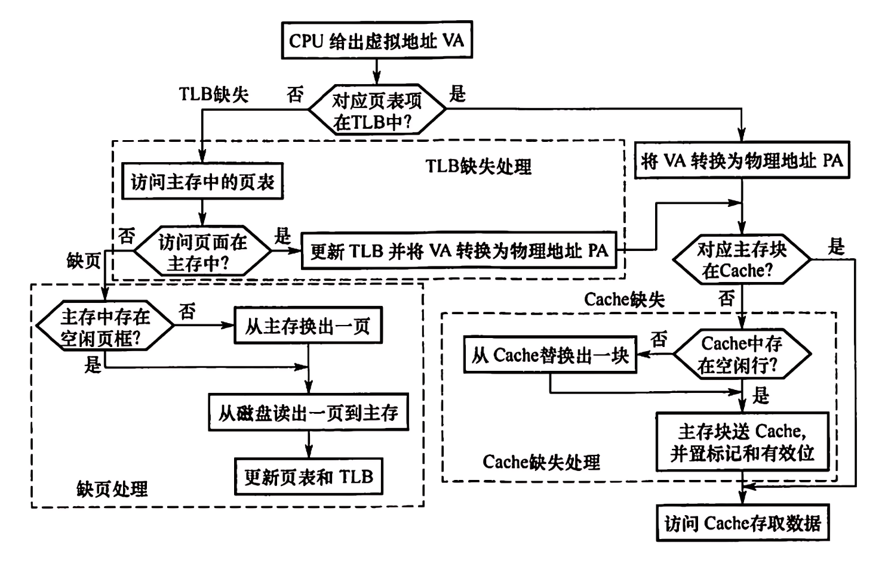

# 进程

# 1 概述

## 1.1 背景

### 1.1.1 操作系统的背景

>操作系统最初的原型是一种**批处理系统**（batch），操作员将所有的任务放在一起，由批处理系统进行读取并交给计算机执行，当一个任务执行完成以后，批处理系统会自动地取出下一个任务。在批处理系统中，存在的最严重的问题是任务执行的过程，会经常需要等待IO操作，这会导致CPU经常性地空闲。 
>
>另一种解决方案是引入**多道程序设计**，在内存当中划分多个区域，每个区域存储一个任务的指令和数据，当其中一个任务在等待IO操作时，另外一个任务可以使用CPU。
>
>除了希望充分利用CPU资源，程序员还希望自己的对计算机的操作能够得到迅速的响应，这种需求导致了分时系统的诞生。在**分时系统**中，操作系统会给每个任务分配一些时间来使用CPU，这样CPU就不会沉浸在一个 大型的任务中，期间的用户操作也会很快地得到响应。
>
><span style="color: red">而进程的概念是上述诸多操作系统能够正常运转的核心。</span>

### 1.1.2 进程存在的意义

>无论是`批处理系统`还是`多道程序设计`或者`分时操作系统`,  他们本质的思想就是把`任务/程序`并发执行，共享CPU和其他计算机资源。
>
>为了实现这种技术，操作系统将每个正在执行的程序`抽象为`一个进程，程序员在书写运行在操作系统上层的程序时，会把运行中的程序看成一个进程，认为**每个进程拥有自己独立的CPU和内存资源**(当然这种看起来的独占都是虚拟的)。
>
>而操作系统的作用就是合理分配和调度`真实、复杂`的底层硬件资源，为`进程`提供逻辑上的支持。这样作为上层程序开发者, 我们只需要认为每个进程拥有自己独立的CPU和内存资源即可,  而操作系统负责基于这种设计逻辑去合理的调度和分配复杂的底层硬件资源。

### 1.1.3 进程的定义

>**从用户的角度来看，进程是一个程序的`动态执行`过程。是一个把静态程序文件加载进内存、分配资源、执行、调度和消亡的过程。**
>
>**从操作系统的角度来看，进程是`资源分配的基本单位`。**进程需要占用`CPU资源`以执行程序指令；而除了需要占用`CPU资源`以外，进程还需要占据`存储资源`来保存状态。进程需要保存的内容包括`数据段、代码段、堆、栈`以及`其他内存空间`，进程也需要占用资源管理打开的文件、挂起的信号、内核内部数据、处理器状态、存在内存映射的内存空间以及执行线程，而执行线程的信息则包含程序计数器、栈和寄存器状态。
>
>综上所述，所谓进程，就是处于执行期的程序和相关资源的总称。故即便通过同一份静态程序， 也可以启动多个不同的进程。
>
>```c
>代码段：这部分内存存储了进程要执行的编译后的代码。
>数据段：数据段存储了程序的全局变量和静态变量。
>堆（Heap）：堆是用于动态内存分配的内存区域。
>栈（Stack）：栈用于存储函数调用时的临时数据，如参数、返回地址和局部变量。
>```
>
>

## 1.2 虚拟资源

### 1.2.1 虚拟CPU

#### 1.2.1.1 进程状态

>在了解进程调度机制之前, 先谈进程最基本的三种的状态是`执行态`、`就绪态`、`阻塞态 `     (理论上: 408)
>
>- 执行态：该进程正在运行，即进程正在占用CPU。
>- 就绪态：进程已经具备执行的一切条件，正在等待分配CPU的处理时间片。 (就绪队列)
>- 等待态：进程不能使用CPU，通常由于等待IO操作、信号量或者其他操作。
>
>
>
>ps: 除了最基本的上面3种状态以外，使用ps命令还可以观察到一些更细致划分的状态

#### 1.2.1.2 Linux进程调度

>利用进程机制，所有的现代操作系统都支持在同一个`时间段`来完成多个任务。尽管某个时刻，真实的CPU只能运行一个进程，但是从进程自己的角度来看，它会认为自己在独享CPU(即虚拟CPU)，而从用户的角度来看多个进程在一段时间内是同时执行的，即并发执行。在实际的实现中，操作系统会使用调度器来分配CPU资源。调度器会根据策略和优先级来给各个进程一定的时间来占用CPU，进程占用CPU时间的基本单位称为时间片，当进程不应该使用CPU资源时，调度器会抢占CPU的控制权，然后快速地切换CPU的使用进程。这种切换对于用户程序的设计毫无影响，可以认为是透明的。由于切换进程消耗的时间和每个进程实际执行的时间片是在非常小的，以至于用户无法分辨，所以在用户看起来，多个进程是在同时运行的。
>
>```C
>并发: 在某一段时间内, 多个进程同时运行。
>并行: 在某一时刻, 多个进程同时运行。
>```
>
>ps:了解: `理论上`的一些常见`通用`调度算法
>
>```C
>// 先来先服务/FCFS/First-Come First-Served：
>    	按照进程到达就绪队列的顺序进行调度。
>// 轮转调度/RR/Round Robin：
>    	属于时间分片/time-slicing调度算法，所有就绪状态的进程被组织在一个循环队列中，为每个进程分配一个固定时间段，按顺序轮流使用CPU一定时间。如果进程在其时间片结束时还没有完成，它将被放回队列的末尾。
>// 优先级调度/Priority Scheduling：
>        每个进程都被分配一个优先级，CPU首先分配给具有最高优先级的进程。优先级调度可以是抢占式的或非抢占式的。在抢占式优先级调度中，如果一个高优先级的进程变为就绪状态，它可以立即取代当前正在执行的低优先级进程。
>// 最短作业优先/SJF/Shortest Job First：
>        选择估计运行时间最短的进程并首先执行它。
>// 最短剩余时间优先/SRTF/hortest Remaining Time First：
>        这是最短作业优先的抢占式版本，选择剩余时间最短的进程来执行。
>// ...
>        
>ps: 需要注意的是: 现代`通用操作系统`使用的调度算法都是综合性的基于多种调度策略(而不是单一策略), 并且对此, 不同操作系统间存在诸多细节上的差异。
>```
>
>ps:闲聊: 多核心CPU
>
>```C
>多核心CPU能够实现真正的并行处理。和单核心CPU通过时间分片来模拟并行不同，单核心CPU在任意时刻实际上只能执行一个任务，但它通过快速在不同任务之间切换来给用户一种同时执行多任务的错觉。而多核心CPU每个核心可以独立执行不同的进程或线程，在多核心CPU中，如果有足够的并行任务/进程，每个核心可以独立工作，从而大大提高整体的处理能力和效率。
>    
>一般在现在操作系统中, 进程在CPU上切换, 要保存进程运行状态的上下文; 这包括进程的状态、程序计数器、CPU寄存器、内存管理信息、账户信息、I/O状态等信息, 我们称之为PCB/进程控制块; 每个进程都有自己的PCB，它在整个进程生命周期内存在，并在进程终止时被销毁。
>    
>操作系统的调度器会一起管理多核CPU的进程调度。这意味着操作系统负责决定哪个进程在哪个核心上运行，并在必要时在不同的核心之间迁移进程(即进程在一个核心上停止执行，并在另一个核心上继续执行)。在迁移时, 其PCB中的相关信息将被用来在新的核心上恢复进程的状态，以便进程可以从上次停止执行的地方继续执行。
>```
>
>ps:了解: 查看CPU相关信息
>
>```C
>// 命令
>cat /proc/cpuinfo
>```

>Linux内核存在一个专门用来调度进程的内核组件，称为`调度器`, 调度器的基本工作是从一组处于`可执行状态的进程`中选择一个来执行。
>
>和很多其他操作系统一样， Linux提供了`抢占式`的多任务模式。调度器会决定某个进程在什么时候停止运行，并且可以让另一个进程进入执行，我们称这个`进程在CPU上替换执行的行为`为`抢占`。
>
>一些常见发生`抢占CPU`的情况:
>
>- 时间片用尽：一个进程的时间片用完后 (使用时间片的调度策略)，调度器会选择另一个进程运行。
>- 更高优先级的进程变为可运行状态：如果一个更高优先级的进程（特别是实时进程）变为可运行状态，它可以抢占当前较低优先级的运行进程。
>- 中断和系统调用：在处理中断或完成系统调用后，内核可能会重新评估当前运行的进程，并决定是否进行上下文切换。

**时间片轮转法**

>以传统的Unix操作系统为例, 其常采用的`时间片轮转法`。这种方法的大致流程是这样的：
>
>- 调度器它把所有的可运行的进程组织在一起，这个数据结构被称为就绪队列。
>- 通常调度器取一个固定时间作为调度周期(又称为调度延迟) ，当一个调度周期开始的时候，调度器会为就绪队列当中的每个进程分配`时间片`，每个进程能够获取的时间片长度和进程的优先级有关。
>- 正在执行的进程会在执行的过程逐渐消耗它的时间片，当时间片耗尽时，如果该进程依然处于运行状态，那么它就会被就绪队列中的下一个进程抢占,  并且被调度器重新放入就绪队列中,  并根据优先级分配新的时间片,  等待下次执行。
>- 同时,  如果在进程执行过程中，会出现等待IO操作的情况(即使分配的时间片未用尽);  此时，进程就会被放入等待/阻塞队列，并且将自己的状态调整为等待/阻塞状态,   当进程被从等待状态唤醒时，调度器会根据优先级分配时间片，再将其插入到就绪队列当中。
>- 而当一个进程运行终止时，进程也会从就绪队列中移除。

**Linux的调度策略: 显示现在的Linux怎么调度进程**

>而Linux操作系统采用了多种进程调度策略，用以适应不同的使用场景和需求，而每个进程都有一个`关联的调度策略`和`调度优先级`(这个调度策略在task_struct中, 并且可以被修改)。主要的进程调度策略包括：
>
>- <u>完全公平调度器/Completely Fair Scheduler/CFS/又称普通调度策略/SCHED_OTHER</u>: Linux默认的调度策略, 适用于操作系统中的大部分无特殊要求的任务 (Eg: 如用户界面、文档编辑、互联网浏览等、不需要严格时间约束的后台任务和系统服务...)
>
>- <u>实时调度策略/Real-time Scheduling Policies</u>: 又分为先到先服务/FIFO，轮转调度/Round Robin/RR,  适用于对响应时间有严格要求和约束、需要快速响应的任务 (Eg: 硬件控制、实时数据处理... )
>- ... ( man sched )
>
>ps1: 在Linux中,  `实时调度`策略的进程通常有比`CFS/完全公平策略`下的进程更高的执行优先级。
>
>```C
>Eg: 以ubuntu为例, 它拥有140个优先级别, 范围为[-40, 99], 其中-40代表最高优先级。
>   其中[-40, 59]这100个优先级,是分配给`实时调度策略/FIFO、RR`的优先级。
>   其他[60, 99]这40个优先级,是为非实时策略进程保留的(我们可以认为是为CFS策略/OTHER保留)。
>// 可通过ps -elf命令查看进程优先级: PRI。
>// 在Linux中(以单核心CPU为例), 只有实时调度策略进程在非就绪态和非执行态, 才能使非实时策略进程占用CPU运行, 否则实时调度策略进程讲一直占用CPU。
>```
>
>ps2: CFS/完全公平调度算法
>
>```C
>// CFS虽然在概念上和时间片轮转法有很多区别，但是大致表现基本一致。
>CFS不使用固定的时间片。相反，它给每个进程分配一个称为“虚拟运行时间”的值，这表示进程的相对运行时间。
>CFS使用红黑树来跟踪所有可运行的进程。这棵树按照进程的“虚拟运行时间”来组织，允许CFS快速选择下一个应该运行的进程（即“虚拟运行时间”最小的进程）。
>CFS会动态地调整每个进程的时间片长度。比如交互式进程/前端应用程序会比批处理进程/比如后台任务获得更短的时间片。
>CFS给长时间睡眠的进程更优先的调度，这意味着当一个进程从等待事件（如用户输入或文件I/O）中醒来时，它的“虚拟运行时间”会比较低，因此更可能被快速调度。
>CFS还负责在多核心CPU系统中的负载平衡(不完美,会产生对特定CPU核心的偏好)，确保CPU核心之间的工作负载均匀分配。
>```
>
>ps3: 实时调度策略
>
>```C
>FIFO:
>// SCHED_FIFO没有时间片的概念。当一个SCHED_FIFO进程开始运行时，它将一直运行，直到它自愿放弃CPU或者被更高优先级的进程抢占。
>// 如果CPU正在运行一个FIFO策略的进程, 当一个具有更高优先级的FIFO策略进程进入就绪态, 会立即抢占当前CPU, 这意味着在所有可运行的进程中，最高优先级的进程总是首先运行。
>// 注意: '先来先执行'体现在FIFO中在同一优先级内的进程调度上, 假设有一批相同优先级的FIFO策略进程进入就绪态, 进程按照先来先执行进行就绪队列组织。(其实, 系统底层对不同优先级别, 进行了分别的队列维护, 每个优先级有其对应的队列)
>
>RR
>// SCHED_RR引入了时间片的概念,并且相同优先级的进程会分配相同的时间片，一个SCHED_RR策略的进程它在运行的过程中, 一旦时间片用尽, 它会被放回队列的末尾，等待下一个轮次。
>// SCHED_RR仅仅是在SCHED_FIFO的基础上, 允许同一优先级的进程通过时间片轮转来使用CPU。它依然维持了实时调度的核心特征, 依旧存在高优先级就绪抢占低优先级,以及高优先级先执行进程的问题
>   
>实时进程并不在CFS使用的红黑树上排队(和CFS以及红黑树无关)，而是根据它们的实时调度策略和优先级在不同的队列中管理。这确保了实时进程能够得到及时的响应，符合实时系统的要求。
>```
>
>ps4: 进程默认的优先级别
>
>```C
>需要注意的是, 我们日常启用进程(没有主动做优先级更改操作),默认的调度原则是遵循普通调度策略CFS。
>而CFS策略, 占用的优先级别为[60, 99]。
>而Linux定义了, 以普通调度策略的优先级排列的'中间位置'为基准做优先级控制; 也就是我们日常创建/操作/接触到的进程的'默认优先级是80'。
>```
>
>ps5: nice值调整
>
>```C
>普通调度策略优先级的调整是依赖于nice值的。 nice值可以用来调整优先级，其范围为-20～19。其中正数表示降低权限，负数表示提升权限。 
>Eg: 假设一个进程为普通调度策略进程, 那么它最开始应该具有的的默认优先级是80, nice值为0, 如果在程序运行的时候, 我们希望这个以更高优先级运行, 我们可以调整nice值,  比如: 我们通过命令设置这个进程的nice值为-20, 那么这个进程的优先级-20 + 80 = 60, 变为了60, 该进程的执行优先级变高了。 (优先级值越小, 优先级级别越高)  
>// 可通过ps -elf命令查看进程nice值: NI。
>// 需要注意的是, nice值只是进程'虚拟运行时间'的一个初始和辅助参考, 虚拟运行时间会随着进程的运行而发生变化, 整体的趋势是高权重/即低nice，它的虚拟运行时间在运行过程中增加的慢;  低权重/即高nice，它的虚拟运行时间在运行过程中增加的块;  
>```
>
>ps6: 一些命令: 了解
>
>```C
>// 启动新进程时设置初始nice值:  
>//	Eg: 以nice值10启动a程序
>		nice -n 10 ./a
>
>// 修改已经运行的进程的nice值。
>//	Eg: 将PID为1234的进程的nice值设置为10
>       renice 10 -p 1234
>           
>注意, 普通用户只能增加自己进程的nice值，root用户才有降低的能力。
>```

### 1.2.2 虚拟内存

>**和虚拟CPU一样, 每个进程不仅从逻辑上独占CPU,  每个进程还从逻辑上还独占一片里连续的内存空间(当然是虚拟的), 我们称为为`虚拟内存`。**
>
>虚拟内存通过虚拟映射的方式(`按照某种关系把虚拟地址和物理地址相互映射`), 从逻辑上为每个进程提供了一个地址连续的、独立使用的内存空间,   这解决了计算实际内存具有大小局限性的问题(`如果虚拟地址经过转化之后在真实内存中未命中, 则需要空闲页框加载磁盘数据, 或者当前内存已满/无空闲页框, 则进行页的置换`, `这样, 借用硬盘空间作为额外的容器, 以及内存的置换能力,打破了真实内存的限制, 拓展了逻辑上内存的大小`);  于此同时`虚拟内存机制`为每个进程提供了一个独立的地址空间(虚拟的)，从而逻辑上隔离了不同进程的内存空间。这样，进程间的内存隔离和解耦，增加了操作系统的稳定性和安全性。
>
>ps: 拓展仅了解:  虚拟内存的大小
>
>```C
>// 从理论逻辑上, 32位系统中，每个进程的虚拟内存空间可以达到4GB(2^32字节)(在32位系统中，CPU的地址总线是32位的，这意味着它可以寻址的内存空间是2^32，即4GB); 
>// 而64位系统, 理论上可以达到2^64字节>一千六百万TB。(但是实际上这都要取决于操作系统的设置: ulimit -a)
>```
>
>
>
>ps: 拓展仅了解:  怎么通过虚拟内存访问实际物理空间
>
>```C
>// 操作系统在内存上为每个进程维护一个页表，该表包含了虚拟页到物理页框的映射信息。除此之外, CPU内部还维护了一个TLB缓存, 是一个把虚拟地址映射物理地址的高速缓存。
>
>// 当进程试图访问一个虚拟地址时，首先检查该地址的映射是否已经在TLB中。如果TLB存在,则将虚拟地址转化为物理地址访问对应的内存单元; 如果TLB中没有找到映射(即 TLB缺失)，内存管理会去内存页表中查找该虚拟地址对应的物理地址, 然后根据物理地址访问对应的内存单元, 并且，这个页表中的映射也会被加载到TLB中以加速未来的查找。
>
>// 需要注意的是当获得物理地址访问对应物理单元时候, 优先访问Cache查找数据, 如果Cache中存在则命中; 如果Cache不存在,则从内存中加载到Cache中; 如果内存中都没有该数据, 则需要去磁盘加载数据到内存中, 再从内存加载到Cache中, 继续访问。
>```
>
>

#### 1.2.2.1 进程模式

>在操作系统中，进程通常分为`用户态/用户模式进程`和`内核态/内核模式进程`。
>
>**用户模式:**
>
>- 当进程运行在用户模式下时，它执行的是应用程序代码。
>- 在用户模式下，进程没有直接访问硬件资源的权限，也不能直接执行任何可能会影响系统整体稳定性的操作。如果需要进行这些操作(如读写文件、请求更多内存等)，进程必须通过系统调用/System call向操作系统请求服务，此时它会从用户模式切换到内核模式。
>
>**内核模式:**
>
>- 当进程运行在内核模式下时，它执行的是操作系统内核的代码。
>- 在内核模式下，进程有权限执行任何CPU指令和访问系统的任何内存地址。这是因为它现在是操作系统的一部分，正在执行系统任务(比如处理系统调用或管理硬件设备)。
>- 一旦内核模式下的操作完成，进程会切换回用户模式，继续执行用户级的应用代码。
>
>同一个进程在其生命周期中可能会在用户模式和内核模式之间切换多次。这通常发生在进程进行系统调用时, 需要操作系统介入处理。这个机制确保了操作系统的安全性和稳定性，因为用户应用不能直接执行可能会影响系统整体运行的操作。同时，它也保证了用户应用的运行环境相对简单和安全，因为这些应用无法直接访问敏感的资源或执行关键的系统操作。

#### 1.2.2.2 用户态空间和内核态空间

>当一个新进程被创建时，操作系统会为其分配用户态空间和内核态空间
>
>````c
>用户态空间分配：
>// 当创建一个进程时，操作系统分配给它一个独立的虚拟地址空间。这个空间是隔离的，意味着一个进程不能直接访问另一个进程的内存。用户态空间包含了程序的代码（文本段）、数据段（全局变量等）、堆（动态分配的内存）、和栈（函数调用时使用的）。
>// 操作系统根据可执行文件来设置进程的内存映像，将程序的代码和数据加载到用户态空间的适当区域。
>// ...
>内核态空间分配：
>// 每个进程都有一个PCB，它包含进程状态、程序计数器、CPU寄存器、内存管理信息、账户信息、I/O状态信息等。PCB位于内核空间。
>// 每个进程在内核态也有自己的栈，用于处理系统调用、中断和异常。更重要的是当进程进入内核态时（例如，执行系统调用函数需要保存函数参数/局部变量等等,  以及进程和线程切换也会用于保存CPU状态/程序计数器/寄存器内容等信息），会使用这个栈。
>// 当进程创建时，操作系统也会为其在内核态空间中创建文件描述符表，用于管理进程打开的文件和其他资源。
>// ...
>````
>
>- 操作系统使用内存保护机制来确保进程只能访问自己的用户态空间，防止一个进程访问或修改另一个进程的数据，或直接访问内核空间。
>- 在内核态，进程拥有执行低级(底层OR硬件操作)操作的权限。操作系统确保进程只在需要时进入内核态，并在完成后返回用户态，以防止潜在的安全风险。
>
>

#### 1.2.2.3 PCB块:了解

>进程控制块/PCB/Process Control Block,  是操作系统中用于存储`有关进程信息`的数据结构。每个进程在操作系统中都有一个对应的PCB，它包含了操作系统需要管理和调度该进程所必需的所有信息。PCB是操作系统进行进程管理的关键，它使得进程可以被挂起(暂停执行)，以后再恢复(继续执行)，而且确保进程的执行状态可以被正确地保存和恢复。
>
>PCB通常包含以下类型的信息： (有兴趣记一记, 了解)
>
>```C
>// 进程标识符PID：每个进程都有一个唯一的标识符，用于区分不同的进程。
>// 进程状态：指示进程当前的状态，如就绪(Ready)、运行(Running)、等待(Waiting)或终止(Terminated)等。
>// 程序计数器PC指针：存储下一条要执行的指令的地址。当进程从中断或等待状态恢复时，PC帮助恢复执行。
>// CPU寄存器：包括累加器、索引寄存器、栈指针和通用寄存器等。这些寄存器的值在进程切换时需要保存和恢复。
>// CPU调度信息：包括进程优先级、调度队列指针和其他调度参数，这些信息用于进程调度决策。
>// 内存管理信息：包括指向进程页表或段表的指针、基址、限制寄存器值等，这些信息用于定义进程的虚拟地址空间。
>// 会计信息：包括CPU使用时间、实际使用时间、时间限制、账户ID、作业或进程组ID等，用于监控和统计。
>// I/O状态信息：包括分配给进程的I/O设备列表、打开文件列表等，这些信息用于管理进程的I/O操作。
>// 进程控制信息：包括进程间通信机制、信号和信号处理程序、进程的退出状态码等信息。
>```
>
>PCB的具体内容和结构可能因不同的操作系统而异，但其核心功能是为了使操作系统能够有效地管理和调度进程。在进程创建时，操作系统会为其分配一个PCB，并在进程生命周期中维护这个PCB。在进程结束时，其PCB会被回收利用。通过PCB，操作系统可以保持跟踪所有进程的状态，并在需要时进行上下文切换，确保系统的协调运行。

#### 1.2.2.4 task_struct

>在Linux操作系统中，`task_struct`是一个结构体，它实现了`进程控制块(PCB)`的功能，是Linux内核中关于`PCB的具体实现`(在其他操作系统中，进程的信息结构可能不叫`task_struct`可能以不同的形式和名称存在，但概念以及其核心目的和功能是一致的：保存和管理操作系统需要的进程信息)。`task_struct`包含了Linux需要维护的关于进程的几乎所有信息，如进程状态、程序计数器、CPU寄存器、优先级、信号、内存地址等。这样，`task_struct`使得Linux内核能够跟踪所有进程的状态，并在进行进程调度时进行必要的上下文切换。
>
>```C
>// task_struct的主要内容：
>// 进程状态：比如可运行、不可运行、停止等。
>// 程序计数器：即下一条要执行的指令的地址。
>// 进程标识符：比如PID（进程ID）、PPID（父进程ID）等。
>// 进程调度信息：比如调度策略、优先级等。
>// 内存管理信息：比如页表指针、虚拟内存区域等。
>// 文件系统信息：比如文件描述符数组、当前工作目录等。
>// 信号处理信息：比如信号处理函数、信号掩码等。
>// CPU-specific context：用于上下文切换时保存和恢复CPU寄存器的信息。
>// 链接信息：比如指向父进程、子进程、同一进程组进程的指针。
>```

仅在此举例: 不用做该操作

>`task_struct`结构体的定义位于Linux内核源代码中。
>
>```c
>// 如果你还没有安装Linux内核源代码，可以通过Ubuntu的软件包管理系统安装。
>sudo apt-get install linux-source
>
>// 内核源代码通常安装在`/usr/src`目录下。找到压缩包, 解压源代码
>sudo tar xvf linux-source-*.tar.bz2
>
>// 找到解压后的 include/linux/sched.h 文件
>
>// 查找task_struct结构体
>```
>
>

# 2 Linux进程

## 2.1 进程信息

### 2.1.1 ps命令

> **我们可以通过`ps`命令在Linux系统中用于显示系统中所有进程的信息。同时ps命令的选项很多、功能很复杂(参考 man ps)，不过工作中使用最多的是两种：`ps -elf`和 `ps aux`**

>在`UNIX System V` 引入了： `ps -elf `   (  -l: 以长格式显示; -f: 完整格式;    -e:列出所有进程 )
>
>
>
> ```C
>F (标志): 显示进程的标志，这些标志是内核用于处理进程的不同属性的。
>S (状态): 显示进程的状态。常见状态包括 R/运行中, S/睡眠中, D/不可中断的睡眠状态, Z/僵尸进程, T/停止或被跟踪, I/空闲进程(不活跃进程: I约等于Z).
>UID (用户ID): 显示启动进程的用户的用户ID。
>PID (进程ID): 显示进程的ID。
>PPID (父进程ID): 显示创建当前进程的父进程的ID。
>C (CPU使用率): 显示进程占用的CPU使用率的近似值。
>PRI (优先级): 显示进程的优先级。
>NI (nice值): 显示进程的nice值，这是一个影响进程调度优先级的值。
>ADDR (地址): 显示进程的内存地址。
>SZ (大小): 显示进程使用的内存大小。
>WCHAN (等待通道): 如果进程是睡眠的，这里显示进程等待的资源。
>STIME (开始时间): 显示进程开始的时间。
>TTY (终端): 显示进程绑定的终端设备。
>TIME (CPU时间): 显示进程使用的CPU时间总计。
>CMD (命令): 显示启动进程的命令名或命令行。
> ```

>在`UNIX BSD` 引入了： `ps -aux `    (  a: 显示所有进程;   u:以用户为中心的格式显示进程信息;    x:显示没有控制终端的进程 )
>
>
>
>```C
>USER: 进程的所有者
>PID: 进程ID
>%CPU: 进程占用的CPU百分比
>%MEM: 进程占用的内存百分比
>VSZ: 进程使用的虚拟内存量（KB）
>RSS: 进程占用的固定内存量（KB）（常驻集大小）
>TTY: 进程的终端类型
>STAT: 进程的状态 (附加值Eg: <高优先级进程 s进程是会话领导  l多线程  +位于后台的进程组...)
>START: 进程的启动时间
>TIME: 进程占用CPU的时间
>COMMAND: 启动进程的命令
>```

### 2.1.2 free命令

>使用`free`命令也可以查看系统的内存占用信息
>
>
>
>```C
>Men内存: 
>// Total: 显示系统的总内存。
>// Used: 显示已使用的内存量。
>// Free: 显示未使用的内存量。
>// Shared: 临时文件存储系统使用的内存。
>// Buff/Cache: 用作缓存的内存量。(用于缓存文件系统的数据，以便加快数据访问速度)
>// Available: 对于系统还能使用多少内存的一个粗略估计(在基本不影响现有运行应用程序的情况下)。
>    
>Swap交换空间内存:(注意交换空间主要用于存储因为内存不足/不活跃等, 而被暂时移出物理内存的数据; 而不是用于直接从磁盘加载新的数据, 磁盘加载新的数据一般直接加载到内存中)
>// Total: 总的交换空间大小。
>// Used: 已使用的交换空间大小。
>// Free: 未使用的交换空间大小。
>```

### 2.1.3 top命令

>`top`命令用以`动态显示`显示系统`运行进程`的信息。
>
>
>
>```C
>// top: 系统情况
>	当前时间、系统运行时间、当前登录用户数、 系统负载/loadaverage(过去1分钟、5分钟和15分钟的平均值)
>    (一般对于单个cpu来说，负载在0～1.00之间是正常的，超过1.00 须引起注意。在多核cpu中，系统平均负载不应该高于cpu核心的总数)
>
>// Tasks: 任务情况
>	显示系统中的进程总数、运行进程数、睡眠进程数、停止的进程数、僵尸进程数。
>
>// %CPU: CPU使用情况
>    us (user): 用户态运行占用的CPU百分比。
>    sy (system): 内核态运行占用的CPU百分比。
>    ni (nice): 改变优先级的进程占用的CPU百分比。
>    id (idle): 空闲的CPU百分比。
>    wa (iowait): 等待输入/输出完成的时间百分比。
>    hi (hardware irq): 硬件中断的时间百分比。
>    si (software irq): 软件中断的时间百分比。
>    st (steal time): 虚拟环境中其他操作系统占用的时间百分比。
>
>// 第四行.第五行: 等价于free命令  
>        
>// 进程列表部分：
>PID: 进程的唯一标识号。
>USER: 运行进程的用户。
>PR: 进程的优先级。
>NI: 进程的nice值，这是一个影响进程调度优先级的值。
>VIRT: 进程使用的虚拟内存总量，包括所有的可执行文件、数据和库。
>RES: 进程使用的、未被换出的物理内存大小。
>SHR: 共享内存的大小，这部分内存可能被多个进程共享。
>S: 进程的状态。
>%CPU: 一个动态更新频率时间段内, 进程占用的CPU时间百分比。
>%MEM: 进程使用的物理内存百分比。
>TIME+: 进程自启动以来占用的总CPU时间。
>COMMAND: 启动进程的命令名称或命令行。
>```

### 2.1.4 PID

>为了方便普通用户定位每个进程，操作系统为每个进程分配了一个唯一的正整数标识符，称为进程***ID***（ ***PID***） 。在Linux中，进程之间存在着亲缘关系，如果一个进程在执行过程中启动了另外一个进程，那么启动者就是父进程，被启动者就是子进程。(实际上PID和PCB之间存在着一一对应关系; 甚至可以从task_struct中看到一个进程的PID和其父进程ID) 
>
>- 以`ps -l`命令结果为例，这里会出现两个进程，一个进程是shell，而另一个进程ps。通过PPID可知，ps的父进程 就是bash。
>- 使用系统调用`getpid()`和`getppid()`可以获取当前运行进程的进程ID和父进程ID。
>
>```C
>int main(int argc,char*argv[])
>{
>    printf("current pid: %d \n", getpid());
>    printf("current f-process pid: %d \n", getppid());
>    return 0;
>}
>```

>ps: 拓展: 仅了解
>
>```C
>// 当Linux启动的时候, 它会先执行BIOS程序, 固件级别的代码执，它负责初始化硬件并找到启动设备(Eg: 硬盘、USB等), 找到启动设备加载并执行Bootloader的代码
>// 运行Bootloader程序, 它也不是传统意义上的进程, 一段运行在操作系统之前的代码。任务是加载Linux内核
>// 一旦Bootloader将控制权交给内核，内核就开始初始化硬件设备，设置内存管理，创建和启动一些关键的内核线程和服务
>// 内核将启动第一个用户级进程，通常是init进程, 这个进程的PID通常是1。它负责启动系统上的所有其他进程和服务。init进程会读取系统配置(Eg: /etc/init.d/.. 、 /etc/rc2.d 、...)，初始化系统环境，并按顺序启动程序以使系统达到正常运行状态。
>
>Eg: 以Bash shell为例, init进程读取配置文件/etc/rc2.d中/etc/init.d/ssh, 在加载ssh程序; ssh程序加载Bash shell, 我们通过Bash shell启动的程序, 又是Bash shell的子进程
>```

### 2.1.5 KILL:重要

**kill命令**

>kill命令可以用来给指定的进程发送信号。
>
>- 通常用户经常会从终端启动shell再启动进程，当进程正在运行时，它可以接受一些键盘发送的信号：比如`ctrl+c`表示终止信号， `ctrl+z`表示暂停信号。这种可以直接接受键盘信号的状态被称为前台，否则称为后台。
>- 当进程处于后台的时候，只能通过kill命令发送信号 给它。
>
>```shell
># 显示所有信号
>$kill -l
>
># 以异常方式终止进程
>$kill -9 pid
>```
>
>- 使用shell启动进程的时候，如果在末尾加上`&符号`可以用来直接运行后台进程。
>- 使用`ctrl+z`可以暂停当前运行的前台进程，并将其放入后台。它也会输出一个任务编号到 屏幕上。
>
>```shell
>#它会输出一个整形数字，表示它的任务编号
>$vim ./01_test &
>```

>- ps: (仅拓展知道)  使用`jobs`命令可以查看和管理所有的后台任务，使用`fg`命令可以将后台进程拿到前台来。 使用`bg`命令可以将后台暂停的程序运行起来。

# 3 Linux进程操作

## 3.1 创建进程

### 3.1.1 system

>system函数用以执行shell命令,  可以通过system函数传入指定的命令创建一个新进程。 (man system)
>
>```C
>#include <stdlib.h>
>//execute a shell command
>int system(
>        const char *command // shell命令
>);
>```
>
>EgCode:
>
>```C
>#include <testfun.h>
>int main()
>{
>        system(" ./01_while "); // 执行./01_while程序
>        return 0;
>}
>```
>
>- 由于system函数创建进程的时间消耗是很大的，对于性能要求比较苛刻的任务来说，这种使用 system 的方式往往是不能被接受的。
>- system函数用以执行shell命令,  所以system函数还可以通过shell去调用其他编程语言程序。

### 3.1.2 fork: 非常重要

**fork函数**

>fork函数用于拷贝当前进程,  以创建一个新进程。 (man fork)
>
>```C
>#include <sys/types.h>
>#include <unistd.h>
>//create a child process
>pid_t fork(void);
>// 返回值: 0代表子进程, 正值代表子进程的PID, 负值表示fork调用失败
>```
>
>EgCode:
>
>```C
>#include <testfun.h>
>int main()
>{
>        pid_t pid = fork();
>        if(pid == 0){//0代表子进程
>            printf("i am child; pid = %d \n", getpid());
>        }else{// 非0代表父进程, 并且这个非零值代表子进程的PID
>            printf("i am mian; pid = %d, child pid = %d \n", getpid(), pid);
>            sleep(1);
>        }
>        return 0;
>}
>```

**内存复制**

>当调用fork函数，fork函数会创建一个和当前进程拥有着几乎一致的用户态地址空间,  作为新进程的地址空间。这意味着父进程在 fork函数调用时的内存布局(进程上下文、变量、堆栈、程序代码、等等等等)会被复制到子进程中。
>
>
>
>尽管子进程是父进程的副本，但某些属性和资源是根据定义或需要在子进程中进行修改的(主要是PCB)，以确保两个进程是独立的。
>
>- 进程标识符（PID）：子进程获得一个唯一的 PID，与父进程不同。
>- 父进程标识符（PPID）：子进程的 PPID 设置为创建它的父进程的 PID。
>- ...

**写时复制**

>为了减少数据复制的开销, 优化内存管理, fork采用是写时复制（Copy-On-Write，简称COW）的策略。
>
>- 在fork()执行时，操作系统并不立即复制父进程的整个内存空间给子进程。操作系统使父进程和子进程暂时共享相同的物理内存页。
>- 这些共享的页面在内存中被标记为只读。如果父进程或子进程尝试写入这些共享的页面(以页为单位)，操作系统会为发起写操作的进程（父进程或子进程）分配一个新的物理内存页, 并复制数据到这个页。
>
>写时复制机制确保只有在必要时才复制数据页，这极大地减少了内存使用和提高了效率。

**文件打开和fork**

>当使用fork()函数创建子进程**之前**我们打开了一个文件，fork时候子进程会拷贝父进程的文件描述符数组，文件描述符数组中存储的指向一个**文件表项**的指针。但是需要注意的是文件表项是操作系统维护的、可以多个进程程共享。这意味着父进程和子进程将共享打开的文件表项。
>
>而在这个**文件表项**中, 不仅维护了指向磁盘文件的inode指针, 还维护有文件读写位置的偏移量。这就意味着, 父子进程对同一个文件对象会共享读写位置。
>
>
>
>EgCode:
>
>```C
>int main()
>{
>    int fd = open("file_before", O_RDWR);
>    pid_t pid = fork();
>    if(pid == 0){
>        write(fd, "hello", 5);
>        sleep(1);
>        write(fd, "world", 5);
>    }else{
>        write(fd, "nothing", 7);
>        sleep(1);
>        write(fd, "happen", 6);
>    }
>    return 0;
>}
>```
>
>当使用fork()函数创建子进程**之后**, 父进程和子进程分别打开了一个文件，操作系统维护会创建两个不同的文件表项, 各自独立维护偏移量(即使底层的文件系统对象/inode是共享的)。
>
>这就意味着, 父子进程对同一个文件不会共享读写位置。
>
>
>
>EgCode:
>
>```C
>int main()
>{
>        pid_t pid = fork();
>        if(pid == 0){
>            int fd = open("file_after", O_RDWR);
>            write(fd, "hello", 5);
>            sleep(1);
>            write(fd, "world", 5);
>        }else{
>            int fd = open("file_after", O_RDWR);
>            write(fd, "nothing", 7);
>            sleep(1);
>            write(fd, "happen", 6);
>        }
>        return 0;
>}
>```

### 3.1.3 exec函数

>exec是一系列的系统调用。它们通常适用于在fork之后，用于在当前进程的上下文中加载并运行一个新的程序。
>
>- 当进程执行到exec系统调用的时候，它会将传入的指令来取代进程本身的代码段、 数据段、栈和堆，然后将PC指针重置为新的代码段的入口。 但进程的 PID 保持不变。 
>- exec 当中包括多个不同的函数，这些函数之间只是在传入参数上面有少许的区别。(man execl)
>
>```C
>int execl(const char *path, const char *arg0, ... /*, (char *)0 */);
>int execv(const char *path, char *const argv[]);
>...
>
>// path参数表示可执行文件路径
>// file参数表示可执行文件名字（file只能在PATH环境变量指定的目录下查找文件）
>// 函数名当中的l表示列表list的含义，它要求传入可变数量的参数，并且每个参数对应一个命令行参数，最后以0结尾
>// 函数名当中的v表示向量vector的含义，它要求传入一个指针数组，数组中的每个元素指向同一个字符串的不同位置
>    
>// 如果执行成功，它不会返回到原来的程序，因为原程序的执行内容已被新程序替换。如果有返回值意味着出现了错误，将返回-1，
>```
>
>EgCode:
>
>```C
>// 05_test.c
>int main(int argc,char*argv[])
>{
>    int num1 = atoi(argv[1]);
>    int num2 = atoi(argv[2]);
>    printf("sum : %d \n", num1+num2);
>
>    return 0;
>}
>```
>
>```C
>int main()
>{
>    if(fork() == 0){
>        execl("/home/snow/code/test/11_process/05_test", "./05_test", "1", "2",(char *)0);
>        //execl("./05_test", "./05_test", "1", "2", (char *)0);
>        //execl("05_test", "./05_test", "1", "2", (char *)0);
>    }else{
>        printf("main process \n");
>    }
>    return 0;
>}
>```
>
>```C
>int main()
>{
>    if(fork() == 0){
>        char * args[] = {"./05_test", "2", "3", (char *)0 };
>        
>        execv("/home/snow/code/test/11_process/05_test", args);
>        //execv("./05_test", args);
>        //execv("05_test", args);
>    }else{
>        printf("main process \n");
>    }
>    return 0;
>}
>```
>
>ps:了解: 实际上，system函数以及从bash或者是其他shell启动进程的本质就是fork+exec

## 3.2 退出进程

>在进程阶段，进程总共有5种终止方式，其中3种是正常终止，还有2种是异常终止：
>
>| 终止方式                       | 终止情况 |
>| ------------------------------ | -------- |
>| main函数中调用return           | 正常     |
>| 调用exit函数                   | 正常     |
>| 调用`_Exit`函数或者`_exit`函数 | 正常     |
>| 调用abort函数                  | 异常     |
>| 接收到引起进程终止的信号       | 异常     |

### 3.2.1 exit

>`_Exit`、`_exit` 和 `exit` 都是用于立即终止进程的函数，但它们在处理进程终止时的行为上有所不同：
>
>- 当调用 `_exit`和`_Exit`的时候，进程会直接终止返回内核，
>- 而exit函数则会首先执行终止处理程序，然后清理标准IO （就是把所有打开的流执行一次fclose ），最后再终止进程回到内核。
>
>
>
>```C
>#include <stdlib.h>
>void exit(int status);
>#include <stdlib.h>
>void _Exit(int status);	
>#include <unistd.h>
>void _exit(int status;
>```
>
>EgCode:
>
>```C
>#include <testfun.h>
>void func(){
>    //exit(EXIT_SUCCESS);
>    //_exit(EXIT_SUCCESS);
>    _Exit(EXIT_SUCCESS);
>}
>int main()
>{
>    printf(" 123 ");
>    func();
>    return 0;
>}
>```

### 3.2.2 信号退出

>当进程处于前台的时候，按下ctrl+c或者是ctrl+\可以给整个进程组发送键盘中断信号 SIGINT和SIGQUIT。

### 3.2.3 abort: 了解

>`abort()` 函数是一个标准库函数，用于异常终止当前进程。(`abort` 实际上是通过发送中止信号给当前进程来实现的。。)
>
>```C
>#include <testfun.h>
>int main()
>{
>    printf("1 \n");
>    abort();
>    printf("2 \n");
>    return 0;
>}
>```

## 3.3 进程控制

### 3.3.1 孤儿进程

>如果父进程先于子进程退出，则子进程成为孤儿进程，此时将自动被PID为1的进程收养,  PID为1的进程就成为了这个进程的父进程。当一个孤儿进程退出以后，它的资源清理会交给它的父进程来处理。
>
>EgCode: 配合`ps -elf`查看
>
>```C
>#include <testfun.h>
>int main()
>{
>        if(fork() == 0){
>            while(1){
>                sleep(1);
>            }
>        }else{
>        }
>        return 0;
>}
>```

### 3.3.2 僵尸进程

>如果子进程先退出，系统不会自动清理掉子进程的环境，而必须由父进程调用wait或waitpid函数来完成清理工作，如果父进程不做清理工作，则已经退出的子进程将成为僵尸进程(defunct)，在系统中如果存在的僵尸进程过多，将会影响系统的性能， 所以必须对僵尸进程进行处理。
>
>(当一个进程执行结束时，它会向它的父进程发送一个SIGCHLD/终止信号，从而父进程可以根据子进程的终止情况进行处理。在父进程处理之前，内核必须要在进程队列当中维持已经终止的子进程的PCB。如果僵尸进程过多，将会占据过多的内核态空间。并且僵尸进程的状态无法转换成其他任何进程状态。)
>
>EgCode: 配合`ps -elf`查看
>
>```C
>int main()
>{
>    if(fork() == 0){
>    }else{
>        while(1){
>        }
>    }
>    return 0;
>}
>```

### 3.3.3 wait

>wait函数的作用是等待一个已经退出的子进程，并进行清理回收子进程资源工作。
>
>-  wait 随机地等待一个已经退出的子进程，并返回该子进程的PID, 并给子进程进程资源清理和回收
>- wait是一个阻塞函数, wait会一直阻塞直到等到一个结束的子进程, 解除阻塞.(前提是有子进程)(没有子进程的时候, 直接返回-1)
>
>```C
>// man 2 wait
>
>#include <sys/types.h>
>#include <sys/wait.h>
>//wait for process to change state
>pid_t wait(
>    int *wstatus	
>);
>// 返回值, 成功返回子进程的ID, 失败返回-1
>```
>
>**wstatus**: 了解
>
>- 该参数是一个整型指针, 用来存储进程的退出状态。
>- 如果不关心进程的退出状态，那该参数可以是一个NULL。
>- 这个wstatus的整型内存区域中由两部分组成，其中一些位用来表示退出状态(当正常退出时)，而另外一些位用来指示发生异常时的信号编号。
>- 我们可以通过一些宏检查状态的情况。 (参考: man 2 wait)
>
>| 宏                   | 说明                                                         |
>| -------------------- | ------------------------------------------------------------ |
>| WIFEXITED(wstatus)   | 子进程正常退出的时候返回真，此时可以使用WEXITSTATUS(wstatus)，获取子进程的返回情况 |
>| WIFSIGNALED(wstatus) | 子进程异常退出的时候返回真，此时可以使用 WTERMSIG(wstatus)获取信号编号，可以使用 WCOREDUMP(wstatus)获取是否产生core文件 |
>| WIFSTOPPED(wstatus)  | 子进程暂停的时候返回真，此时可以使用WSTOPSIG(wstatus)获取信号编号 |
>| ...                  |                                                              |

>EgCode:
>
>```C
>#include <testfun.h>
>int main()
>{
>    if(fork() == 0){
>        printf("child process \n");
>        sleep(20);
>        return 100;
>    }else{
>        int status;
>        int s_pid = wait(&status);
>        printf("wait child: child pid=%d \n", s_pid);
>        if(WIFEXITED(status)){// 子进程正常退出
>            printf("child status: %d \n", WEXITSTATUS(status));
>        }else if(WIFSIGNALED(status)){//子进程信号退出
>            printf("child signed: %d \n", WTERMSIG(status));
>        }
>    }
>    return 0;
>}
>```

### 3.3.4 waitpid

>waitpid函数的作用是等待一个已经退出的子进程，并进行清理工作。
>
>-  waitpid 等待一个指定退出的子进程，并返回该子进程的PID
>- waitpid 是一个阻塞函数
>
>```C
>#include <sys/types.h>
>#include <sys/wait.h>
>// wait for process to change state
>pid_t waitpid(
>    pid_t pid,		// 指定等待的PID的子进程
>    int *wstatus,	// 存储进程的退出状态
>    int options		// 修改 waitpid 的行为的选项, 默认0
>);
>// 返回值:  返回值, 成功返回子进程的ID, 失败返回-1。
>// 返回值:  如果在options参数上使用WNOHANG选项，且没有子进程退出：返回0
>```
>
>**pid参数:**
>
>- pid参数可以控制支持更多种模式的等待方式。
>
>| PID数值 | 效果                         |
>| ------- | ---------------------------- |
>| < -1    | 等待进程PID和pid绝对值的进程 |
>| == -1   | 等待任一个子进程, 等价于wait |
>| == 0    | 等待同一进程组的任意子进程   |
>| > 0     | 等待指定PID的进程            |
>
>**options参数:**   
>
>- waitpid是阻塞函数，如果给waitpid 的options参数设置一个名为WNOHANG的宏，则系统调用会变成非阻塞模式。
>- 如果默认阻塞: 填0。

>EgCode:
>
>```C
>#include <testfun.h>
>int main()
>{
>    if(fork() == 0){
>        printf("child process \n");
>        sleep(20);
>        return 100;
>    }else{
>        int status;
>        //int s_pid = waitpid(-1, &status, WNOHANG);
>        int s_pid = waitpid(-1, &status, 0);
>        if(s_pid == 0){
>            printf("no child process end \n");
>        }else{
>            printf("wait child: child pid=%d \n", s_pid);
>            if(WIFEXITED(status)){
>                printf("child status: %d \n", WEXITSTATUS(status));
>            }else if(WIFSIGNALED(status)){
>                printf("child signed: %d \n", WTERMSIG(status));
>            }
>        }
>    }
>    return 0;
>}
>```

## 3.4 守护进程

### 3.4.1 用户组和权限

**进程的用户ID和组ID**

>进程在运行过程中必须具有用户身份，以便于内核进行进程的权限控制。在默认情况下，程序进程拥有启动用户的身份。
>
>- 假设当前登录用户为A，他运行了任意一个程序, 无论是不是他创建的，则程序在运行过程中就具有A的身份，该进程的用户ID和组ID分别为A和A所属的组，其ID和组ID就被称为进程的**真实用户ID**和**真实组ID**。
>- 真实用户ID和真实组ID可以通过函数getuid()和getgid()获得。
>
>```C
>#include <testfun.h>
>
>int main(int argc,char*argv[])
>{
>   printf("current process uid: %d \n", getuid());
>   printf("current process group uid: %d \n", getgid());
>   return 0;
>}
>```
>
>

**进程的有效用户ID和组ID**

>进程除了**真实用户ID**和**真实组ID**以外,    进程还具有**有效用户ID**和**有效组ID**的概念。
>
>- 当系统内核对进程的访问权限检查时，它检查的是进程的**有效用户ID和有效组ID**，而不是**真实用户ID和真实组ID**。
>- 默认情况 下，用户的有效用户ID和真实用户ID是相同的，有效组ID和真实组ID是相同的。
>- 有效用户ID和 有效组ID通过函数geteuid()和getegid()获得。
>
>```C
>#include <testfun.h>
>
>int main(int argc,char*argv[])
>{
>   printf("current effective process uid: %d \n", geteuid());
>   printf("current effective process group uid: %d \n", getegid());
>   return 0;
>}
>```

ps: 拓展

>1, 以`sudo`命令为例, 它的主要作用之一就是通过提升命令的有效用户ID, 来实现执行权限的提升。   
>
>2, 有效组ID是可以通过系统调用修改的。(存在安全隐患)

### 3.4.2 文件权限:拓展

>Linux文件权限中，除了基本的读/r、写/w、执行/x权限之外，还有几个特殊的权限位：SetUID、SetGID以及Sticky位。
>
>**SetUID**
>
>- SetUID权限使得该文件以文件所有者的身份运行，而不是执行文件的用户的身份。这是通过在文件的权限表示中为所有者的执行位添加一个's'来实现的。例如，如果一个可执行文件的权限是`-rwsr-xr-x`，那么不论谁运行这个文件，该文件都会以`文件所有者`的权限运行,  它的有效用户ID也会变为和文件所有者一致的用户身份。
>
>
>
>**SetGID**
>
>与SetUID类似，SetGID权限应用于文件时，使得文件以其所属组的权限运行。在文件权限表示中，这通过在组的执行位添加一个's'来实现，例如`-rwxr-sr-x`。
>
>

>ps: 拓展
>
>```C
>// 更改文件或目录的所有者和所属组
>sudo chown root:root 文件
>// 增加用户s权限
>sudo chmod u+s 文件
>```

### 3.4.3 进程组

>**进程组**是一个或多个进程的集合:
>
>- 每个进程除了是一个单独的进程，还归属于某一个进程组;  所以进程不仅有**进程ID**, 还有**进程组ID**。
>- 当使用shell创建进程的时候，除了这个进程被创建，这个进程将会创建一个进程组, 并作为进程组的组长。
>- 组长的PID就是进程组ID。  
>- **通过fork**创建一个子进程时，子进程默认和父进程属于同一个进程组。  
>- 只要进程组当中存在至少一个进程（这个进程即使不是组长），该进程组就存在。
>- getpgrp()函数获得**进程组ID。**
>
>EgCode:
>
>```C
>#include <testfun.h>
>int main(int argc,char*argv[])
>{
>    printf("test pid: %d;  group id: %d \n",getpid(), getpgrp());
>    return 0;
>}
>```
>
>```C
>#include <testfun.h>
>int main()
>{
>    if(fork() == 0){
>        sleep(1);
>        printf("child pid: %d; child group id: %d \n", getpid(), getpgrp());
>        execl("00_test", "./00_test", (char *)0);
>    }else{
>        printf("main pid: %d;  group id: %d \n",getpid(), getpgrp());
>        printf("main proceess over \n");
>    }
>    return 0;
>}
>```
>
>

**创建进程组 **:  让某一个进程脱离当前进程组

>setpgid(pid, pgid)函数, 允许一个进程改变自己或其他进程的进程组。 (man 2 setpgid)
>
>```C
>#include <sys/types.h>
>#include <unistd.h>
>//set  process group
>int setpgid(
>        pid_t pid, // 要改变进程组的目标进程, 如果0,表示当前进程
>        pid_t pgid // 新的进程组ID, 如果0,表示当前进程PID作为进程组ID
>);
>// 成功返回0, 失败返回-1
>```
>
>EgCode:
>
>```C
>int main(int argc,char*argv[])
>{
>        if(fork() == 0){
>            printf("child pid: %d; group id: %d \n", getpid(), getpgrp());
>            setpgid(0, 0);
>            printf("child pid: %d; group id: %d \n", getpid(), getpgrp());
>        }else{
>            printf("main pid: %d; group id: %d \n", getpid(), getpgrp());
>        }
>        return 0;
>}
>```

### 5.4.4 终端

>只是一个名词性的概念.
>
>终端是登录到Linux操作系统所需要的入口设备。终端可以是本地的，也可以是远程的。当操作系统启动的时候， init进程会创建子进程并使用exec来执行getty程序(管理虚拟控制台)，从而打开终端设备或者等待远程登录，然后再使用exec调用login程序验证用户名和密码。

### 5.4.5 会话

**会话特点**

>**会话**是指一个终端与操作系统之间的一系列交互操作或通信过程。每当用户打开一个新的终端窗口，就会创建一个新的会话。这个会话可以使用户完成从登录到注销的整个过程; 。在此期间，用户与系统的交互（如打开文件、运行程序、等等）都是会话的一部分。
>
>- 在一个会话中, 可以存在多个进程组。(会话也是一个或者多个进程组的集合)
>- 和控制终端建立连接的会话首进程被称为控制进程。
>- 一个会话存在**最多一个前台进程组**和**多个后台进程组**。
>- 从终端输入的中断，会将信号发送到前台进程组所有进程。
>- **终端断开连接，挂断信号会发送给控制进程, 随着控制进程结束, 正常情况下前台进程组和后台进程组也都会结束。**
>
>```C
>int main(int argc,char*argv[])
>{
>    while(1){
>        sleep(1);
>    }
>    return 0;
>}
>```
>
>

**会话ID**

>每个会话都有会话ID, 基本上会话ID都是最初创建会话的进程的PID。 (man setsid)(man getsid)
>
>- 可以使用getsid函数可以获取进程的会话ID。
>- 一个进程可以使用系统调用**setsid新建一个会话。 该进程成为新会话的第一个进程/会话领导。**
>- 注意: 用来调用setsid创建会话的进程,  不能是进程组组长。
>- 创建新会话以后，即使原来的shell被关闭了，子进程创建的新会话依然不受影响/不会关闭。
>
>```C
>#include <sys/types.h>
>#include <unistd.h>
>// get session ID
>pid_t getsid(
>    pid_t pid	// 要查询会话ID的进程pid, 0代表当前进程
>);
>// 返回值: 成功返回会话ID, 失败-1
>```
>
>```C
>#include <sys/types.h>
>#include <unistd.h>
>// creates a session and sets the process group ID
>pid_t setsid(void);
>// 返回值: 成功返回新会话的ID, 失败-1
>```

>EgCode:
>
>```C
>#include <testfun.h>
>int main(int argc,char*argv[])
>{
>    if(fork() == 0){
>        printf("child session id: %d \n", getsid(0));
>        int res = setsid();
>        ERROR_CHECK(res, -1, "setsid");
>        printf("new session id: %d \n", getsid(0));
>        while(1){
>            sleep(1);
>        }
>    }else{
>        printf("main session id: %d \n", getsid(0));
>    }
>    return 0;
>}
>```

### 5.4.6 守护进程

>**守护进程**Linux操作系统中运行在后台的一种特殊进程，用于执行特定的系统或应用程序任务。与用户交互式进程不同的是它与终端无关，经常长时间持续性运行(直到系统关闭)，而非与用户会话相绑定。(Eg: 日志记录、系统监控、调度任务、邮件服务、**服务器程序**....)
>
>**守护进程的创建流程**
>
>- 父进程创建子进程，然后让父进程终止。
>- 在子进程当中创建新会话。
>- 修改当前工作目录为根目录。(因为如果使用当前目录, 意味着当前目录活跃, 则当前目录无法在文件系统中卸载; 而根目录所在的文件系统正常来讲是一直挂载的)
>- 重设文件权限掩码为0，避免创建文件的权限受限。
>- 关闭不需要的文件描述符，比如0、1、2。

>EgCode:
>
>```C
>int main(int argc,char*argv[])
>{
>        if(fork() == 0){
>            setsid();
>            chdir("/");
>            umask(0);
>            for(int i = 0; i < 1024; i++){
>                close(i);
>            }
>            while(1){
>                sleep(1);
>            }
>        }
>        return 0;
>}
>```

### 5.4.7 日志

>使用守护进程经常可以用记录日志,  `syslog函数` 在Linux中可以用于发送消息到系统日志。(操作系统的日志文件存储在/var/log/...中)  (man 3 syslog)
>
>```C
>#include <syslog.h>
>//send messages to the system logger
>void syslog(
>        int priority, // 日志级别的组合值: LOG_ERR、LOG_WARNING、LOG_INFO、LOG_DEBUG 等
>        const char *format, // 格式字符串
>        ...	// 格式字符串对应的变量参数列表
>);
>```

>EgCode:
>
>```C
>int main(int argc,char*argv[])
>{
>    int flag = 0;
>    
>   if(fork() == 0){
>       setsid();
>       chdir("/");
>       umask(0);
>       for(int i = 0; i < 64; i++){
>           close(i);
>       }
>       while(1){
>           sleep(1);
>
>           // 获取当前时间
>           time_t now = time(NULL);
>           // 讲time_t转化为tm
>           struct tm *local = localtime(&now);
>           //获得时间
>           int year = local->tm_year+1900;
>           int month = local->tm_mon+1;
>           int day = local->tm_mday;
>           int hour = local->tm_hour;
>           int min = local->tm_min;
>           int second = local->tm_sec;
>
>           // 日志打印
>           if(flag == 0)
>           syslog(LOG_INFO, "%d-%02d-%02d %02d:%02d:%02d \n", year, month, day, hour, min, second);
>       }
>   }
>   return 0;
>}
>```