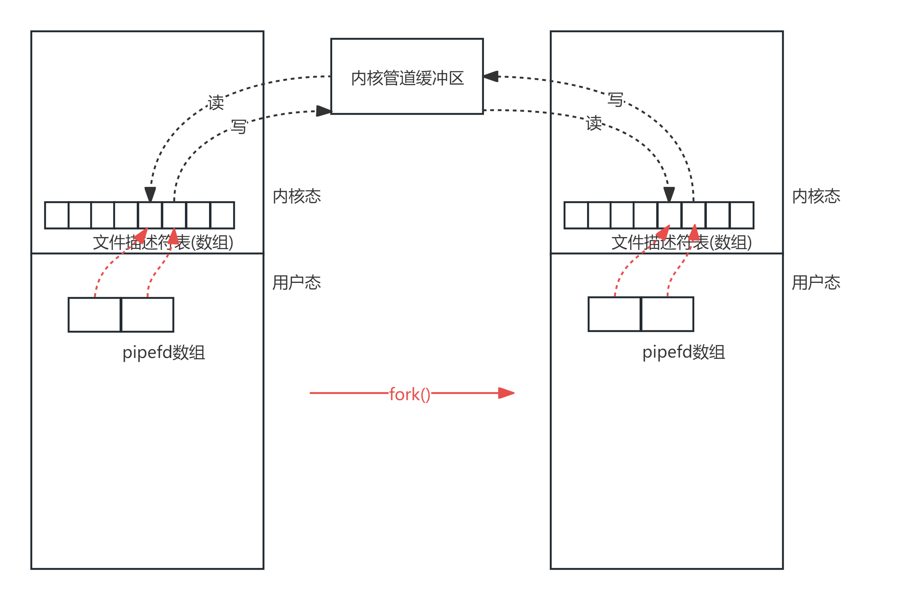

# 进程间通信

>虚拟CPU和虚拟内存的引入保证了进程的一个重要特性就是隔离，一个进程在执行过程中逻辑上总是认为自己占用了所有的CPU和内存，但是实际在底层，操作系统和硬件完成了很多工作才实现了隔离的特性(比如内核和时钟设备配合实现进程调度)。在多个进程之间，如果需要进行通信的话，隔离特性会造成一些通信的障碍。所以我们需要一些手段来跨越隔离，实现进程间通信(InterProcess Communication，IPC)。

# 1, 管道

>一种最自然的通信方式就是依赖文件系统， 一个进程打开文件并读写信息，另一个进程也可以打开文件来获取信息。显然，这种通信方式要依赖磁盘文件，效率十分低下。
>
>为了提升效率， **有名管道**（named pipe，FIFO）就被设计出来了，有名管道是文件系统中一种专门用来读写的文件，但是通过有名管道进行通信的时候实际上并没有经过磁盘，而是经过内核的管道缓冲区进行数据传递。
>
>如果对于拥有**亲缘关系**的进程而言，它们之间可以使用另一种**匿名管道**。匿名管道它不需要在文件系统创建单独的文件，相反它是进程在执行过程中动态创建和销毁的。

## 1.1 有名管道

>**有名管道**在文件系统中以文件的形式存在，但它允许进程之间以先进先出的方式进行通信。它可以使用mkfifo可以创建管道文件，使用unlink删除管道文件。(man 3 mkfifo)
>
>```C
>#include <sys/types.h>
>#include <sys/stat.h>
>// make a FIFO special file (a named pipe)
>int mkfifo(
>        const char *pathname, // 要创建的命名管道的路径名
>        mode_t mode	// 指定新管道的权限(掩码)
>);
>// 返回值: 成功0, 失败-1
>```
>
>```C
>#include <unistd.h>
>// delete a name and possibly the file it refers to
>int unlink(
>    	const char *pathname // 要删除的文件的路径名
>);
>// 返回值: 成功0, 失败-1
>```

>EgCode:
>
>```C
>int main(int argc,char*argv[])
>{
>        mkfifo("myfifo", 0600);
>
>            int fd = open("myfifo", O_RDWR);//可读可写
>        if(fork() == 0){
>            write(fd, "hello", 5);
>            sleep(1);
>
>            char buf[5] = {0};
>            read(fd, buf, sizeof(buf));
>            printf("child: %s \n", buf);
>        }else{
>            char buf[5] = {0};
>            read(fd, buf, sizeof(buf));
>            printf("main: %s \n", buf);
>
>            sleep(1);
>            write(fd, "ok", 2);
>        }
>        unlink("myfifo");
>        return 0;
>}
>```

## 1.2 匿名管道

>**匿名管道/pipe函数**是Linux系统中用于实现父子进程间通信的一种简单方式。 (man pipe)
>
>- 管道是**单向的**，数据从一端流入，从另一端流出，因此它们是半双工的。(这就意味着: 使用匿名管道，一个进程将数据写入管道pipe[1]，而另一个进程则可以从管道读取数据pipe[0])
>- 匿名管道只使用于存在亲缘关系的进程之间进行通信(Eg: 父子进程)。
>- 先在一个进程中创建一个管道，然后再利用fork, 可以让父子进程同时持有管道,   就可以实现进程间通信了。(单个进程的管道的是没有什么价值的)
>- 如果要实现父子进程之间全双工通信，需要调用pipe函数两次来创建两条管道。而且， fork的次数和管道的数量无关，每一次使用 pipe函数就会在内核创建一个管道缓冲区。
>
>```C
>#include <unistd.h>
>// create pipe
>int pipe(
>   int pipefd[2]//包含两个文件描述符的整型数组。pipefd[0]读取端文件描述符，pipefd[1]写端文件描述符。
>);
>// 返回值: 成功0, 失败-1
>```
>
>

>EgCode:
>
>```C
>int main(int argc,char*argv[])
>{
>        int pipefd[2];
>        pipe(pipefd);
>
>        if(fork() == 0){
>            close(pipefd[1]); // 只保留读
>            char buf[5];
>            read(pipefd[0], buf, 5);
>
>            printf("child get message: %s \n", buf);
>        }else{
>            close(pipefd[0]); // 只保留写
>            write(pipefd[1], "hello", 5);
>            wait(NULL);
>        }
>        return 0;
>}
>```

## 1.3 popen

>popen()函数是一个在 Linux系统中常用的库函数，它用于创建一个管道，并且同时启动一个新的进程，然后将这个启动的新进程的标准输入或标准输出与管道连接起来。(man 3 popen)
>
>- 这允许当前程序和新启动的程序之间进行数据交换。
>- `popen()` 函数的本质是对 `pipe()`, `fork()`, 等函数的高级封装。
>
>```C
>#include <stdio.h>
>// pipe stream to or from a process
>FILE *popen(
>    const char *command, // 要执行的命令
>    const char *type	// 通信的方向: r表示当前程序可以从新启动的程序的标准输出中读取数据。
>						// w表示当前程序可以向新启动的程序的标准输入写入数据。
>);
>// 返回值: 成功返回一个FILE指针，通过这个指针，可以使用标准的输入/输出库函数来读取或写入数据[如 fread、fwrite、fgets、fputs等]。失败返回 NULL。
>```

>EgCode1:
>
>```C
>int main(int argc,char*argv[])
>{
>        char buf[1024];
>        FILE *pipe = popen("ls", "r");//读取ll命令的结果
>
>        fread(buf,1, sizeof(buf), pipe);
>
>        printf("ls: \n%s", buf);
>        pclose(pipe);
>        return 0;
>}
>```
>
>EgCode2:
>
>```C
>// 04_printf_str
>int main(int argc,char*argv[])
>{
>        printf("hello \n");
>        return 0;
>}
>```
>
>```C
>int main(int argc,char*argv[])
>{
>        char buf[1024];
>        FILE *pipe = popen("./04_printf_str", "r");//读取04_printf_str的标准输出
>
>        fread(buf, 1, sizeof(buf), pipe);
>
>        printf("04_printf_str: \n%s", buf);
>        pclose(pipe);
>        return 0;
>}
>```
>
>EgCode3:
>
>```C
>// 05_sum
>int main(int argc,char*argv[])
>{
>        int num1;
>        int num2;
>        scanf("%d%d",&num1, &num2);
>        printf("sum: %d \n", num1+num2);
>        return 0;
>}
>```
>
>```C
>int main(int argc,char*argv[])
>{
>        FILE *pipe = popen("./05_sum", "w");//向05_sum的标准输入写数据
>
>        fwrite("3 4", 1, 3, pipe);
>
>        pclose(pipe);
>        return 0;
>}
>```

# 2, 共享内存

>在进程的数量比较少的时候，使用管道进行通信是比较自然的思路。如果需要在任意两个进程之间使用匿名管道，它需要调用两次 pipe系统调用，但是随着进程数量增加， pipe的使用次数将会急剧增加。除此以外，使用管道通信的时候，数据要从写端拷贝到内核管道缓冲区， 再从缓冲区拷贝到读端，总共要进行两次拷贝，性能比较差。为了提升进程间通信的效率， 共享内存 (也有翻译成共享存储)的方式就诞生了。
>
>(多个进程间进行数据共享,     传大量的数据 )
>
>对于进程而言，代码中所使用的地址都是虚拟地址，所操作的地址空间是虚拟地址空间。当进程执行的时候，如果发生访问内存的操作，操作系统和硬件需要能保证虚拟地址能够映射到物理内存上面( _这种地址转换相关的设备被称为内存管理单元MMU_) (_所以如果两个不同的进程即使使用相同的虚拟地址，它们所对应的物理内存地址是不一样的_)。
>
>而**共享内存**就允许两个或者多个进程共享一个给定的**物理存储**区域 (怎么共享的?   把两个或者更多的进程, 的某些数据的虚拟地址, 经过映射之后, 映射到相同物理内存上 )，这使得不同的进程就可以通过共享内存进行通信了。(_当然为了实现内存共享，内核会专门维护一个用来存储共享内存信息的数据结构 : 其中包括共享内存大小、权限、引用进程数量...._)。
>
>对于Linux的共享内存, 有两个常见的版本`System V`和`POSIX接口`。

## 2.1 System V

### 2.1.1 生产标识

>**ftok函数**的作用是根据条件产生一个独特的、用于标识作用的**键值**，使得在SystemV共享内存机制中,  不同的进程可以通过同一键值访问到同一片共享内存，从而实现进程间通信。(man 2 ftok)
>
>```C
>#include <sys/types.h>
>#include <sys/ipc.h>
>// convert a pathname and a project identifier to a System V IPC key
>key_t ftok(
>        const char *pathname, // 实际存在且可访问的文件的路径(文件本身内容并不重要, 只是标识作用)
>        int proj_id	// 进一步确保生成的键值的唯一性(也是标识作用), 1-255(不能是0)
>);
>// 返回值: 成功则返回产生键值, 失败返回-1
>```

### 2.1.2 创建共享内存

>使用**shmget函数**可以根据键来获取一个共享内存段。
>
>- 函数的键值key通常由ftok函数生成。
>- 如果参数key设置为IPC_PRIVATE的宏，函数**总会**创建一个新的共享内存段，且只有创建这个共享内存的进程，及其具有亲缘关系的进程(_子进程_)可以访问。 (设置IPC_PRIVATE创建的共享内存又被称为私有内存)
>- 建议size为内存页大小的整数倍。
>- shmflg参数, 可以设置共享内存的读写权限。 (Eg: 0600 ...)
>- shmflg参数, 还可以配合逻辑标准使用。( IPC_CREAT、IPC_EXCL  )
>
>```C
>#include <sys/ipc.h>
>#include <sys/shm.h>
>//allocates a System V shared memory segment
>int shmget(
>    key_t key, // 共享内存段的键值, 用于标识共享内存段
>    size_t size, // 指定共享内存段的大小(单位:字节)
>    int shmflg // 位掩码，用于设置共享内存段的权限和状态
>);
>// 返回值: 
>// 情况一: 如果shmflg, 既没有设置IPC_CREAT, 也没有设置IPC_EXCL, 只有文件权限
>			如果指定的共享内存(key来确定)已经存在：返回已存在的共享内存段的标识符
>			如果指定的共享内存(key来确定)不存在： 将失败，并返回 -1
>// 情况二: 如果shmflg, 设置了文件权限之后, 也设置了IPC_CREAT
>			如果指定的共享内存(key来确定)已经存在：返回已存在的共享内存段的标识符
>			如果指定的共享内存(key来确定)不存在: 会创建一个新的共享内存段，并返回该共享内存标识符
>// 情况三: 如果shmflg, 设置了文件权限之后, 也设置了IPC_CREAT, 也设置了IPC_EXCL
>			如果指定的共享内存(key来确定)已经存在：会失败返回-1，errno被设置为 EEXIST
>			如果指定的共享内存(key来确定)不存在: 会创建一个新的共享内存段，并返回该共享内存标识符
>                
>ps:  IPC_EXCL标志单独使用无意义(等同第一种情况), IPC_EXCL标志只有在与IPC_CREAT一起使用时才有意义。
>```

>EgCode:
>
>```C
>int main(int argc,char*argv[])
>{
>    key_t keytag = ftok("./Makefile", 1); // 获得key标记
>    printf("key_t: %d \n", keytag);
>
>    int shmid = shmget(keytag, 100, 0600|IPC_CREAT);// 产生共享内存
>    ERROR_CHECK(shmid, -1, "shmget");
>    printf("shmid: %d \n", shmid);
>
>    return 0;
>}
>```

**查看共享内存命令**

>如共享内存、以及信号量和消息队列一旦创建以后，即使进程已经终止，这些IPC并不会释放在内核中的数据结构，可以用使用命令ipcs来查看这些IPC的信息。
>
>````shell
>$ipcs
># key	shmid	owner	perms      bytes	nattch    status				
># 键		描述符	拥有者       权限	占据空间     连接数       状态
>    
>$ipcs -l
># 查看各个IPC的限制
>    
>$ipcrm -m shmid
># 手动删除
>````

### 2.1.3 获取共享内存

>**shmat函数**用于将共享内存段映射到当前进程的地址空间，允许进程访问共享内存段中的数据。(man 2 shmat)
>
>```C
>#include <sys/types.h>
>#include <sys/shm.h>
>//memory operations
>void *shmat(
>        int shmid,	// 共享内存标识符，由 shmget 返回。 
>        const void *shmaddr,	// 指定共享内存连接到进程地址空间的具体地址。建议NULL自动选择
>        int shmflg	// 标识权限。意义不大填0即可
>);
>// 返回值: 成功, 返回共享内存段在进程地址空间中的起始地址, 这个地址是进程用于访问共享内存的指针。失败-1
>```

### 2.1.4 共享内存通信

>EgCode: 向共享内存写内容
>
>```C
>int main(int argc,char*argv[])
>{
>        int shmid = shmget(1000, 4096, 0600|IPC_CREAT); // 简单指定key: 1000
>        char *p = (char *)shmat(shmid, NULL, 0);
>
>        strcpy(p, "hello123");
>    
>        return 0;
>}
>```
>
>EgCode: 从共享内存读内容
>
>```C
>int main(int argc,char*argv[])
>{
>        int shmid = shmget(1000, 4096, 0600|IPC_CREAT); // 简单指定key: 1000
>        char *p = (char *)shmat(shmid, NULL, 0);
>
>        printf("read: %s \n", p);
>    
>        return 0;
>}
>```

### 2.1.5 解除共享内存映射

>使用 **shmdt函数**可以断开当前进程与共享内存段的连接，解除到共享内存段的映射(某种程度上等价于free)。(_当一个进程通过 shmat函数将共享内存段附加到自己的地址空间后，使用 shmdt函数将其分离。_) (man 2 shmdt)
>
>```C
>#include <sys/types.h>
>#include <sys/shm.h>
>//shared memory operations
>int shmdt(
>    	const void *shmaddr	// 指向共享内存段的起始地址(shmat返回值)
>);
>// 返回值: 成功0, 失败-1
>```

>EgCode:
>
>```C
>int main(int argc,char*argv[])
>{
>    int shmid = shmget(1000, 4096, 0600|IPC_CREAT);
>    char *p = (char *)shmat(shmid, NULL, 0);
>
>    strcpy(p, "hello123");
>    shmdt(p);
>
>    while(1){
>         strcpy(p, "456");
>    }
>    return 0;
>}
>```

### 2.1.6 修改共享内存属性: 仅了解

>使用**shmctl函数**可以用于对共享内存段执行多种操作。根据参数的不同，可以执行不同的操作。 (man shmctl)
>
>- IPC_STAT可以用来获取存储共享内存段信息的数据结构；
>- IPC_RMID可以用来从内核删除共享内存段，当删除时，无论此时有多少进程映射到共享内存段，它都会被标记为待删除， 一旦被标记以后，就无法再建立映射了。当最后一个映射解除时，共享内存段就真正被移除。
>- IPC_SET可以用来修改共享内存段的所有者、所在组和权限；  
>
>EgCode:
>
>```C
>//获取共享内存段信息 
>int main()
>{
>    int shmid = shmget(1000,4096,0600|IPC_CREAT);
>    char *p = (char *)shmat(shmid,NULL,0);
>
>    struct shmid_ds stat;
>    int ret = shmctl(shmid,IPC_STAT,&stat);
>    
>    printf("cuid = %d perm = %o size= %ld nattch = %ld\n",
>           stat.shm_perm.cuid,stat.shm_perm.mode,stat.shm_segsz,stat.shm_nattch);
>    return 0;
>}
>```
>
>```C
>//删除共享内存
>int main()
>{
>    int shmid = shmget(1001,4096,0600|IPC_CREAT);
>    char *p = (char *)shmat(shmid,NULL,0);
>    int ret = shmctl(shmid,IPC_RMID,NULL);
>    return 0;
>}
>```
>
>```C
>//修改共享内存段的权限
>int main()
>{
>    int shmid = shmget(1000,4096,0600|IPC_CREAT);
>    char *p = (char *)shmat(shmid,NULL,0);
>    struct shmid_ds stat;
>    int ret = shmctl(shmid,IPC_STAT,&stat);
>    printf("cuid = %d perm = %o size= %ld nattch = %ld\n",
>           stat.shm_perm.cuid,stat.shm_perm.mode,stat.shm_segsz,stat.shm_nattch);
>    
>    stat.shm_perm.mode = 0666;
>    ret = shmctl(shmid,IPC_SET,&stat);
>    return 0;
>}
>```

## 2.2 POSIX

>EgCode:
>
>```C
>#include <stdio.h>
>#include <stdlib.h>
>#include <fcntl.h>
>#include <sys/mman.h>
>#include <sys/stat.h>
>#include <unistd.h>
>#include <sys/types.h>
>#include <sys/wait.h>
>int main() {
>    	int shm_fd = shm_open("/test", O_CREAT | O_RDWR, 0666);
>	ftruncate(shm_fd, 4096);
>
>        void *ptr = mmap(0, 4096, PROT_READ | PROT_WRITE, MAP_SHARED, shm_fd, 0);
>    
>        if (fork() == 0) {
>               sprintf((char *)ptr, "Hello from child!");
>             } else { 
>               wait(NULL); 
>                printf("shared memory: %s \n", (char *)ptr);
>             }
>    
>        munmap(ptr, 4096);
>         shm_unlink("/test");
>         return 0;
>    }
>```
>
>在上述例子中: 使用基本和System V一致
>
>1. 使用 `shm_open` 创建一个新的或打开一个共享内存对象。
>2. 使用 `ftruncate` 设置共享内存对象的大小。
>3. 使用 `mmap` 将共享内存映射到进程的地址空间。
>4. 通过 `fork` 创建一个新的进程。
>5. 在子进程中，向共享内存写入数据。
>6. 在父进程中，等待子进程结束后，从共享内存读取数据。
>7. 使用 `munmap` 解除映射。
>8. 使用 `shm_unlink` 删除共享内存对象。
>
>
>
>ps1: 上述代码编译需要注意链接 -lrt  (参考 man shm_open).     (Eg:  gcc test.c  -o  test  -lrt)
>
>ps2:  shm_open 函数的第一个参数是一个POSIX共享内存对象的名字，而不是文件系统上的一个路径，而是一个标识符，应该以 / 开头的名字，用于创建和引用共享内存对象。 (这和ftok是不同的)

## 2.3 同时写入

>共享内存可以实现多个进程同时对同一个数据进行访问和修改。
>
>```C
>int main(int argc,char*argv[])
>{
>    int shmid = shmget(100, 4096, 0600|IPC_CREAT);
>    int *p = (int *)shmat(shmid, NULL, 0);
>    p[0] = 0;
>
>    if(fork() == 0){
>        for(int i = 0; i < 100000; i++){
>            p[0]++;
>        }
>    }else{
>        for(int i = 0; i < 100000; i++){
>            p[0]++;
>        }
>
>        wait(NULL);
>        printf("%d \n", p[0]);
>    }
>    return 0;
>}
>```
>
>执行上述程序，所得到的结果和预期的200000并不一致。进程的切换是造成结果不一致 的原因：当其父进程进程尝试对共享资源进行访问的时候，比如将p[0]从共享内存取出到寄存器当中时，此时父进程进程有可能被切换到子进程进程，而子进程进程会修改p[0]的数值并写回到共享内存中，当重新切换回父进程进程的时候， 父进程进程会继续刚才的指令继续运行，就会将寄存器当中p[0]的内容写回内存中，这样的话子进程进程刚刚的修改就丢失掉了 (反之亦然)。这个多个进程同时写入造成结果出错误的情况被称为竞争条件。

man -k shm