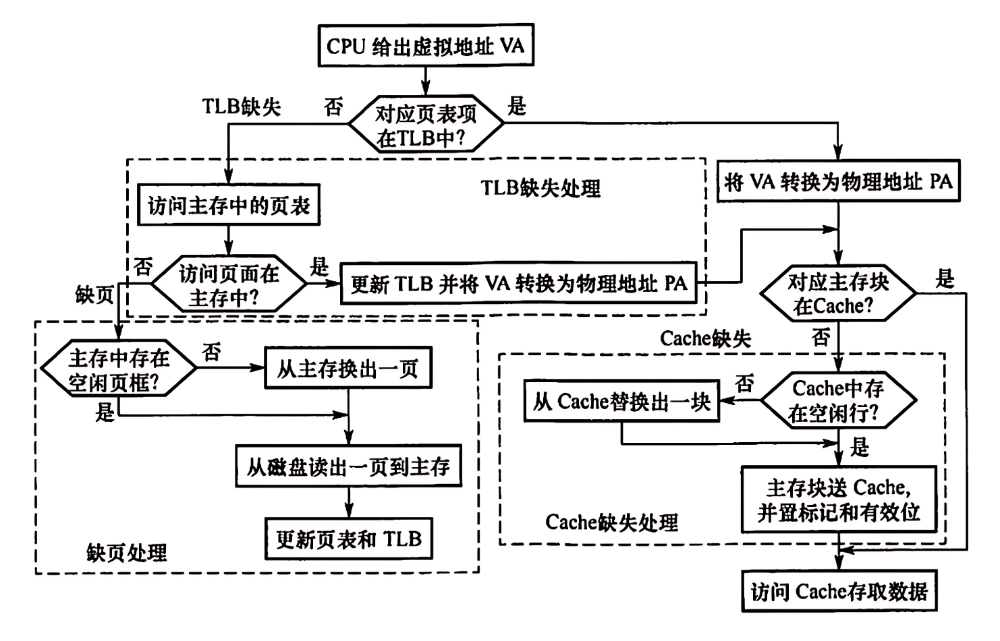
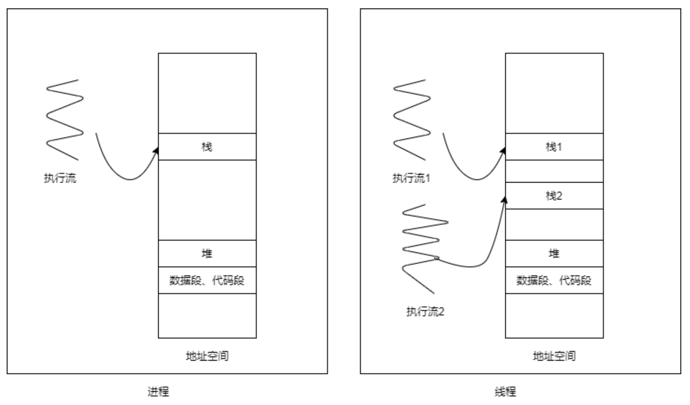
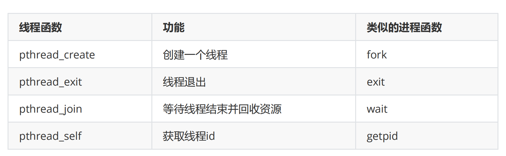
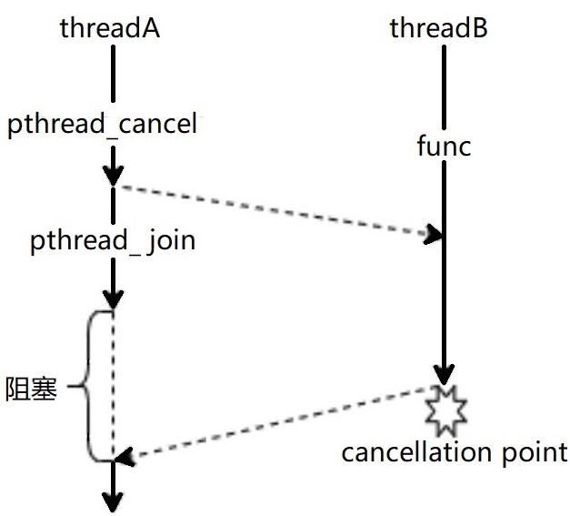

# 线程

## 1. 线程概述

### 1.1 从进程到线程

>在经过之前课程的学习之后，我们已经了解进程的基本概念：**进程是正在执行的程序，并且是系统资源分配的基本单位**。
>
>当用户需要在一台计算机上去完成多个独立的工作任务时，可以使用多进程的方式，为每个独立的工作任务分配一个进程。多进程的管理则由操作系统负责——操作系统调度进程，合理地在多个进程之间分配资源，包括CPU资源、内存、文件等等。除此以外，即便是一个单独的应用，采用多进程的设计也可以提升其**吞吐量**，改善其**响应时间**。假如在处理任务的过程中，其中一个进程因为死循环或者等待IO之类的原因无法完成任务时，操作系统可以调度另一个进程来完成任务或者响应用户的请求。比如在文本处理程序当中，可以并发地处理用户输入和保存已完成文件的任务。随着进程进入大规模使用，程序员在分析性能的时候发现**计算机花费了大量的时间在切换不同的进程上面**。当一个进程在执行过程中，CPU的寄存器当中需要保存一些必要的信息，比如堆栈、代码段等，这些状态称作**上下文**。**上下文切换**这里涉及到大量的寄存器和内存之间的保存和载入工作。除此以外，Linux操作系统还支持虚拟内存，所以每个用户进程都拥有自己独立的地址空间，这在实现上就要求每个进程有自己独立的页目录表(页目录表: 映射虚拟地址到物理地址)(TLB是是一个页目录表的缓存，来存储最近使用的物理和虚拟地址映射)。所以，具体到Linux操作系统，进程切换包括两步：首先是切换页目录表，以支持一个新的地址空间；然后是进入内核态，将硬件上下文，即CPU寄存器的内容以及内核态栈切换到新的进程。
>
>

>为了缩小切换进程的开销，**线程**的概念便诞生了。线程又被称为**轻量级进程** **(Light Weight Process,LWP)**，<span style="color:red">我们将一个进程分解成多个线程</span>，每个线程是独立的运行中程序实体，线程之间并发运行，这样线程就取代进程成为CPU时分配和调度的**最小单位**，在Linux操作系统当中，**每个线程都拥有自己独立的 task_struct 结构体**，当然，在属于同一个进程多个线程中， task_struct 中大量的字段是相同的或者是共享的。注意到在Linux操作系统中，线程并没有脱离进程而存在。而计算机的内存、文件、IO设备等资源依然还是按进程为单位进行分配，属于同一个进程的多个线程会**共享进程地址空间**，每个线程在执行过程会在地址空间中有自己独立的栈，而堆、数据段、代码段、文件描述符和信号屏蔽字等资源则是共享的。
>
>

>因为属于同一个进程的多个线程是共享地址空间的，所以**线程切换**的时候不需要切换页目录表，而且上下文的内容中需要切换的部分也很少，只需要切换栈和PC指针以及其他少量控制信息即可，数据段、代码段等信息可以保持不变。因此，切换线程的花费要小于切换进程的。
>
>同一个进程的多个线程各自拥有自己的栈，这些栈虽然是独立的，但是都位于同一个地址空间中，所以一个线程可以通过地址去访问另一个线程的栈区。

**了解:**

>在Linux文件系统中，路径 /proc 挂载了一个伪文件系统，通过这个伪文件系统用户可以采用访问普通文件的方式（使用read系统调用等），来访问操作系统内核的数据结构。其中，在 /proc/[num] 目录中，就包含了pid为num的进程的大量的内核数据。而在 /proc/[num]/task 就包含本进程中所有线程的内核数据。我们之前的编写进程都可以看成是单线程进程。
>
>```shell
>man ps
>ps -elf
>ps aux
>```

### 1.2 用户级线程和内核级线程

>在Linux2.4以及以前版本，因为还没有线程的概念，Linux内核不知道什么是线程。而后来随着技术发展，因为创建进程开销的资源更多，且进程间的切换相比线程更慢，线程带来的好处被大家所认识。于是我们希望Linux能实现多线程编程，然而要修改一个操作系统并不是件容易的事情，于是采用的办法是写函数来实现，而不是去修改操作系统的内核。而这些函数也就是最初的线程库，由于在Linux内核中没有线程的概念，因此这种线程是用进程来模拟的。因此这种线程也被称为**用户级线程**。
>
>虽然当时的线程库已经和POSIX的标准非常接近了，但是在Linux的线程实现版本和POSIX标准之间还是存在着细微的差别，最明显的是关于信号处理部分，这些差别中的大部分都受底层Linux内核的限制，而不是函数所能改变的。许多项目都在研究如何才能改善Linux对线程的支持，这其中大部分工作集中在了如何将用户级的线程映射到内核级的线程。
>
>其中IBM公司的NGPT(Next Generation POSIX Threads),和Redhat公司的NPTL(Native POSIX Thread Library)通过修改Linux内核来支持新的线程库，两者都极大地提升了性能。在2002年，NGPT项目组宣布，由于不希望分化团队，所以停止为NGPT添新功能。也因此NPTL成为了Linux线程的新标准。在NPTL中, 内核会处理每个线程堆栈所使用的内存的回收工作。它甚至还通过在清除父线程之前进行等待，从而实现对所有线程结束的管理。

目前使用最广泛的线程库名为**NPTL** (Native POSIX Threads Library)，在Linux内核2.6版本之后，它取代了传统的LinuxThreads线程库。NPTL支持了POSIX的线程标准库，在早期，NPTL只支持用户级线程，随着内核版本的迭代，现在每一个用户级线程都对应一个内核态线程，这样NPTL线程本质就成为了**内核级线程**，可被操作系统调度

>```c
>man 7 pthreads
>    (Linux implementations of POSIX threads
>          LinuxThreads: 并不完全兼容POSIX标准
>          NPTL:   Native POSIX Thread Library)
>```

用户级线程和内核级线程在实现方式、运行状态、切换方式、调度方式、对系统资源的访问、创建和销毁等方面存在明显的差异

>用户级线程和内核级线程的主要区别体现在以下方面：
>
>1. 实现方式：用户级线程是在用户程序中实现的，而内核级线程是由操作系统内核创建和管理的。
>2. 运行状态：用户级线程运行在用户态下，而内核级线程可以访问操作系统的所有资源。
>3. 切换方式：用户级线程的切换由应用程序自己控制，而内核级线程的切换需要操作系统的支持。
>4. 调度方式：用户级线程的调度由应用程序自己控制，而内核级线程的调度由操作系统内核负责。
>5. 等...

```C
闲聊: (线程源码参考)
/usr/src/linux-source-4.15.0/linux-source-4.15.0/arch/h8300/include/asm/thread_info.h
```

### 1.3 线程的创建

使用线程的思路其实和使用进程的思路类似，用户需要去**关心**线程的**创建、退出和资源回收**等行为，初学者可以参考之前学习进程的方式对比学习线程对应的库函数。下面是常用的**线程库函数**和之前的进程中的对应关系。



#### 1.3.1 pthread_create

>线程创建使用的函数是 pthread_create ，这个函数的函数原型如下( man pthread_create )
>
>```c
>#include <pthread.h>
>int pthread_create(
>       pthread_t *thread, // 不同线程独立唯一的线程id 
>       const pthread_attr_t *attr, // 线程的属性 (attr属性),  暂时使用NULL填充
>       void *(*start_routine) (void *), // 线程的启动函数
>       void *arg // 线程的传参 
>);
>// 返回值： 0成功， 其它失败可暂时忽略or参见1.3.2错误处理
>```
>
>```c
>ps: 在使用线程相关的函数之后，在链接时需要加上 -lpthread   -pthread 选项以显式链接线程库
>ps: 在一个进程当中的不同线程都拥有自己独立唯一的线程id（thread id），NPTL使用pthread_t类型来保存线程id，在不同的操作系统中，pthread_t底层实现不同，具体到Linux是一个无符号整型数 (也可以使用函数 pthread_self 获取本线程的id)。
>ps: 在操作系统中，当一个新进程被创建时（例如，通过执行一个程序），操作系统会自动创建一个线程(作为这个进程的主线程)。
>ps: 主线程终止时（例如通过返回main()或调用exit()），这会导致整个进程终止，包括它创建的所有子线程也会随着进程的终止而消亡。（除非主线程是通过调用pthread_exit()来终止的, 这不会导致进程终止，这种情况下进程内的其他线程可以继续依赖进程存活）。
>```

>```c
>//下面是一个不传递参数的版本
>void * threadFunc(void *arg){
>   printf("I am child thread, \n" );
>   return NULL;
>}
>int main()
>{
>   pthread_t tid;
>   pthread_create(&tid,NULL,threadFunc,NULL);
>
>   printf("I am main thread \n") 
>   sleep(1);
>   //usleep(20);
>   return 0;
>}
>
>// 在上面的例子当中，如果主线程不sleep, 或者将 sleep(1) 改成 usleep(20)或者别的  (设个时间也取决于系统的cpu核心和执行效率)，线程并发执行的特点会导致一些看上去非常奇怪的结果：在某次执行的时候，标准输出上有一定的几率显示两条相同的语句。
>// 产生这种问题的原因是这样的，stdout缓冲区在多个线程之间是共享，当执行 printf 时，会首先将stdout的内容拷贝到内核态的文件对象中，再清空缓冲区，当**主线程终止导致所有线程终止**时，可能子线程已经将数据拷贝到了内核态（此时第一份语句已经打印了），但是stdout的内容并未清空，此时进程终止，会把所有缓冲区清空，清空缓冲区的行为会将留存在缓冲区的内容直接清空并输出到标准输出中，此时就会出现内容的重复打印了。
>```

#### 1.3.2 线程函数错误处理

>之前的POSIX系统调用和库函数在调用出错的时候，通常会把全局变量 errno (按进程隔离)设置为一个特别的数值以指示报错的类型，这样就可以调用 perror 以显示符合人阅读需求的报错信息。但是在多线程编程之中，全局变量是各个线程的共享资源，很容易被并发地读写，所以pthread系列的函数优化了检错方式，它会根据pthread系列的函数不同的返回值, 让strerror 函数根据这个错误返回值，使用 strerror 函数可以根据返回值显示报错字符串。(man strerror)
>
>```c
>char *strerror(int errnum);
>
>#define THREAD_ERROR_CHECK(ret,msg) {if(ret!=0){fprintf(stderr,"%s:%s\n",msg,strerror(ret));}}
>```
>
>```c
>void * threadFunc(void *arg){
>        printf("I am child thread, \n" );
>        return NULL;
>}
>int main()
>{
>        pthread_t tid;
>        int ret = pthread_create(&tid,NULL,threadFunc,NULL);
>        THREAD_ERROR_CHECK(ret,"pthread_create");
>        printf("I am main thread \n") 
>        sleep(1);
>        //usleep(20);
>        return 0;
>}
>```
>
>```c
>// 创建最大的线程数
>void * threadFunc(void *arg){
>        sleep(3);
>        return NULL;
>}
>int main()
>{
>        int count = 1;
>        whlie(1){
>     
>            pthread_t tid;
>            int ret = pthread_create(&tid,NULL,threadFunc,NULL);
>            THREAD_ERROR_CHECK(ret,"pthread_create");
>    
>            count++;
>            if(ret != 0){
>                printf("sum thread count=%d \n", count);
>                break;
>            }
>        }
>    
>        return 0;
>}
>```

### 1.4 线程和数据共享

#### 1.4.1 共享全局变量 (数据段)

>多个线程是共享一片地址空间的，所以各个线程可以并发地访问的同一个数据段、堆空间和其他位置。
>
>下面是一个共享数据段的例子：
>
>```c
>//多线程共享数据段
>#include <func.h>
>int global= 100;
>
>void * threadFunc(void *arg){
>        printf("I am child thread \n" );
>        printf("child thread, global = %d\n", global);
>        return NULL;
>}
>int main()
>{
>        pthread_t tid;
>        int ret = pthread_create(&tid,NULL,threadFunc,NULL);
>        THREAD_ERROR_CHECK(ret,"pthread_create");
>        printf("I am main thread \n" );
>   
>        global = 200;
>        printf("main thread, global = %d\n", global);
>    
>        sleep(1);
>        return 0;
>}
>```

#### 1.4.2 共享堆空间

>堆空间自然也是可以共享的，我们通过会将堆空间的首地址作为参数在创建线程的时候进行传递，无论是子线程还是主线程访问的区域都是同一片空间。
>
>eg:
>
>```c
>//多线程共享堆空间
>void * threadFunc(void *arg){
>    
>        char *pHeap = (char *)arg;
>        printf("I am child thread \n" );
>   
>        strcpy(pHeap,"world"); // 复制字符串
>        printf("child thread, %s\n",pHeap);
>    
>        return NULL;
>}
>int main()
>{
>   
>        char *pHeap = (char *)malloc(20);
>        strcpy(pHeap,"hello");
>    
>        pthread_t tid;
>        int ret = pthread_create(&tid,NULL,threadFunc,(void *)pHeap);
>        THREAD_ERROR_CHECK(ret,"pthread_create");
>    
>        printf("I am main thread \n" );
>    
>        sleep(1);
>        printf("parent thread, %s\n",pHeap);
>        free(pHeap);
>   
>        return 0;
>}
>```

#### 1.4.3 访问栈数据

>需要注意的是，虽然各个线程执行的过程中拥有自己独立的栈区，但是这些所有的栈区都是在同一个地址空间当中，所以一个线程完全可以访问到另一个线程栈帧内部的数据。(如果将主线程栈帧数据的地址作为参数传递给各个子线程，就一定要注意并发访问的情况，有可能另一个线程的执行会修改掉原本想要传递数据的内容)
>
>```c
>void * threadFunc(void *arg){
>        printf("I am child thread \n" );
>    
>        int * pval = (int *)arg;
>        *pval = 1002;
>        printf("child, val = %d\n",*pval);
>    
>        return NULL;
>}
>int main(){
>    
>        pthread_t tid;
>        int val = 1001;
>        int ret = pthread_create(&tid,NULL,threadFunc,(void *)&val);
>        THREAD_ERROR_CHECK(ret,"pthread_create");
>    
>        printf("I am main thread \n" );
>    
>        sleep(1);
>        //虽然栈帧是私有的，但是其他线程依然有权限读写
>        printf("main, val = %d\n",val);
>        return 0;
>}
>```

#### 1..4.4 其它

##### 注意: long作为8字节参数

>虽然说 arg 是一个 void* 类型的参数，这暗示着用户可以使用该参数来传递一个数据的地址，但是有些情况下我们只需要传递一个整型数据，在这种情况，除了传递参数地址以外,  用户可以直接把 void* 类型的参数当成是一个8字节的普通数据(比如long)进行传递。
>
>传递地址
>
>```c
>void * threadFunc(void *arg){
>
>   int *intnum = (int *)arg;
>       printf("I am child thread \n" );
>        //把参数当成是普通的8字节整型
>        printf("child, val = %d\n", *intnum);
>        return NULL;
>     }
>     int main(){
>
>   int val = 1001;
>    
>        pthread_t tid;
>       int ret = pthread_create(&tid,NULL,threadFunc,&val);
>        THREAD_ERROR_CHECK(ret,"pthread_create");
>     
>        //sleep(1);
>    
>        val = 1002;
>       ret = pthread_create(&tid,NULL,threadFunc, &val);
>        THREAD_ERROR_CHECK(ret,"pthread_create");
>     
>        printf("I am main thread \n" );
>       sleep(1);
>     
>        return 0;
>    }
>     ```
>
>传递8字节数据
>
>```c
>void * threadFunc(void *arg){
>
>   printf("I am child thread \n" );
>       //把参数当成是普通的8字节整型
>        printf("child, val = %ld\n",(long)arg);
>        return NULL;
>     }
>     int main(){
>
>   long val = 1001;
>    
>        pthread_t tid;
>       int ret = pthread_create(&tid,NULL,threadFunc,(void *)val);
>        THREAD_ERROR_CHECK(ret,"pthread_create");
>     
>        //sleep(1);
>    
>        val = 1002;
>       ret = pthread_create(&tid,NULL,threadFunc,(void *)val);
>        THREAD_ERROR_CHECK(ret,"pthread_create");
>     
>        printf("I am main thread \n" );
>       sleep(1);
>     
>        return 0;
>    }
>     ```

##### 注意: 栈数据共享的释放

>共享栈数据，一定要注意内存的释放顺序
>
>EgCode：
>
>```c
>void * threadFunc(void *arg){
>        sleep(1);
>
>        int *intnum = (int *)arg;
>        printf("I am child thread \n" );
>        //把参数当成是普通的8字节整型
>        printf("child, val = %d\n", *intnum);
>        return NULL;
>}
>void func(){
>        int val = 1001;
>
>        pthread_t tid;
>        int ret = pthread_create(&tid,NULL,threadFunc,&val);
>        THREAD_ERROR_CHECK(ret,"pthread_create");
>
>        printf("function over \n" );
>}
>int main(){
>        func(); // 调用函数
>    
>        printf("I am main thread \n" );
>        sleep(2);
>        return 0;
>}
>```

### 1.5 获取线程的退出状态

>我们可以通过pthread_join()方法捕获线程的退出和退出状态。

#### 1.5.0 补充: ps -elLf

>补充
>
>```shell
>ps -elLf
># 我们可以在在shell中使用ps -elLf命令， 列出所有线程
>```
>
>运行如下代码，在代码运行中，并通过ps -elLf命令查看所有线程状态，观察线程变化
>
>EgCode：
>
>```c
>#include <testfun.h> 
>void * fun1(void * arg){
>        // while(1){};
>        sleep(10);
>}
>int main()
>{
>        pthread_t pid;
>        int ret = pthread_create(&pid, NULL, fun1, NULL);
>	THREAD_ERROR_CHECK(ret,"pthread_create");
>	sleep(20);
>	return 0;
>}    
>```

#### 1.5.1 pthread_join

>使用 pthread_join() 捕获线程的退出和退出状态。
>
>```c
>#include <pthread.h>
>// join with a terminated thread
>int pthread_join( 
>	pthread_t thread, // 要捕获线程目标的线程id
>    	void **retval // 目标线程的退出状态(指向线程的退出时携带参数)
>);
>// 返回值int标识捕获状态:  0代表成功 (别的仅作了解: 死锁,不可捕获,被别的线程捕获, 不识别的线程id)
>
>
>ps1: pthread_join可以使本线程处于等待状态/阻塞,直到指定的thread终止, 就结束等待/结束阻塞,并且捕获到的线程终止状态存入retval指针所指向的内存空间中。
>ps2: pthread_join可以捕获一个线程,一个线程的退出也可以由另一个线程使用pthread_join捕获,需要注意的是,另一个线程的选择是任意的,不需要是被捕获线程创建者。 (一个线程通过pthread_join捕获另外一个线程, 两个线程未必是具有父子关系)
>ps3: 一个线程的退出,可以被多个线程通过pthread_join"试图"捕获(多个线程调用该函数获取同一个线程的执行结果),但是只有一个pthread_join能捕获成功。别的都将失败。
>ps4: 指针retval捕获线程函数内部的局部数据, 可能会存在问题。
>```

>```c
>#include <testfun.h>
>
>void *funThread(void *arg){
>    	return 0;
>} 
>int main()
>{
>        pthread_t threadId;
>        int ret = pthread_create(&threadId, NULL, funThread, NULL);
>        THREAD_ERROR_CHECK(ret, "pthread_create");
>   
>        int ret_join = pthread_join(threadId, NULL );// NULL代表不接收join线程返回状态
>        THREAD_ERROR_CHECK(ret_join, "pthread_join");
>     
>        printf("child thread join status = %d \n",  ret_join);
>        return 0;
>}
>```

>EgCode:
>
>```c
>// pthread_join 可以使本线程处于等待/阻塞状态,直到指定的 thread 终止, 就结束等待,并且捕获到的线程终止状态(返回参数)存入 retval 指针所指向的内存空间中。
>#include <testfun.h>
>
>void *funThread(void *arg){
>   sleep(10);
>     
>       // return 100;
>        return (void *)100;
>     } 
>
>int main()
>{
>   pthread_t threadId;
>        int ret = pthread_create(&threadId, NULL, funThread, NULL);
>        THREAD_ERROR_CHECK(ret, "pthread_create");
>     
>       void * retThread;
>        int ret_join = pthread_join(threadId, &retThread );
>        THREAD_ERROR_CHECK(ret_join, "pthread_join");
>     
>   printf("child thread retval = %ld \n",  (long)retThread);
>        return 0;
>     }
>```

> ```c
>// 如下代码报错: Segmentation fault (core dumped), 
>// 原因是: funThread 函数中定义了一个局部变量 num。 函数返回时，它返回了一个指向 num 的指针。一旦 funThread 函数执行完毕，num 所占用的栈内存将不再有效，因此返回的指针指向一个已经被回收的内存区域。当主线程尝试通过这个指针访问 num 的值时，它访问了一个无效的内存地址，从而引发了 "Segmentation fault"
>#include <testfun.h>
>
>void *funThread(void *arg){
>    sleep(5);
>
>        int num = 10;
>       return &num;
>    } 
>    
>int main()
>{
>    pthread_t threadId;
>    int ret = pthread_create(&threadId, NULL, funThread, NULL);
>        THREAD_ERROR_CHECK(ret, "pthread_create");
>    
>        void *retThread;
>       int ret_join = pthread_join(threadId, &retThread );
>        THREAD_ERROR_CHECK(ret_join, "pthread_join");
>    
>        printf("child thread retval = %d \n", *(int *)retThread);
>        return 0;
>    }
>    ```
>
>```c
>// 假设返回的堆上数据没有问题
>#include <testfun.h>
>
>void *funcThread(void *arg){
>    sleep(5);
>
>        int *num = malloc(sizeof(int));
>    *num = 10;
>    
>        //return num;
>    return (void *)num;
>    }
>    int main()
>{
>    pthread_t pid;
>    int ret = pthread_create(&pid, NULL, funcThread, NULL);
>        THREAD_ERROR_CHECK(ret, "pthread_create");
>    
>        void *retThread;
>    int ret_join = pthread_join(pid, &retThread);
>        THREAD_ERROR_CHECK(ret_join, "pthread_join");
>        printf("child thread retval = %d \n", *(int *)retThread);
>        free(retThread);
>    
>        //void **retThread;
>        //int ret_join = pthread_join(pid, retThread);
>        //THREAD_ERROR_CHECK(ret_join, "pthread_join");
>        //printf("child thread retval = %d \n", *(int *)(*retThread));
>        //free(*retThread);
>    
>        return 0;
>    }
>    ```

### 1.6 线程的主动退出

#### 1.6.1 线程的return退出

>1, 当存在一个线程， 这个线程正常运行结束， 其入口调用函数通过return运行结束。 此线程将正常退出。
>
>2, 我们可以通过pthread_join捕获到线程return退出, 以及退出时返回数据.

>EgCode： （可配合 ps -elLf命令， 查看子线程的结束时机。）
>
>```c
>#include <testfun.h> 
>void *fun2(){
>        sleep(5);
>        printf("fun2 sleep over \n");
>        return NULL;
>}
>void * fun1(void * arg){
>        fun2();
>        sleep(5);
>        printf("fun1 sleep over \n");
>        // 需要注意的是,要通过return结束线程
>        // 是要在线程的入口的函数中return(类似主线程的main方法return)
>        // 而非是在更深层次的非线程的入口函数(调用函数)中return
>        return NULL;
>}
>int main()
>{
>        pthread_t pid;
>        int ret = pthread_create(&pid, NULL, fun1, NULL);
>        THREAD_ERROR_CHECK(ret,"pthread_create");
>        sleep(20);
>        return 0;
>}
>```

>通过pthread_join捕获正常return线程
>
>```c
>#include <testfun.h> 
>
>void * fun1(void * arg){ 
>        sleep(5);
>        return (void *)11;
>}
>int main()
>{
>        pthread_t pid;
>        int ret = pthread_create(&pid, NULL, fun1, NULL);
>        THREAD_ERROR_CHECK(ret, "pthread_cetate");
>
>        void *numP;
>        int ret_join = pthread_join(pid, &numP);
>        THREAD_ERROR_CHECK(ret_join, "pthread_join");
>
>        printf("catch from child thread return value = %ld \n",  (long)numP);
>        return 0;
>}
>```

#### 1.6.2 通过pthread_exit退出

>使用 pthread_exit 函数可以主动退出线程。
>
>无论这个函数是否是在 start_routine(主调函数/线程入口函数) 中被调用(其行为类似于进程退出的 exit), 都将退出该线程 。
>
>```c
>#include <pthread.h>
>// terminate calling thread
>void pthread_exit( 
>	void *retval // 该参数描述了线程的退出状态
>    			 // ( 即它指向的数据将作为线程退出时的返回值。
>    			 //   如果线程不需要返回任何数据，将retval参数置为NULL即可。)
>);
>
>ps: 指针retval建议不要指向该退出线程函数内部的局部数据。
>ps: 在正常return结束的线程中, 其start_routine/入口函数的最终返回值, 等价于pthread_exit退出线程的携带retval,等待捕获程结束的pthread_join()函数都可以接收到线程的返回值, 对于pthread_join来说,并不认为两者有什么异同
>ps: 如果子线程通过return 0, 或者 pthread_exit(NULL) 或者 pthread_exit(0),  return NULL 结束, 那么pthread_join()捕获的线程退出状态可以表示为0
>ps: pthread_exit()可以自动调用线程清理程序(参考pthread_cleanup_push()),return 则不具备这个能力。
>```

>EgCode:  pthread_exit 函数可以主动退出线程
>
>```c
>#include <testfun.h>
>
>void *funThread(void *arg){
>        // 退出线程的参数要求是void*类型 
>        pthread_exit((void *) 11);
>        printf("this scene well not be print \n");
>} 
>
>int main()
>{
>        pthread_t threadId;
>        int ret = pthread_create(&threadId, NULL, funThread, NULL);
>        THREAD_ERROR_CHECK(ret, "pthread_create");
>
>        void *numP;
>        int ret_join = pthread_join(threadId, &numP);
>        THREAD_ERROR_CHECK(ret_join, "pthread_join");
>
>        printf("catch child thread by pthread_exit value = %ld \n", (long)numP);
>        return 0;
>}
>```
>
>EgCode:  无论这个函数是否是在start_routine函数中被调用, 都将退出该线程 。
>
>```c
>#include <testfun.h>
>
>void funTHreadDeep(){
>        printf("this is deep funaction \n");
>        // 次数调用退出线程, 依旧会导致该方法所在线程退出
>        // 即使当前方法不是线程的入口函数
>        pthread_exit(NULL);
>        printf("this scene2 well not be print \n");
>}
>void *funThread(void *arg){
>        funTHreadDeep();// 调用另一个方法
>        printf("this scene1 well not be print \n");
>} 
>int main()
>{
>        pthread_t threadId;
>        int ret = pthread_create(&threadId, NULL, funThread, NULL);
>        THREAD_ERROR_CHECK(ret, "pthread_create");
>        sleep(20);
>        return 0;
>}       
>```

>```c
>// 如果子线程通过pthread_exit(NULL) 退出, 那么pthread_join()捕获的线程退出状态和 return 0以及pthread_exit(0) 结束线程一样,捕获返回结果为0。
>#include <testfun.h>
>
>void *funThread(void *arg){
>   //pthread_exit(NULL);
>        //pthread_exit(0);
>        return 0;    
>     } 
>int main()
>{
>   pthread_t threadId;
>        int ret = pthread_create(&threadId, NULL, funThread, NULL);
>        THREAD_ERROR_CHECK(ret, "pthread_create");
>     
>   void *numP;
>        int ret_join = pthread_join(threadId, &numP);
>        THREAD_ERROR_CHECK(ret_join, "pthread_join");
>     
>   printf("catch child thread by pthread_exit value = %ld \n", (long)numP);
>        return 0;
>     }
>```

###### 一个stdout的特殊情况

>每个线程开辟了一个独属于自己的栈, 而堆/数据段/代码段/..是共享的。 同时也共享一个进程的stdout(标准输出)。
>
>```c
>#include <testfun.h>
>
>void *funThread(void *arg){
>        printf("i am child thread"); // 这句话并未立即输出,而是等了一会 才输出
>        // 退出线程的参数要求是void*类型 or NULL
>        pthread_exit((void *) 11);
>        printf("this scene well not be print \n");
>} 
>
>int main()
>{
>    pthread_t threadId;
>    int ret = pthread_create(&threadId, NULL, funThread, NULL);
>    THREAD_ERROR_CHECK(ret, "pthread_create");
>    sleep(10);
>    printf("i am main thread \n");
>    return 0;
>}
>```

### 1.7 线程的被动退出

>我们在上面分别介绍了: 通过代码正常运行return结束, 以及通过执行pthread_exit函数退出线程; 而这两种方式都是由执行线程触发的主动退出方式。
>
>除了上述线程自己主动退出的情况, 那线程有没有可能被另一个线程通过某些方式强制终止(即被动退出)的情况那? 
>
>```c
>ps: 不过首先值得注意的是，和进程的'被动退出'情况不同, 我们可以通过'信号'让进程被动退出/终止,  但是我们不能轻易地在多线程程序使用信号，因为多线程是共享代码段的，从而'信号处理的回调函数'也是共享的，当产生一个信号到进程时，进程中用于递送信号的线程是随机的，很有可能会出现主线程因递送信号而终止从而导致所有线程异常退出的情况
>```

#### 1.7.1 线程的取消

>而多线程程序中，一个线程可以借助 pthread_cancel() 函数向另一个线程发送`终止执行`的信息,   从而实现在一个线程中去终止另一个线程的操作, 从而使被通知的线程被动退出。

##### 函数原理

>线程的被动取消流程， 如图所示:
>
>
>
>需要注意的是， 当线程A向线程B发送取消线程执行信息的时候， 线程B并不是立即终止执行， 线程B是要先运行到一个叫`取消点`的位置才终止线程。
>
>**取消点**
>
>```c
>// 什么是取消点？
>当一个线程调用 pthread_cancel 去取消另一个线程的时候，另一个线程会将本线程的取消标志位设置为真，当这个线程执行一些函数之时，线程就会退出。这些会导致已取消未终止的线程终止的函数称为取消点。
>// 那些常见的取消点函数？
>a. 几乎所有会引发阻塞的函数：  eg：sleep()， select(), wait() ....
>b. I/O操作： open(), close(), read(), write(), fopen(), fclose(), printf()....
>
>ps: 可以通过(man 7 pthreads)查看取消点函数(cancellation points)
>    ```

##### pthread_cancel

>通过pthread_cancel() 取消一个执行中的线程
>
>```c
>#include <pthread.h>
>// send a cancellation request to a thread
>int pthread_cancel( 
>	 pthread_t thread, // 不同线程的线程id 
>);
>// 返回值int标识捕获状态:  0代表成功， ESRCH代表参数错误(没找到这个线程id)
>```

>EgCode： 没有取消点无法取消示例 
>
>```c
>#include <testfun.h>
>
>void * func(void *arg){
>    while(1){
>    }
>    return NULL;
>}
>int main()
>{
>    pthread_t  pid;
>    int res = pthread_create(&pid, NULL, func, NULL);
>    THREAD_ERROR_CHECK(res, "pthread_create");
>
>    int res_cancel = pthread_cancel(pid);
>    THREAD_ERROR_CHECK(res_cancel, "pthread_cancel");
>
>    printf("main use cancel \n");    
>    int res_join = pthread_join(pid, NULL);
>    THREAD_ERROR_CHECK(res_join, "pthread_join");
>
>    return 0;
>}
>```
>
>EgCode： 正常取消示例
>
>```c
>#include <testfun.h>
>
>void * func(void *arg){
>    while(1){
>        printf("child thread printf \n");
>    }
>    return NULL;
>}
>int main()
>{
>    pthread_t  pid;
>    int res = pthread_create(&pid, NULL, func, NULL);
>    THREAD_ERROR_CHECK(res, "pthread_create");
>
>    sleep(10);
>
>    printf("main use cancel \n");
>    int res_cancel = pthread_cancel(pid);
>    THREAD_ERROR_CHECK(res_cancel, "pthread_cancel");
>    
>    int res_join = pthread_join(pid, NULL);
>    THREAD_ERROR_CHECK(res_join, "pthread_join");
>
>    return 0;
>}
>```

>```c
>// 如下仅作为了解:
>// 当线程被动取消， 通过pthread_join捕获的结束状态： PTHREAD_CANCELED ,本质值为-1 
>// 当线程主动退出：pthread_exit(PTHREAD_CANCELED)退出，pthread_join捕获的结束状态也是PTHREAD_CANCELED
>#include <testfun.h>
>
>void * func(void *arg){
>   while(1){
>       sleep(1);
>       printf("child thread printf \n");
>   }
>   return NULL;
>}
>int main()
>{
>   pthread_t  pid;
>   int res = pthread_create(&pid, NULL, func, NULL);
>   THREAD_ERROR_CHECK(res, "pthread_create");
>
>   sleep(10);
>
>   int res_cancel = pthread_cancel(pid);
>   THREAD_ERROR_CHECK(res_cancel, "pthread_cancel");
>
>   void *ret_catch ;
>   int res_join = pthread_join(pid, &ret_catch);
>   THREAD_ERROR_CHECK(res_join, "pthread_join");
>
>   if(ret_catch == PTHREAD_CANCELED){
>       printf("catch value = %ld \n", (long)ret_catch); // -1
>   }else{
>       printf("other value = %ld \n", (long)ret_catch);
>   }
>
>   return 0;
>}
>```

#### 1.7.2 手打取消点

>从上述的的被动取消过程中， 我们知道pthread_cancel函数是依赖于被取消线程的`取消点`这一关键标志位； 但是有一种可能，要被取消线程代码中（试图被动取消的代码片段位置）没有取消点， 那么我们该怎么办那？
>
>我们可以通过pthread_testcancel方法， 手动添加一个取消点。

##### pthread_testcancel

>通过pthread_testcancel方法， 手动添加一个取消点。
>
>```c
>#include <pthread.h>
>// request delivery of any pending cancellation request 
>void pthread_testcancel(void);
>// 无参数和返回值
>```

>EgCode:
>
>```c
>#include <testfun.h>
>
>void * func(void *arg){
>        while(1){
>           pthread_testcancel();// 没有这句代码， 将一直 循环无法取消
>        }
>        return NULL;
>    }
>    int main()
>    {
>        pthread_t  pid;
>        int res = pthread_create(&pid, NULL, func, NULL);
>        THREAD_ERROR_CHECK(res, "pthread_create");
>
>        printf("main use cancel \n");
>        int res_cancel = pthread_cancel(pid);
>        THREAD_ERROR_CHECK(res_cancel, "pthread_cancel");
>
>        int res_join = pthread_join(pid, NULL);
>        THREAD_ERROR_CHECK(res_join, "pthread_join");
>
>        return 0;
>}
>```

#### 1.7.3 总结补充

>了解线程取消的先后顺序流程是很重要的，尤其是在复杂的多线程应用中。当调用 `pthread_cancel` 来取消一个线程时，以下是线程取消的大致步骤和流程：
>
>```c
>// 1, 首先在某个线程中调用'pthread_cancel', 并传入要取消的目标线程ID。系统根据线程ID找到要取消的目标线程， 给这个线程的内部取消标记设置为真。
>// 2， 被取消线程在程序的执行的时候， 当执行到取消点函数， 则去检测标志位。
>// 3,  取消点函数一旦检测到线程为取消状态时，在终止线程之前， 将执行清理函数： pthread_cleanup_push, 用于释放占用资源、解锁互斥锁等。。。 
>// 4,  完成数据清理后， 线程执行退出操作。而操作系统和线程库负责销毁thread local数据， 比如栈空间
>// 5,  pthread_join被返回， 接受线程取消状态， eg：PTHREAD_CANCELED。
>```

### 1.8 资源清理

>在引入线程取消之后，程序员在管理资源回收的难度上会急剧提升。
>
>EgCode：
>
>```C
>#include <testfun.h>
>
>void * func(void *arg){
>        void *p1 = malloc(4);
>        void *p2 = malloc(4);
>
>        int fd = open("file1", O_RDWR);
>        // ... 其它代码
>        close(fd); // 有没有可能代码在这个， 被取消了？这决定了p1, p2的空间会不会被释放？
>
>        free(p2);
>        free(p1);
>        return NULL;
>}
>int main()
>{
>        pthread_t  pid;
>        int res = pthread_create(&pid, NULL, func, NULL);
>        THREAD_ERROR_CHECK(res, "pthread_create");
>
>        int res_cancel = pthread_cancel(pid);// 取消线程
>        THREAD_ERROR_CHECK(res_cancel, "pthread_cancel");
>
>        int res_join = pthread_join(pid, NULL);
>        THREAD_ERROR_CHECK(res_join, "pthread_join");
>
>        return 0;
>}
>```
>
>在上述代码中， 我们遇到了什么问题？
>
>```c
>和我们前面通过return或者pthread_exit主动退出线程不同(是可控行为)， 当我们通过pthread_cancel被动退出线程， 有可能导致被退出的线程中有些资源没有回收， 从而导致内存泄漏。
>```
>
>为了解决这个问题， 线程库引入了 `pthread_cleanup_push` 和 `pthread_cleanup_pop `函数来管理线程主动或者被动终止时所申请资源（比如文件、堆空间、锁等等）。

#### 1.8.1 pthread_cleanup

>当线程开始执行时，会创建一个清理栈（thread's stack of  thread-cancellation），用于存储注册的清理函数和参数。
>
>而我们可以通过 `pthread_cleanup_push` 和 `pthread_cleanup_pop `通过向这个清理栈中添加清理函数，以及pop出清理函数执行。从而确保线程的正确终止和资源回收。 

>```c
>#include <pthread.h>
>// push thread cancellation clean-up handlers
>void pthread_cleanup_push( 
>	void (*routine)(void *),// 指向清理函数的指针，该函数将在线程取消时被调用
>    	void *arg // 传递给清理函数的参数
>);
>```
>
>```c
>#include <pthread.h>
>// pop thread cancellation clean-up handlers
>void pthread_cleanup_pop( 
>	int execute // 设置参数0代表弹出栈顶函数并且'不执行'这个函数， 非0代表代表弹出栈顶函数并且'执行'这个函数
>);
>```
>
>```c
>ps：pthread_cleanup_push()和pthread_cleanup_pop()必须在同一个作用域中要成对出现 。
>    （此处可参考: /usr/include/pthread.h 对这两个方法的定义 
>        -> 可以发现push和pop的宏定义不是语义完全的，它们必须在同一作用域中成对出现才能使花括号成功匹配。）
>ps：线程运行到pthread_cleanup_pop()方法,当execute参数0代表弹出栈顶函数并且'不执行'这个函数， 
>    								 当execute参数非0代表代表弹出栈顶函数并且'执行'这个函数。
>ps: 通过pthread_cancel取消线程， 线程取消，所有入栈的清理函数将按照顺序依次弹栈并执行。
>ps: 调用pthread_exit主动退出线程， 所有入栈的清理函数将按照顺序依次弹栈并执行。
>ps: 当线程因为在start_routine/入口函数中因为return结束线程， 清理函数栈将不会弹栈。（这取决于操作系统）
>```

>EgCode:
>
>```c
>#include <testfun.h>
>
>void cleanheap(void *argp){
>        printf("cleanheap is runing \n");
>        free(argp);
>}
>void cleanfile(void *filep){
>        printf("cleanfile is runing \n");
>        int *fdP = (int *)filep;
>        close(*fdP);
>}
>void * func(void *arg){
>        void *p1 = malloc(4);
>        pthread_cleanup_push(cleanheap, p1);
>        void *p2 = malloc(4);
>        pthread_cleanup_push(cleanheap, p2);
>
>        int fd = open("file1", O_RDWR); // ps： 注意，代码未必能执行到这个位置
>        pthread_cleanup_push(cleanfile, &fd);
>
>        // sleep(2);
>    
>        pthread_cleanup_pop(1);
>        pthread_cleanup_pop(1);
>        pthread_cleanup_pop(1);
>}
>int main()
>{
>        pthread_t  pid;
>        int res = pthread_create(&pid, NULL, func, NULL);
>        THREAD_ERROR_CHECK(res, "pthread_create");
>
>        // sleep(1);
>        int res_cancel = pthread_cancel(pid);
>        THREAD_ERROR_CHECK(res_cancel, "pthread_cancel");
>
>        int res_join = pthread_join(pid, NULL);
>        THREAD_ERROR_CHECK(res_join, "pthread_join");
>
>        return 0;
>}
>```

## 2. 线程的同步和互斥

>由于多线程之间不存在隔离，共享同一个地址在提高运行效率的同时也给用户带来了巨大的困扰。在并发执行的情况下，大量的共享资源成为`竞争条件`(竞争条件是指多个线程并发访问和修改共享资源时可能出现的问题)，导致程序执行的结果往往和预期的内容大相径庭。
>
>EgCode: 两个线程操作一个共享变量, "每个线程每次加一, 加一百万次"
>
>````c
>#include <testfun.h>
>// 两个线程对同一个共享变量分别加一百万次
>#define TIMES 1000000
>int global = 0;
>
>void * func(void *arg){
>        printf("child thread is runing \n");
>        for(int i = 0; i<TIMES; i++){
>            global++;
>        }
>        printf("child thread stop \n");
>}
>int main(int argc,char*argv[])
>{
>        pthread_t pid;
>        pthread_create(&pid,NULL,func,NULL);
>    
>        printf("main thread is runing \n");
>        for(int i = 0; i<TIMES; i++){
>            global++;
>        }
>        printf("main thread stop \n");
>
>        pthread_join(pid, NULL);
>        printf("all over, global = %d \n", global);
>        return 0;
>}
>````
>
>我们发现结果并不是我们期望的二百万。原因是什么那?
>
>```c
>// 以某次逻辑为例
>1, 当主线程在读取共享变量时，假设它的值为x, 那么主线程把它从内存读到寄存器, 把x自增变成x+1再写回内存。
>2, 在主线程完成上述操作的过程中，假设在写回内存之前, 子线程可能也已经读取了共享变量的值, 即未被主线程写回更新之前的x。 子线程的运行也是把自己读取到寄存器的x自增变成x+1再写回内存。
>// 综上, 虽然两个线程都进行了一次逻辑自增执行,但是实际结果产生了覆盖, 最终只增加了1. 
>```

>如果一个程序的结果是不正确的，那么再高的效率也毫无意义。在基于之前进程对并发的研究之上，线程库也提供了专门用于正确地访问共享资源的机制--> **锁。**

### 2.1 互斥锁

>在多线程编程中，用来控制共享资源的最简单有效也是最广泛使用的机制就是 mutex(MUTual EXclusion)，即互斥锁。**锁的本质是一个全局的标志位**，线程可以对锁进行原子性修改，即所谓的**加锁/解锁**。当一个线程持有锁的时候，其余线程再尝试加锁时(包括自己再次加锁)，都会使自己陷入阻塞状态，直到这把锁 -> 被持有该锁的线程解锁, 其它线程才能拿到这个锁, 拿到锁之后并且解除之前的阻塞状态恢复运行。所以锁在某个时刻永远不能被两个线程同时持有。

#### 2.1.1 锁的基本情况

>**锁**
>
>```c
>互斥锁（Mutex，全称为Mutual Exclusion）是一种用于多线程编程的同步机制。
>它可以保证在任意时刻只有一个线程能够访问共享资源，从而避免了多个线程同时对共享资源进行操作, 确保线程之间的互斥执行。
>```
>
>**锁的状态**
>
>```c
>(锁的本身是一个, 通过原子性操作的全局的标志位.)
>// 未锁
>此时没有线程拥有该锁, 任意线程都可以试图来占有/获取该锁。
>// 已锁
>该锁被某一个线程持有, 其它线程在获取该锁的时候阻塞。
>```
>
>**锁的行为**
>
>```c
>// 加锁(原子操作)
>查看锁的状态, 如果未锁, 则加锁/占有锁; 
>查看锁的状态, 如果已锁, 则阻塞;
>// 解锁(原子操作)
>让锁处于未锁状态;
>```
>
>**锁的要求**
>
>```C
>1, 同时只有一个线程获取锁
>2, 谁加锁, 谁解锁 (锁的使用纷繁复杂，如果不按照规范行事，很容易出现错误，而且随意解锁会导致代码的无可读性)
>```
>
>**临界区**/临界资源
>
>```C
>加锁和解锁是成对出现的操作, 在加锁之后和解锁之前的这一段代码, 我们称为临界区.
>在临界区中的这段代码，我们可以对共享资源进行操作。因为将临界区的代码块用互斥锁包裹，由于锁的互斥性, 则可以确保同一时间内只有一个线程能够进入该代码块，从而保证了共享资源的安全性。
>```
>
>**饥饿**
>
>```C
>饥饿是指线程由于某种原因无法获得所需的锁，导致该线程长时间无法执行。
>当多个线程竞争同一把锁时，如果某个线程经常无法获得所需的锁，那么它可能会长时间处于阻塞状态，即饥饿状态; 另外, 临界区范围过大, 也可能导致饥饿。
>饥饿现象可能会导致程序性能下降等问题
>```
>
>**死锁: 重要**
>
>```C
>死锁是指线程在执行过程中，由于竞争资源使用不当造成的一种永久阻塞的现象，若无外力作用，某些逻辑将再阻塞状态下无法向下推进。
>使用互斥锁的时候必须小心谨慎，如果是需要持续多个锁的情况，加锁和解锁之间必须要维持一定的顺序。即使是只有一把锁，如果使用不当，也会导致死锁。
>```
>
>```C
>常见的死锁的情况
>1, 情况一
>// 存在线程1:  先持有锁A, 再持有锁B
>// 存在线程2:  先持有锁B, 再持有锁A
>
>// 如果上述两个线程, 1先持有了A锁, 2持有了B锁;  在这种状态下1又试图去获取B锁, 2又试图获取A锁都会产生死锁
>2, 情况二
>// 持有锁的线程在未释放锁的情况下, 线程终止了, 造成锁未释放; 
>// 而另外的线程试图获取这个未释放的锁 
>3, 情况三
>// 某个线程在对A锁进行加锁, 当持有了A锁之后, 在未释A放锁的情况下, 重复对A进行加锁 
>```

#### 2.1.2 锁的使用

>定义锁
>
>```c
>// 需要先定义一个pthread_mutex_t类型的锁(eg:)
>pthread_mutex_t mLock;
>```
>
>初始化锁
>
>```c
>对锁的初始化,有两种方式: (man pthread_mutex_destroy)
>// 1, 一种是调用pthread_mutex_init函数
>		int pthread_mutex_init(
>            		pthread_mutex_t *mutex, // 要初始化的锁
>        			const pthread_mutexattr_t *attr // 锁的属性类型
>        );
>
>// 2, 另一种是直接将锁变量初始化为PTHREAD_MUTEX_INITIALIZER
>		pthread_mutex_t mLock = PTHREAD_MUTEX_INITIALIZER;
>```
>
>加锁
>
>```c
>使用pthread_mutex_lock加锁: (加锁后进入临界区)
>		#include <pthread.h>
>		// lock a mutex
>		int pthread_mutex_lock(
>        			pthread_mutex_t *mutex // 锁
>        );
>```
>
>解锁
>
>```c
>使用pthread_mutex_unlock把锁置为未锁: (临界区代码执行结束,解锁)
>		#include <pthread.h>
>		// unlock a mutex
>		int pthread_mutex_unlock(
>        			pthread_mutex_t *mutex // 锁
>        );
>```
>
>销毁锁
>
>```c
>在程序结束前回收锁,释放其占用的资源:
>		#include <pthread.h>
>		// destroy a mutex
>		int pthread_mutex_destroy(
>        			pthread_mutex_t *mutex // 锁
>        );
>```

>EgCode: 锁的基本使用
>
>```C
>#include <testfun.h>
>// 两个线程对同一个共享变量分别加一百万次: 使用锁
>#define TIMES 1000000
>int global = 0;
>
>void * func(void *arg){
>    pthread_mutex_t *pmLock = (pthread_mutex_t *)arg; // 接收主线程传参, 获得锁
>    printf("child thread is runing \n");
>    for(int i = 0; i<TIMES; i++){
>        pthread_mutex_lock(pmLock); // 加锁
>        global++;
>        pthread_mutex_unlock(pmLock); // 解锁
>    }
>    printf("child thread stop \n");
>}
>int main(int argc,char*argv[])
>{
>    pthread_mutex_t mLock; // 定义锁
>    pthread_mutex_init(&mLock, NULL);// 对锁初始化
>
>    pthread_t pid;
>    pthread_create(&pid,NULL,func, &mLock); // 把锁传给子线程
>    
>    printf("main thread is runing \n");
>    for(int i = 0; i<TIMES; i++){
>        pthread_mutex_lock(&mLock); // 加锁
>        global++;
>        pthread_mutex_unlock(&mLock); // 解锁 
>    }
>    printf("main thread stop \n");
>
>    pthread_join(pid, NULL);
>    printf("all over, global = %d \n", global);
>
>    pthread_mutex_destroy(&mLock); // 销毁锁
>    return 0;
>}
>```
>
>EgCode: 锁的基本使用
>
>```C
>#include <testfun.h>
>// 两个线程对同一个共享变量分别加一百万次: 使用锁
>#define TIMES 10000000
>typedef struct share_value{
>        int sum;
>        pthread_mutex_t mLock;
>} share_value_t;
>
>void * func(void *arg){
>        share_value_t *pshareValue = (share_value_t *)arg;
>        printf("child thread is runing \n");
>        for(int i = 0; i<TIMES; i++){
>            pthread_mutex_lock(&pshareValue->mLock);
>            pshareValue->sum ++;
>            pthread_mutex_unlock(&pshareValue->mLock);
>        }
>        printf("child thread stop \n");
>}
>
>int main(int argc,char*argv[])
>{
>        share_value_t shareValue;
>        shareValue.sum = 0;
>        pthread_mutex_init(&shareValue.mLock, NULL);
>
>        pthread_t pid;
>        pthread_create(&pid,NULL,func, &shareValue);
>    
>        printf("main thread is runing \n");
>        for(int i = 0; i<TIMES; i++){
>            pthread_mutex_lock(&shareValue.mLock);
>            shareValue.sum++;
>            pthread_mutex_unlock(&shareValue.mLock);
>        }
>        printf("main thread stop \n");
>
>        pthread_join(pid, NULL);
>        printf("all over, global = %d \n", shareValue.sum);
>
>        pthread_mutex_destroy(&shareValue.mLock);
>        return 0;
>}
>```

#### 2.1.3 拓展

###### A gettimeofday: 了解

>`gettimeofday`是一个在C语言中常用的函数,是POSIX标准的一部分,用于获取当前的时间和日期。
>
>```c
>#include <sys/time.h>
>// get time
>int gettimeofday(
>		struct timeval *tv, // 是一个指向timeval结构体的指针，用于存储获取的时间和日期
>    	struct timezone *tz // 是一个指向timezone结构体的指针，用于指定时区信息，通常设置为NULL。
>)
>```
>
>```c
>struct timeval{
>        time_t tv_sec; // seconds 秒
>        suseconds_t tv_usec; // microseconds 微妙
>}
>```
>
>EgCode: 消耗时间
>
>```C
>#include <testfun.h>
>// 两个线程对同一个共享变量分别加一百万次: 使用锁: 计算时间
>#define TIMES 10000000
>typedef struct share_value{
>        int sum;
>        pthread_mutex_t mLock;
>} share_value_t;
>
>void * func(void *arg){
>
>        share_value_t *pshareValue = (share_value_t *)arg;
>        printf("child thread is runing \n");
>        for(int i = 0; i<TIMES; i++){
>            pthread_mutex_lock(&pshareValue->mLock);
>            pshareValue->sum ++;
>            pthread_mutex_unlock(&pshareValue->mLock);
>        }
>        printf("child thread stop \n");
>}
>
>int main(int argc,char*argv[])
>{
>    	struct timeval beginTime, endTime;
>        gettimeofday(&beginTime, NULL);
>
>        share_value_t shareValue;
>        shareValue.sum = 0;
>        pthread_mutex_init(&shareValue.mLock, NULL);
>
>        pthread_t pid;
>        pthread_create(&pid,NULL,func, &shareValue);
>    
>        printf("main thread is runing \n");
>        for(int i = 0; i<TIMES; i++){
>            pthread_mutex_lock(&shareValue.mLock);
>            shareValue.sum++;
>            pthread_mutex_unlock(&shareValue.mLock);
>        }
>        printf("main thread stop \n");
>
>        pthread_join(pid, NULL);
>        printf("all over, global = %d \n", shareValue.sum);
>
>        pthread_mutex_destroy(&shareValue.mLock);
>        gettimeofday(&endTime, NULL);
>
>        printf("time: %ld  us \n", endTime.tv_usec - beginTime.tv_usec + (endTime.tv_sec - beginTime.tv_sec)*1000000);
>        return 0;
>}
>```

###### B pthread_mutex_trylock

>`pthread_mutex_trylock`在获取互斥锁和加锁的时候，它是一种非阻塞锁, 即:  如果锁已经被其他线程持有，则该函数会立即返回一个错误代码，而不是阻塞当前线程; 如果这个锁没有被别人持有, 拿到这个锁
>
>```c
>#include <pthread.h>
>// lock a mutex
>int pthread_mutex_trylock(
>	pthread_mutex_t *mutex
>)
>// int返回值, 获取到锁则返回0; 没有获取到锁则返回错误码
>    
>ps: pthread_mutex_trylock配合循环可解锁第一种死锁问题
>```
>
>EgCode: trylock解决死锁问题
>
>```c
>// 代码一: 线程A先获得锁一再获得锁二, 线程B先获得锁二再获得锁一; 这是一个死锁逻辑
>#include <testfun.h>
>#define TIMES 10000000
>typedef struct share_value{
>        int sum;
>        pthread_mutex_t mLock1;
>        pthread_mutex_t mLock2;
>} share_value_t;
>
>void * func(void *arg){
>        share_value_t *pshareValue = (share_value_t *)arg;
>
>        pthread_mutex_lock(&pshareValue->mLock2);
>        sleep(1);
>        pthread_mutex_lock(&pshareValue->mLock1);
>
>        printf("child thread runing \n");
>    
>        pthread_mutex_unlock(&pshareValue->mLock1);
>        pthread_mutex_unlock(&pshareValue->mLock2);
>
>        return NULL;
>}
>int main(int argc,char*argv[])
>{
>    share_value_t shareValue;
>    shareValue.sum = 0;
>    pthread_mutex_init(&shareValue.mLock1, NULL);
>    pthread_mutex_init(&shareValue.mLock2, NULL);
>
>    pthread_t pid;
>    pthread_create(&pid,NULL,func, &shareValue);
>
>    pthread_mutex_lock(&shareValue.mLock1);
>    sleep(1);
>    pthread_mutex_lock(&shareValue.mLock2);
>
>    printf("main thread runing \n");
>    
>    pthread_mutex_unlock(&shareValue.mLock2);
>    pthread_mutex_unlock(&shareValue.mLock1);
>
>    pthread_join(pid, NULL);
>    pthread_mutex_destroy(&shareValue.mLock1);
>    pthread_mutex_destroy(&shareValue.mLock2);
>    return 0;
>}
>```
>
>```c
>// 使用pthread_mutex_trylock处理上述死锁问题
>#include <testfun.h>
>#define TIMES 10000000
>typedef struct share_value{
>        int sum;
>        pthread_mutex_t mLock1;
>        pthread_mutex_t mLock2;
>} share_value_t;
>
>void * func(void *arg){
>    share_value_t *pshareValue = (share_value_t *)arg;
>
>    while(1){ // 通过while循环 (这其实是自旋锁机制), 反复的试图获取所有锁, 获取不到所有的锁, 则不持有任何锁
>        pthread_mutex_lock(&pshareValue->mLock2);
>        sleep(1);
>        int res_trylock = pthread_mutex_trylock(&pshareValue->mLock1);
>        if(res_trylock != 0){
>            pthread_mutex_unlock(&pshareValue->mLock2);
>            continue;
>        }
>
>        printf("child thread runing \n");
>
>        pthread_mutex_unlock(&pshareValue->mLock1);
>        pthread_mutex_unlock(&pshareValue->mLock2);
>        break;
>    }
>    return NULL;
>}
>int main(int argc,char*argv[])
>{
>    share_value_t shareValue;
>    shareValue.sum = 0;
>    pthread_mutex_init(&shareValue.mLock1, NULL);
>    pthread_mutex_init(&shareValue.mLock2, NULL);
>
>    pthread_t pid;
>    pthread_create(&pid,NULL,func, &shareValue);
>
>    pthread_mutex_lock(&shareValue.mLock1);
>    sleep(1);
>    pthread_mutex_lock(&shareValue.mLock2);
>
>    printf("main thread runing \n");
>
>    pthread_mutex_unlock(&shareValue.mLock2);
>    pthread_mutex_unlock(&shareValue.mLock1);
>
>    pthread_join(pid, NULL);
>    pthread_mutex_destroy(&shareValue.mLock1);
>    pthread_mutex_destroy(&shareValue.mLock2);
>    return 0;
>}
>```

###### C 其它锁1:了解

>我们目前所使用的`pthread_mutex_*`  锁是一种`睡眠锁`，即不满足条件的线程会陷入睡眠状态(进入阻塞态,不占用CPU)。还存在另一个锁称作`自旋锁`，当线程不满足条件时，线程会一直循环(一直占用CPU),  直到条件成立。
>
>而我们上面代码: pthread_mutex_trylock配合while循环使用, 也是一种自旋锁的思想.
>
>```C
>ps1: 自旋锁一直占用CPU效率低, 一般适合用于条件很快就会被满足的情况。
>ps2: 实际上有些操作系统内核实现互斥锁的底层就用了自旋锁。
>```

>在pthread下还提供了一种标准的自旋锁: pthread_spin_lock
>
>```c
>#include <pthread.h>
>// spin lock:  spin->旋转
>
>pthread_spinlock_t  mLock; // 锁类型
>int pthread_spin_init(pthread_spinlock_t *lock int pshared);// 初始化锁
>//PTHREAD_PROCESS_PRIVATE: 表示自旋锁仅用于同一进程的不同线程之间的同步。
>//PTHREAD_PROCESS_SHARED: 表示自旋锁可以用于不同进程之间的同步(前提是这个锁变量位于某种共享内存区域中)
>
>int pthread_spin_lock(pthread_spinlock_t *lock);// 自旋获取锁
>int pthread_spin_trylock(pthread_spinlock_t *lock);// 无法获得锁直接返回
>int pthread_spin_unlock(pthread_spinlock_t *lock);// 解锁
>
>int pthread_spin_destroy(pthread_spinlock_t *lock);// 销毁锁
>```
>
>EgCode
>
>```C
>#include <testfun.h>
>// 自旋锁
>pthread_spinlock_t mSpinLock;
>void * func(void *arg){
>       sleep(1);
>       pthread_spin_lock(&mSpinLock);
>       printf("child get lock \n");
>       pthread_spin_unlock(&mSpinLock);
>
>       return NULL;
>}
>int main(int argc,char*argv[])
>{
>       pthread_spin_init(&mSpinLock, PTHREAD_PROCESS_PRIVATE);
>
>       pthread_t pid;
>       pthread_create(&pid, NULL, func, NULL);
>
>       pthread_spin_lock(&mSpinLock);
>       printf("main get lock \n");
>       sleep(10);
>       pthread_spin_unlock(&mSpinLock);
>
>       pthread_join(pid, NULL);
>       pthread_spin_destroy(&mSpinLock);
>       return 0;
>}
>```

###### D 其它锁2: 了解

>读锁: 它允许多个线程同时以读模式访问共享资源。当一个线程持有读锁时，其他线程可以同时获取读锁来读取数据，但只能有一个线程可以获取写锁来写入数据。
>
>```C
>pthread_rwlock_t my_lock; // 读写锁: 可以充当读锁, 也可以充当写锁, 读写锁
>```
>
>```C
>#include <pthread.h>
>int pthread_rwlock_rdlock(pthread_rwlock_t *rwlock);
>```
>
>写锁: 它只允许一个线程以写模式访问共享资源。当一个线程持有写锁时，其他线程无法获取读锁或写锁，必须等待该锁被释放后才能访问共享资源。
>
>```C
>#include <pthread.h>
>int pthread_rwlock_wrlock(pthread_rwlock_t *rwlock);
>```

>```C
>#include <testfun.h>
>// read lock ex
>int num = 10;
>pthread_rwlock_t rLock = PTHREAD_RWLOCK_INITIALIZER;
>void *func(void *arg){
>
>        pthread_rwlock_rdlock(&rLock);
>        printf("i am child thread %ld, num = %d \n", pthread_self(), num);
>        sleep(10);
>        printf("%ld  free lock \n", pthread_self());
>        pthread_rwlock_unlock(&rLock);
>} 
>int main(int argc,char*argv[])
>{
>        pthread_t pid1, pid2, pid3;
>        pthread_create(&pid1, NULL, func, NULL);
>        pthread_create(&pid2, NULL, func, NULL);
>        pthread_create(&pid3, NULL, func, NULL);
>
>        pthread_join(pid1, NULL);
>        pthread_join(pid2, NULL);
>        pthread_join(pid3, NULL);
>
>        pthread_rwlock_destroy(&rLock);
>        return 0;
>}
>```

####  2.1.4 锁的类型

>我们在初始化锁的时候,  调用<span style="color:red">`pthread_mutex_init(锁, 类型)`</span>, 可以给锁设置不同的类型  (可 `man pthread_mutexattr_gettype` 查看)
>
>```C
>PTHREAD_MUTEX_NORMAL		// 普通锁. 
>PTHREAD_MUTEX_DEFAULT		// 默认锁,和普通锁表现等价. 
>PTHREAD_MUTEX_ERRORCHECK	// 检错锁. 同一线程中, 对某个锁重复上锁, 会返回错误, 去解锁未锁的锁,也会返回错误.是一种锁的错误检查机制
>PTHREAD_MUTEX_RECURSIVE		// 递归锁/可重入锁.  一个线程中可对该锁重复上锁, 通过计数标记上锁次数, 每次上锁计数+1,每次解锁技术-1; 当计数为0, 其它线程才能获取该锁.
>```

>定义锁类型
>
>```c
>// 需要先定义一个pthread_mutexattr_t的类型(eg:)
>pthread_mutexattr_t mutexattr;
>```
>
>初始化类型
>
>```C
>#include <pthread.h>
>// initialze the mutex attributes object
>int pthread_mutexattr_init(
>		pthread_mutexattr_t *attr // 类型变量
>)
>```
>
>设置类型
>
>```C
>#include <pthread.h>
>// set mutex type attribute
>int pthread_mutexattr_settype(
>		pthread_mutexattr_t *attr,  // 类型变量
>    	int type					// 锁的具体类型
>)
>```
>
>使用
>
>```C
>#include <pthread.h>
>// 初始化锁的时候, 给锁传入类型
>int pthread_mutex_init(
>            		pthread_mutex_t *mutex, // 要初始化的锁
>        			const pthread_mutexattr_t *attr // 锁的类型
>        );
>```
>
>销毁
>
>```C
>#include <pthread.h>
>// destroy the mutex attributes object
>int pthread_mutexattr_destroy(
>		pthread_mutexattr_t *attr  // 类型变量
>)
>```

>EgCode: 正常锁
>
>```C
>#include <testfun.h>
>// 使用正常锁
>int main(int argc,char*argv[])
>{
>        pthread_mutexattr_t attr;
>        pthread_mutexattr_init(&attr);
>        pthread_mutexattr_settype(&attr, PTHREAD_MUTEX_NORMAL);
>
>        pthread_mutex_t mLock;
>        pthread_mutex_init(&mLock, &attr);
>
>        pthread_mutex_lock(&mLock);
>        int res_errorcheck_lock =  pthread_mutex_lock(&mLock);
>        THREAD_ERROR_CHECK(res_errorcheck_lock, "lock repetition");
>
>        pthread_mutex_unlock(&mLock);
>
>        pthread_mutex_destroy(&mLock);
>        pthread_mutexattr_destroy(&attr);
>        return 0;
>}
>```
>
>EgCode: 检错锁
>
>```C
>#include <testfun.h>
>// 使用检错锁
>int main(int argc,char*argv[])
>{
>    pthread_mutexattr_t attr;
>    pthread_mutexattr_init(&attr);
>    pthread_mutexattr_settype(&attr, PTHREAD_MUTEX_ERRORCHECK);
>
>    pthread_mutex_t mLock;
>    pthread_mutex_init(&mLock, &attr);
>
>    pthread_mutex_lock(&mLock);
>    int res_errorcheck_lock =  pthread_mutex_lock(&mLock);
>    THREAD_ERROR_CHECK(res_errorcheck_lock, "lock repetition");
>
>    pthread_mutex_unlock(&mLock);
>
>    pthread_mutex_destroy(&mLock);
>    pthread_mutexattr_destroy(&attr);
>    return 0;
>}
>```
>
>EgCode: 递归锁/可重复锁
>
>```C
>#include <testfun.h>
>// 使用重入锁
>int main(int argc,char*argv[])
>{
>    pthread_mutexattr_t attr;
>    pthread_mutexattr_init(&attr);
>    pthread_mutexattr_settype(&attr, PTHREAD_MUTEX_RECURSIVE);
>
>    pthread_mutex_t mLock;
>    pthread_mutex_init(&mLock, &attr);
>
>    pthread_mutex_lock(&mLock);
>    int res_errorcheck_lock =  pthread_mutex_lock(&mLock);
>    THREAD_ERROR_CHECK(res_errorcheck_lock, "lock repetition");
>
>    pthread_mutex_unlock(&mLock);
>    pthread_mutex_unlock(&mLock);
>
>    pthread_mutex_destroy(&mLock);
>    pthread_mutexattr_destroy(&attr);
>    return 0;
>}
>```

##### 练习:卖票程序

>```C
>以一个卖票的逻辑为例:    
>// 一个人卖票: 票未必每一次都能卖掉, 每一次买票的人在随机的状态下选择是否买票
>// 另一个人加票
>// 在初始20张票的情况下:每次卖一张
>// 当第一次票小于5张的时候再追加一次票: 10张票
>```
>
>```C
>// 失败示例
>#include <testfun.h>
>typedef struct share_state{
>    int ticketNum;
>    pthread_mutex_t mLock;
>} share_state_t;
>
>void *sellFun(void *arg){
>        share_state_t *pShareState = (share_state_t *)arg;
>
>        while(1){
>            pthread_mutex_lock(&pShareState->mLock);
>
>            if(pShareState->ticketNum <= 0){
>                pthread_mutex_unlock(&pShareState->mLock);
>                break;
>            }
>
>            struct timeval nowTime;
>            gettimeofday(&nowTime, NULL);
>            srand((unsigned int) nowTime.tv_usec );
>            double rand_num = (double)rand()/RAND_MAX;
>
>            if(pShareState->ticketNum > 0 && rand_num < 0.1){
>                pShareState->ticketNum--;
>                printf("ticketNum = %d \n", pShareState->ticketNum);
>                pthread_mutex_unlock(&pShareState->mLock);
>            }
>
>            pthread_mutex_unlock(&pShareState->mLock);
>        }
>}
>void *purchaseFun(void *arg){
>        share_state_t *pShareState = (share_state_t *)arg;
>
>        while(1){
>            pthread_mutex_lock(&pShareState->mLock);
>            printf("----");
>            if(pShareState->ticketNum <= 5){
>                pShareState->ticketNum = pShareState->ticketNum + 10;
>                pthread_mutex_unlock(&pShareState->mLock);
>                break;
>            } 
>            pthread_mutex_unlock(&pShareState->mLock);
>        }
>    }
>    int main(int argc,char*argv[])
>    {
>        share_state_t shareState;
>        shareState.ticketNum = 20;
>        pthread_mutex_init(&shareState.mLock, NULL);
>
>        pthread_t pid1, pid2;
>        pthread_create(&pid2,NULL,purchaseFun,&shareState);
>        pthread_create(&pid1,NULL,sellFun,&shareState);
>
>        pthread_join(pid1, NULL);
>        pthread_join(pid2, NULL);
>        return 0;
>}
>```
>
>```C
>#include <testfun.h>
>typedef struct share_state{
>        int flag; // 0: 未加票, 1已加票 
>        int ticketNum;
>        pthread_mutex_t mLock;
>} share_state_t;
>
>void *sellFun(void *arg){
>        share_state_t *pShareState = (share_state_t *)arg;
>
>        while(1){
>            pthread_mutex_lock(&pShareState->mLock);
>
>            if(pShareState->ticketNum <= 0 && pShareState->flag == 1){
>                pthread_mutex_unlock(&pShareState->mLock);
>                break;
>            }
>
>            struct timeval nowTime;
>            gettimeofday(&nowTime, NULL);
>            srand((unsigned int) nowTime.tv_usec );
>            double rand_num = (double)rand()/RAND_MAX;
>
>            if(pShareState->ticketNum > 0 && rand_num < 0.1){
>                pShareState->ticketNum--;
>                printf("ticketNum = %d \n", pShareState->ticketNum);
>            }
>            pthread_mutex_unlock(&pShareState->mLock);
>        }
>}
>void *purchaseFun(void *arg){
>        share_state_t *pShareState = (share_state_t *)arg;
>
>        while(1){
>            pthread_mutex_lock(&pShareState->mLock);
>
>            if(pShareState->ticketNum <= 5){
>                pShareState->ticketNum = pShareState->ticketNum + 10;
>                pShareState->flag = 1;
>                pthread_mutex_unlock(&pShareState->mLock);
>                break;
>            } 
>
>            pthread_mutex_unlock(&pShareState->mLock);
>        }
>}
>int main(int argc,char*argv[])
>{
>        share_state_t shareState;
>        shareState.ticketNum = 20;
>        shareState.flag = 0;
>        pthread_mutex_init(&shareState.mLock, NULL);
>
>        pthread_t pid1, pid2;
>        pthread_create(&pid2,NULL,purchaseFun,&shareState);
>        pthread_create(&pid1,NULL,sellFun,&shareState);
>
>        pthread_join(pid1, NULL);
>        pthread_join(pid2, NULL);
>        return 0;
>}
>```
>
>严格上讲上述逻辑中, 追加票的线程, 是一种以轮询方式反复询问票数是否小于5张的方式进行;  这种轮询的方式比较消耗资源(因为其在一直抢占cpu).
>
>我们接下来可以试图以一种更高效和减少资源消耗的方式, 来实现上述逻辑, 即利用线程的等待/唤醒机制, 来模拟的`异步通知方式`. --> 条件变量

### 2.2 条件变量

>理论上来说，利用互斥锁可以解决所有的同步问题，但是生产实践之中往往会出现这样的问题：一个线程能够执行取决于一个共享资源的具体数值，而该共享资源的数值会随着程序的运行不断地变化，线程也经常在可运行和不可运行之间动态切换，假如纯粹使用互斥锁来解决问题的话，就会出现大量的重复的“上cpu_试图加锁-检查条件不满足-让出cpu”的行为，这样的话，不满足条件的线程会经常试图占用CPU资源，上下文切换也会非常频繁。
>
>对于这样`依赖于共享资源`作为`条件`来控制线程之间的同步的问题，我们希望采用一种**无竞争**的方式让多个线程在共享资源处会和——这就是**条件变量**。
>
>```C
>条件变量:
>// 基本原理是, 线程可以在不满足`共享资源的某个条件`时等待/挂起，直到另一个线程发出通知，告诉它条件已经满足, 进一步唤醒这个等待。
>Eg:
>// 当A线程持有锁的时候，A认为自己做某些操作的条件还不够成熟，A可以主动让自己阻塞并且释放锁(陷入阻塞和解锁是原子的)
>// 当锁被A释放，其他的线程比如B线程可以持有锁(有些情况下可以不持有锁)去修改条件的内容
>// B进行逻辑操作的过程中, 一旦B认为现在是一个合适的时机唤醒A时，B可以通过唤醒操作通知到A线程。
>// A线程收到唤醒通知之后，会首先恢复运行并加锁，再继续执行后续的指令。
>这其中涉及到两个动作: A主动阻塞, B唤醒A
>```

#### 2.2.1 pthread_cond_wait

>我们可以在线程运行过程中, 通过调用`pthread_cond_wait`让不满足条件的线程主动阻塞, 等待被唤醒.
>
>当通过`pthread_cond_wait`陷入阻塞的时候, 会先释放锁.
>
>当`pthread_cond_wait`被从阻塞状态唤醒的时候, 会先加锁, 然后继续执行其后的代码逻辑.

>定义条件变量
>
>```C
>pthread_cond_t cond;
>```
>
>初始化条件变量
>
>```C
>#include <pthread.h>
>// initialize condition variables 
>int pthread_cond_init(
>	pthread_cond_t *cond,		// 条件变量的指针
>	pthread_condattr_t *attr	// 条件变量属性对象 (默认NULL)
>)// 返回值: 初始化成功返回0；否则，返回一个错误码
>```
>
>陷入阻塞并释放锁
>
>```C
>#include <pthread.h>
>// wait on a condition 
>int pthread_cond_wait(
>		pthread_cond_t *cond,		// 条件变量的指针
>	pthread_mutex_t *muten		// 要操作(释放和获取)的锁
>)// 返回值: 成功返回0；否则，返回一个错误码
>```
>
>唤醒以指定条件变量阻塞的线程, 并使其重新获取锁
>
>```C
>#include <pthread.h>
>// signal a condition 
>int pthread_cond_signal(
>		pthread_cond_t *cond		// 条件变量的指针
>)// 返回值: 成功返回0；否则，返回一个错误码
>    
>// pthread_cond_signal一次只能唤醒一个被pthread_cond_wait放进唤醒队列中线程
>// 通过pthread_cond_signal唤醒的线程, 如果无法获取锁, 会立即进入阻塞, 直到锁空闲, 再自动去获取锁, 并持有锁(  第一个意思: 即使被pthread_cond_signal唤醒也不一定能拿到锁; 第二意思: 拿不到等一会重新拿  )
>```
>
>销毁条件变量
>
>```C
>#include <pthread.h>
>// destroy a condition variables
>int pthread_cond_destroy(
>		pthread_cond_t *cond		// 条件变量的指针
>)// 返回值: 成功返回0；否则，返回一个错误码
>```

>重写上面的卖票程序
>
>```C
>#include <testfun.h>
>
>typedef struct share_state{
>    int ticketNum;
>    int flag; // 0未加票, 1已经加票
>    pthread_mutex_t mLock;
>    pthread_cond_t cond;
>} share_state_t;
>
>void *sellFun(void *arg){
>        share_state_t *pShareState = (share_state_t *)arg;
>
>        while(1){
>            pthread_mutex_lock(&pShareState->mLock);
>
>            if(pShareState->ticketNum <= 0 && pShareState->flag != 0){
>                pthread_mutex_unlock(&pShareState->mLock);
>                break;
>            }
>
>            struct timeval nowTime;
>            gettimeofday(&nowTime, NULL);
>            srand((unsigned int) nowTime.tv_usec );
>            double rand_num = (double)rand()/RAND_MAX;
>
>            if(pShareState->ticketNum > 0 && rand_num < 0.1){
>                pShareState->ticketNum--;
>                printf("ticketNum = %d \n", pShareState->ticketNum);
>            }
>
>            if(pShareState->ticketNum <= 5 && pShareState->flag == 0){
>                pthread_cond_signal(&pShareState->cond);
>                pthread_cond_wait(&pShareState->cond, &pShareState->mLock );
>            }
>
>            pthread_mutex_unlock(&pShareState->mLock);
>    }
>    return NULL;
>}
>void *purchaseFun(void *arg){
>        share_state_t *pShareState = (share_state_t *)arg;
>
>        pthread_mutex_lock(&pShareState->mLock);
>
>        if(pShareState->ticketNum > 5){
>            pthread_cond_wait(&pShareState->cond, &pShareState->mLock);
>            pShareState->ticketNum = pShareState->ticketNum + 10;
>            pShareState->flag = 1;
>        }else{
>            pShareState->ticketNum = pShareState->ticketNum + 10;
>            pShareState->flag = 1;
>        } 
>        pthread_cond_signal(&pShareState->cond);
>        pthread_mutex_unlock(&pShareState->mLock);
>        return NULL;
>}
>int main(int argc,char*argv[])
>{
>    share_state_t shareState;
>    shareState.ticketNum = 20;
>    shareState.flag = 0;
>    pthread_mutex_init(&shareState.mLock, NULL);
>    pthread_cond_init(&shareState.cond, NULL);
>
>    pthread_t pid1, pid2;
>    pthread_create(&pid2,NULL,purchaseFun,&shareState);
>    pthread_create(&pid1,NULL,sellFun,&shareState;
>
>    pthread_join(pid1, NULL);
>    pthread_join(pid2, NULL);
>    return 0;
>}
>```

#### 2.2.2 pthread_cond_timedwait

>`pthread_cond_timedwait`是一个可设置超时的`pthread_cond_wait`
>
>```C
>pthread_cond_timedwait和pthread_cond_wait区别: 
>// pthread_cond_timedwait允许设置一个超时时间，当线程等待条件变量超过这个时间后，函数会自动返回。这避免了线程无限期地等待下去，有助于防止死锁和资源占用。
>// pthread_cond_timedwait返回有两种可能的情况。如果在设置的等待时间内条件变量被其他线程唤醒并满足条件，函数会返回0。如果等待超时，函数会返回ETIMEDOUT。
>// 对于pthread_cond_timedwait，条件变量被唤醒或超时时，互斥锁会被重新锁定，以便线程可以安全地继续执行。
>
>ps: 虽然pthread_cond_timedwait提供了超时机制，但在实际应用中，死锁和活锁问题仍然可能发生。仔细设计和测试代码，才是确保代码正常运行的重要条件
>ps: 活锁指的是任务OR代码逻辑没有被阻塞，但是由于某些条件没有满足，导致一直重复尝试，失败，再尝试，再失败的过程。
>```

>条件变量的声明/初始化/唤醒/销毁, 皆同`pthread_cond_wait`
>
>```C
>#include <pthread.h>
>// wait on a condition 
>int pthread_cond_timedwait(
>		pthread_cond_t *cond,		// 条件变量的指针
>    	pthread_mutex_t *muten,		// 要操作(释放和获取)的锁
>    	timespec *abstime			// 超时时间
>)// 返回值: 成功返回0；否则，返回一个错误码
>```
>
>```C
>// timespec类型   
>struct timespec
>{
>   __time_t tv_sec;//秒
>   __syscall_slong_t tv_nsec; //纳秒
>};
>
>// __time_t  ->  typedef long int __time_t;
>// __syscall_slong_t  ->  typedef long int __syscall_slong_t; 
>```

>```C
>#include <testfun.h>
>
>int main(int argc,char*argv[])
>{
>
>    pthread_mutex_t mLock;
>    pthread_cond_t cond;
>    pthread_mutex_init(&mLock, NULL);
>    pthread_cond_init(&cond, NULL);
>
>    pthread_mutex_lock(&mLock);
>
>    time_t now = time(NULL);
>    struct timespec end;
>    end.tv_sec = now+10;
>    end.tv_nsec = 0;
>
>    int res = pthread_cond_timedwait(&cond, &mLock, &end);
>    THREAD_ERROR_CHECK(res, "timedwait");
>
>    pthread_mutex_unlock(&mLock);
>
>    return 0;
>}
>```

#### 2.2.3 pthread_cond_broadcast

>pthread_cond_broadcast 用于唤醒以指定条件变量阻塞的线程, 并使其重新获取锁, 但是和pthread_cond_signal不同的是, 虽然都是唤醒阻塞线程,  pthread_cond_signal 每次从阻塞队列中取出一个唤醒, 而pthread_cond_broadcast 是以广播的方式把指定条件变量的阻塞队列线程全部唤醒.
>
>ps: 要注意虚假唤醒问题(eg: 以一个生产者唤醒多个消费者为例)
>
>```C
>// 虚假唤醒: pthread_cond_broadcast 唤醒了多个线程, 每一个进程一定会立即获得锁? 不会
>eg: 广播: 唤醒了5个线程, 5个线程使用的还是同一把锁, 这个醒的5个线程, 都要去试图获取那个锁, 1个成功, 4个等待锁
>    1个成功获得锁的线程做了针对性的事情, 导致条件变化了; 也就是说, 其余线程被喊醒了, 在从唤醒到拿到锁的这个时间, 别的线程对共享数据做了操作, 导致某些线程拿到锁的时候, 已经不满足最开始的被唤醒条件,  做不了事, 即虚假唤醒.
>      而解决虚假唤醒的一种良好的方式, 就是让wait配合while循环使用, 当取得锁的时候, 再对最开始的条件重新进行一次检测.
>   while(num >= 5){
>          重新wait;
>      }
>     ```

>```C
>#include <testfun.h>
>
>typedef struct share_value{
>        int num;
>        pthread_mutex_t mLock;
>        pthread_cond_t cond;
>} share_value_t;
>
>void *fun(void *arg){
>        share_value_t *pShareValue = (share_value_t *)arg;
>    
>        pthread_mutex_lock(&pShareValue->mLock);
>        pShareValue->num++;
>        int childNum = pShareValue->num;
>        pthread_mutex_unlock(&pShareValue->mLock);
>
>        sleep(childNum);
>        printf("i am %d child thread \n", childNum);
>
>
>        pthread_mutex_lock(&pShareValue->mLock);
>        printf("i am %d child thread before \n", childNum);
>        pthread_cond_wait(&pShareValue->cond,&pShareValue->mLock);
>        printf("i am %d child thread after \n", childNum);
>        pthread_mutex_unlock(&pShareValue->mLock);
>
>}
>int main(int argc,char*argv[])
>{
>        share_value_t shareValue;
>        shareValue.num = 0;
>        pthread_mutex_init(&shareValue.mLock, NULL);
>        pthread_cond_init(&shareValue.cond, NULL);
>
>        pthread_t pid1, pid2;
>        pthread_create(&pid1, NULL, fun, &shareValue);
>        pthread_create(&pid2, NULL, fun, &shareValue);
>
>        sleep(5);
>        pthread_mutex_lock(&shareValue.mLock);
>        pthread_cond_broadcast(&shareValue.cond);
>        // pthread_cond_signal(&shareValue.cond);
>        pthread_mutex_unlock(&shareValue.mLock);
>
>        pthread_join(pid1, NULL);
>        pthread_join(pid2, NULL);
>    
>        pthread_mutex_destroy(&shareValue.mLock);
>        pthread_cond_destroy(&shareValue.cond);
>
>        return 0;
>}
>```

#### 2.2.4 代码练习

>生产者-消费者:
>
>```C
>// 存在两个生产者, 三个消费者
>// 生产者每隔3秒生产一个商品, 容器满则等待
>// 消费者,在前5秒不消费, 5秒之后, 每隔一秒消费一个商品, 无商品则等待
>// 容器初始10个商品, 最大上限20个商品
>```
>
>```c
>#include <testfun.h>
>
>typedef struct node_s{
>    int value;
>    struct node_s *p_next;
>}node_t;
>
>typedef struct queue_s{
>    node_t *pHead;
>    node_t *pEnd;
>    int size;
>}queue_t;
>
>void offer(queue_t *pQueue, int value){
>    node_t *pNewNode = (node_t *)calloc(1, sizeof(node_t));
>    pNewNode->value = value;
>
>    if(pQueue->size == 0){
>        pQueue->pHead = pNewNode;
>        pQueue->pEnd = pNewNode;
>    }else{
>        pQueue->pEnd->p_next = pNewNode;
>        pQueue->pEnd = pNewNode;
>    }
>    pQueue->size++;
>}
>int poll(queue_t *pQueue){
>    if(pQueue == NULL || pQueue->size == 0){
>        return 0;
>    }
>    node_t *pOldHead = pQueue->pHead;
>    pQueue->pHead = pOldHead->p_next;
>    pQueue->size--;
>    if(pQueue->size == 0){
>        pQueue->pEnd = NULL;
>    }
>    int pollValue = pOldHead->value;
>    free(pOldHead);
>    return pollValue;
>}
>void toString(queue_t *pQueue){
>    node_t *mid = pQueue->pHead;
>    if(mid == NULL){
>        return;
>    }
>    printf("==  ");
>    while(mid){
>        printf("%3d  ", mid->value);
>        mid = mid->p_next;
>    }
>    printf("== \n");
>}
>typedef struct share_value_s{
>    queue_t queue;
>    pthread_mutex_t mLock;
>    pthread_cond_t cond;
>}share_value_t;
>void *produce(void *arg){
>    share_value_t *pShareValue = (share_value_t *)arg;
>    while(1){
>        pthread_mutex_lock(&pShareValue->mLock);
>        while(pShareValue->queue.size >= 20){
>            pthread_cond_wait(&pShareValue->cond, &pShareValue->mLock);
>        }
>        int value = rand()%1000;
>        offer(&pShareValue->queue, value);
>        printf("add: %d \n", value);
>        toString(&pShareValue->queue);
>
>        pthread_cond_broadcast(&pShareValue->cond);
>
>        pthread_mutex_unlock(&pShareValue->mLock);
>        sleep(3);
>    }
>
>}
>void *consume(void *arg){
>        share_value_t *pShareValue = (share_value_t *)arg;
>        sleep(5);
>        while(1){
>            pthread_mutex_lock(&pShareValue->mLock);
>            while(pShareValue->queue.size <= 0 ){
>                pthread_cond_wait(&pShareValue->cond, &pShareValue->mLock);
>            }
>            int value = poll(&pShareValue->queue);
>            printf("take out: %d \n", value);
>            toString(&pShareValue->queue);
>
>            pthread_cond_broadcast(&pShareValue->cond);
>
>            pthread_mutex_unlock(&pShareValue->mLock);
>            sleep(1);       
>        }
>}
>int main(){
>        share_value_t shareValue;
>
>        memset(&shareValue.queue, 0 , sizeof(queue_t));
>        for(int i=0; i<10; i++){
>            int data = rand()%1000;
>            offer(&shareValue.queue, data);
>        }
>        toString(&shareValue.queue);
>        pthread_mutex_init(&shareValue.mLock, NULL);
>        pthread_cond_init(&shareValue.cond, NULL);
>
>        pthread_t  tid1, tid2, tid3, tid4, tid5;
>        pthread_create(&tid1, NULL, produce, &shareValue);
>        pthread_create(&tid2, NULL, produce, &shareValue);
>        pthread_create(&tid3, NULL, consume, &shareValue);
>        pthread_create(&tid4, NULL, consume, &shareValue);
>        pthread_create(&tid5, NULL, consume, &shareValue);
>
>        pthread_join(tid1, NULL);
>        pthread_join(tid2, NULL);
>        pthread_join(tid3, NULL);
>        pthread_join(tid4, NULL);
>        pthread_join(tid5, NULL);
>
>        pthread_mutex_destroy(&shareValue.mLock);
>        pthread_cond_destroy(&shareValue.cond);
>}
>```

### 2.3 其它: 了解

#### 2.3.1 线程的属性

了解

>在线程创建的时候，用户可以给线程指定一些属性，用来控制线程的调度情况、CPU绑定情况、屏障、线程调用栈和线程分离等属性。这些属性可以通过一个 pthread_attr_t 类型的变量来控制，可以使用pthread_attr_set 系列设置属性，然后可以传入 pthread_create 函数，从控制新建线程的属性。(man -k pthread_attr_set)
>
>```c
>//  设置线程的CPU
>pthread_attr_setaffinity_np (3) - set/get CPU affinity attribute in thread attributes object
>//  设置线程的脱离状态
>pthread_attr_setdetachstate (3) - set/get detach state attribute in thread attributes object
>//  设置线程的扩展内存的大小 
>pthread_attr_setguardsize (3) - set/get guard size attribute in thread attributes object
>//  设置线程的调度属性继承方式
>pthread_attr_setinheritsched (3) - set/get inherit-scheduler attribute in thread attributes object
>//  线程的调度参数(包括线程的优先级、调度策略和调度参数)
>pthread_attr_setschedparam (3) - set/get scheduling parameter attributes in thread attributes object
>//  设置线程的调度策略(先进先出（SCHED_FIFO）、轮转法（SCHED_RR），或其它（SCHED_OTHER）)
>pthread_attr_setschedpolicy (3) - set/get scheduling policy attribute in thread attributes object
>//  设置线程优先级的有效范围
>pthread_attr_setscope (3) - set/get contention scope attribute in thread attributes object
>//  设置线程栈的地址和大小。
>pthread_attr_setstack (3) - set/get stack attributes in thread attributes object
>//  设置线程的堆栈地址(确保线程的堆栈在特定的内存区域中创建)
>pthread_attr_setstackaddr (3) - set/get stack address attribute in thread attributes object
>//  设置线程的堆栈大小
>pthread_attr_setstacksize (3) - set/get stack size attribute in thread attributes object
>```

>在这里，我们以 pthread_attr_setdetachstate 为例子演示如何设置线程的属性。分离/脱离属性影响一个线程的终止状态是否能被其他线程使用 pthread_join 函数捕获终止状态。如果一个线程设置了分离/脱离属性，那么另一个线程使用 pthread_join 时会返回一个报错
>
>```C
>#include <testfun.h>
>// 给线程设置属性
>void *func(void *arg){
>}
>int main(int argc,char*argv[])
>{
>        pthread_attr_t attr;
>        pthread_attr_init(&attr);
>        pthread_attr_setdetachstate(&attr, PTHREAD_CREATE_DETACHED);
>
>        pthread_t tid;
>        pthread_create(&tid,&attr, func, NULL);
>
>        int res = pthread_join(tid, NULL);
>        THREAD_ERROR_CHECK(res, "join");
>
>        pthread_attr_destroy(&attr);
>        return 0;
>}
>```

#### 2.3.2 线程安全

>由于多线程之间是共享同一个进程地址空间，所以多线程在访问共享数据的时候会出现竞争问题，这个问题不只会发生在用户自定义函数中，在一些库函数执行中也可能会出现竞争问题。
>
>有些库函数在设计的时候会申请额外的内存，或者会在静态区域分配数据结构——一个典型的库函数就是 ctime 。 ctime函数会把日历时间字符串存储在静态区域。
>
>```C
>#include <testfun.h>
>// ctime的线程安全问题
>void *func(void *arg){
>
>        time_t childTime;
>        time(&childTime);
>        char *str = ctime(&childTime);
>
>        printf("child time = %s \n", str);
>        sleep(5);
>        printf("child time = %s \n", str);
>}
>int main(int argc,char*argv[])
>{
>        pthread_t tid;
>        pthread_create(&tid,NULL,func, NULL);
>
>        sleep(3);
>        time_t mainTime;
>        time(&mainTime);
>
>        printf("main time = %s \n", ctime(&mainTime));
>
>        pthread_join(tid, NULL);
>        return 0;
>}
>// ps: 22行输出时间和11行输出时间相同
>```
>
>在上述例子中的，子线程中的 str 是指向的区域是静态的，所以即使子线程没有作任何修改，但是因为主线程会调用ctime 修改静态区域的字符串，子线程两次输出的结构会有不同。
>
>使用 ctime_r 可以避免这个问题，ctime_r 函数会增加一个额外指针参数，这个指针可以指向一个线程私有的数据，比如函数栈帧内，从而避免发生竞争问题
>
>```C
>#include <testfun.h>
>// ctime的线程安全
>void *func(void *arg){
>
>        time_t childTime;
>        time(&childTime);
>
>        char buff[100];
>        char *str = ctime_r(&childTime, buff);
>
>        printf("child time = %s \n", str);
>        sleep(5);
>        printf("child time = %s \n", str);
>}
>int main(int argc,char*argv[])
>{
>        pthread_t tid;
>        pthread_create(&tid,NULL,func, NULL);
>
>        sleep(3);
>        time_t mainTime;
>        time(&mainTime);
>
>        char buff[100];
>        printf("main time = %s \n", ctime_r(&mainTime, buff));
>
>        pthread_join(tid, NULL);
>        return 0;
>}
>```
>
>类似于 ctime_r 这种函数是**线程安全**的，如果额外数据是分配在线程私有区域的情况下，在多线程的情况下并发地使用这些库函数是不会出现并发问题的。
>
>在帮助手册中，库函数作者会说明线程的安全属性。

#### 2.3.3 可重入性

>在信号/多线程情况下，一个函数异步地被重新调用过程中，如果重复的函数调用有可能会导致错乱的结果，那么这些函数就是**不可重入**的。
>
>```C
>#include <testfun.h>
>char *fun(){
>static char p[20] = {0};
>for(int i=0; i<20; i++){
>if(p[i] == 0){
>p[i] = 'a';
>break;
>}
>}
>return p;
>}
>int main(int argc,char*argv[])
>{
>char *p1 = fun();
>printf("p = %s \n", p1);
>
>char *p2 = fun();
>printf("p = %s \n", p2);
>return 0;
>}
>```
>
>理论上来说，实现可重入函数有下列需求：
>
>- 访问静态或者全局数据必须采取同步手段。
>
>- 不能调用非可重入函数。
>
>- ```C
> // 如果在一个函数中, 这个函数运行, 依赖于静态数据
> 或者
> // 一个函数中, 它本身又调用了, 另一个不可重入函数
> --> 大概率也是不可重入的函数
> ```
> ```
>
>一个比较典型的不可重入函数例子就是 malloc 函数， malloc 函数必然是要修改静态数据的，为了保证线程安全性， malloc 函数的实现当中会存在加锁和解锁的过程，假如 malloc 执行到加锁之后，解锁之前的时候，此时有信号产生并且递送的话，线程会转向执行信号处理回调函数，假如信号处理函数当中又调用了 malloc 函数，此时就会导致死锁—>这就是 malloc 的不可重入性。
>
>
>
>
>
>
>
>
> ```


